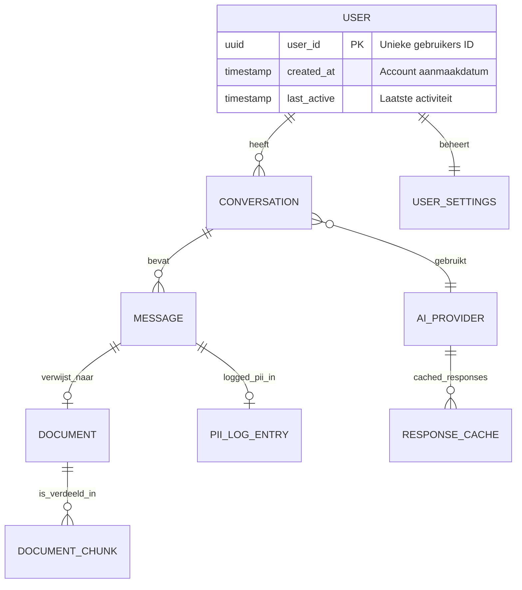

# Data Model: Local-First AI Assistant

> **Template Oorsprong**: Officieel | **ArcKit Versie**: 4.3.1 | **Commando**: `/arckit:data-model`

## Documentbeheer

| Veld | Waarde |
|------|--------|
| **Document ID** | ARC-000-DATA-v1.0 |
| **Document Type** | Data Model |
| **Project** | Local-First AI Assistant (Template 000) |
| **Classificatie** | PUBLIC |
| **Status** | DRAFT |
| **Versie** | 1.0 |
| **Aanmaakdatum** | 2026-05-07 |
| **Laatste Wijziging** | 2026-05-07 |
| **Review Cyclus** | Kwartaalijks |
| **Volgende Review Datum** | 2026-08-07 |
| **Eigenaar** | [Architect Rol] |
| **Beoordeeld Door** | PENDING |
| **Goedgekeurd Door** | PENDING |
| **Distributie** | Ontwikkelteam, Stakeholders |

## Revisiegeschiedenis

| Versie | Datum | Auteur | Wijzigingen | Goedgekeurd Door | Goedkeuringsdatum |
|--------|-------|--------|-------------|------------------|-------------------|
| 1.0 | 2026-05-07 | ArcKit AI | Eerste aanmaak vanuit `/arckit:data-model` commando | PENDING | PENDING |

---

## Uitvoerende Samenvatting

### Overzicht

Dit datamodel beschrijft de data-architectuur voor local-first AI assistant systemen. Het model ondersteunt core functionaliteiten zoals conversatie management, documentverwerking, AI provider configuratie, en privacy-georiënteerde data logging. De architectuur volgt een local-first benadering waarbij alle data standaard lokaal op de gebruikerstoestel wordt opgeslagen.

**Dit is een generiek sjabloon** — pas de entiteiten, attributen en relaties aan op basis van uw specifieke project requirements.

### Model Statistieken

- **Totaal Entiteiten**: [AANTAL] entiteiten gedefinieerd
- **Totaal Attributen**: [AANTAL] attributen over alle entiteiten
- **Totaal Relaties**: [AANTAL] relaties in kaart gebracht
- **Data Classificatie**:
  - 🟢 Publiek: [AANTAL] entiteiten
  - 🟡 Intern: [AANTAL] entiteiten
  - 🟠 Vertrouwelijk: [AANTAL] entiteiten
  - 🔴 Streng: [AANTAL] entiteiten

### Naleving Samenvatting

- **AVG/GDPR Status**: [STATUS]
- **PII Entiteiten**: [AANTAL] entiteiten bevatten mogelijk persoonsgegevens
- **Data Protection Impact Assessment (DPIA)**: [STATUS]
- **Data Retentie**: [BELEID]
- **Cross-Border Transfers**: [JA/NEE met uitleg]

### Belangrijke Data Governance Stakeholders

- **Data Eigenaar (Business)**: [Rol/Naam]
- **Data Steward**: [Rol/Naam]
- **Data Custodian (Technisch)**: [Rol/Naam]
- **Data Protection Officer**: [Rol/Naam of N.v.t.]

---

## Visuele Entity-Relationship Diagram (ERD)

Kopieer en pas dit Mermaid diagram aan op basis van uw entiteiten:



**Diagram Opmerkingen**:

- **Cardinaliteit**: `||` = precies één, `o{` = nul of meer, `|{` = één of meer
- **Primary Keys (PK)**: Identificeren elke record uniek
- **Foreign Keys (FK)**: Refereren naar andere entiteiten
- **Local-First**: Alle data opgeslagen op lokale machine van gebruiker

---

## Entiteit Catalogus

### Sjabloon voor Individuele Entiteiten

Kopieer dit sjabloon voor elke entiteit in uw model:

---

### Entiteit E-[XXX]: [Entiteit Naam]

**Beschrijving**: [Klare beschrijving van wat de entiteit vertegenwoordigt]

**Bron Requirements**:
- **Afgeleid van**: [Requirements document of architectuur principe]
- **[Specifiek vereiste]**: [Beschrijving]

**Business Context**: [Hoe deze entiteit past in het bredere bedrijfscontext]

**Data Eigendom**:

- **Business Eigenaar**: [Rol/Naam]
- **Technische Eigenaar**: [Rol/Naam]
- **Data Steward**: [Rol/Naam]

**Data Classificatie**: [PUBLIEK | INTERN | VERTROUWELIJK | STRENG]

**Volume Schattingen**:

- **Initieel Volume**: [Schatting bij lancering]
- **Groei Rate**: [Schatting van groei per periode]
- **Peak Volume**: [Schatting van maximum]
- **Gemiddelde Record Grootte**: [Schatting in bytes/KB]

**Data Retentie**:

- **Actieve Periode**: [Hoe lang data actief blijft]
- **Archive Periode**: [Archief periode indien van toepassing]
- **Totale Retentie**: [Totale bewaartermijn]
- **Verwijderingsbeleid**: [Soft/hard delete, back-up etc.]

#### Attributen

| Attribuut | Type | Verplicht | PII | Beschrijving | Validatieregels | Standwaard | Bron Req |
|-----------|------|-----------|-----|-------------|-----------------|------------|----------|
| [naam] | [TYPE] | [Ja/Nee] | [Ja/Nee] | [Beschrijving] | [Regels] | [Default] | [Source] |
| ... | ... | ... | ... | ... | ... | ... | ... |

#### Relaties

**Inkomende Relaties**:

- [Beschrijving]: E-[XXX] → E-[XXX] (one-to-many/one-to-one/etc)
  - Foreign Key: [Details]
  - Beschrijving: [Relatie beschrijving]
  - Cascade Delete: [JA/NEE]

**Uitgaande Relaties**:

- [Beschrijving]: E-[XXX] → E-[XXX] (relationship type)
  - Foreign Key: [Details]
  - Beschrijving: [Relatie beschrijving]
  - Orphan Check: [VERPLICHT/OPTIONAL]

#### Indexes

**Primary Key**:
- `pk_[naam]` op `[kolom]` (type index)

**Foreign Keys**:
- `fk_[naam]` op `[kolom]` references [TABEL].[KOLOM]

**Performance Indexes**:
- `idx_[naam]` op `[kolom(en)]` (voor doel)

**Unique Constraints**:
- `uk_[naam]` op `[kolom(en)]` (doel)

#### Privacy & Compliance

**AVG/GDPR Overwegingen**:

- **Bevat PII**: [JA/NEE/MOGELIJK]
- **PII Attributen**: [Lijst van PII attributen]
- **Rechtsgrond voor Verwerking**: [Toestemming/Contract/Legitiem belang]
- **Data Subject Rechten**:
  - **Recht op Toegang**: [Hoe geïmplementeerd]
  - **Recht op Rectificatie**: [Hoe geïmplementeerd]
  - **Recht op Vergetelheid**: [Hoe geïmplementeerd]
  - **Recht op Overdraagbaarheid**: [Hoe geïmplementeerd]

---

## Typische Local-First AI Assistant Entiteiten

De volgende entiteitstypen zijn veelvoorkomend in local-first AI assistant systemen. Gebruik deze als startpunt en pas aan op basis van uw requirements:

### Core Entiteiten

| Entiteit | Doel | Typische Attributen |
|----------|------|---------------------|
| **User** | Gebruikersidentiteit | user_id, created_at, last_active |
| **UserSettings** | Gebruikersvoorkeuren | settings_id, preferred_provider, privacy_settings |
| **Conversation** | Gesprekscontext | conversation_id, title, created_at, model_used |
| **Message** | Individuele berichten | message_id, role, content, created_at, token_count |
| **Document** | Geüploade bestanden | document_id, filename, file_path, mime_type, checksum |
| **DocumentChunk** | Gedeelde documenten | chunk_id, chunk_index, content, embedding_vector |

### AI/LLM Specifieke Entiteiten

| Entiteit | Doel | Typische Attributen |
|----------|------|---------------------|
| **AIProvider** | LLM provider config | provider_id, naam, api_endpoint, is_local, auth_config, is_eu_compliant |
| **ResponseCache** | Gecachete responses | cache_id, prompt_hash, response, cached_at, hit_count |
| **PromptTemplate** | Herbruikbare prompts | template_id, naam, template_content, variables |

### Europese AI Providers (Europa-First)

Voor Europese overheidsorganisaties is de volgorde van provider selectie:

| Prioriteit | Provider | Modellen | Locatie | Licentie | Data Locatie |
|------------|----------|----------|----------|----------|--------------|
| **1e** | **Mistral AI** | Mixtral 8x7B, Mixtral 8x22B, Mistral 7B, Codestral | 🇫🇷 Frankrijk | Apache 2.0 | EU (Parijs) |
| **1e** | **Aleph Alpha** | Luminous Supreme/Extended/Control | 🇩🇪 Duitsland | Proprietary (EU) | EU (Duitsland) |
| **1e** | **LightOn** | Squirrels series | 🇫🇷 Frankrijk | Apache 2.0 | EU |
| **2e** | **Llama (Meta)** | Llama 2, Llama 3 | 🇺🇸 USA (Meta) | Llama 2 Community License | Self-hosted (EU) |
| **2e** | **Mistral (via Ollama)** | Alle Mistral modellen | Local | Apache 2.0 | Local (EU) |
| **3e** | **OpenAI** (uitzondering) | GPT-4, GPT-3.5 | 🇺🇸 USA | Proprietary | VS (EU compliant?) |
| **Laatste** | **Anthropic** (uitzondering) | Claude 3 Opus/Sonnet/Haiku | 🇺🇸 USA | Proprietary | VS (EU compliant?) |

**Aanbevolen Default Provider Configuratie**:

```json
{
  "provider_id": "mistral-ai-primary",
  "naam": "Mistral AI (Primary)",
  "api_endpoint": "https://api.mistral.ai/v1",
  "is_local": false,
  "is_eu_compliant": true,
  "is_eu_based": true,
  "license": "Apache 2.0",
  "data_residence": "EU",
  "priority": 1
}
```

**Fallback Strategie**:
1. **Primary**: Mistral API (EU-based)
2. **Fallback**: Self-hosted Ollama (Mistral/Llama models)
3. **Last Resort**: OpenAI API (met uitzondering)

### Privacy & Compliance Entiteiten

| Entiteit | Doel | Typische Attributen |
|----------|------|---------------------|
| **PIILogEntry** | PII detectie logging | log_id, pii_type, original_value, redacted_value, confidence_score |
| **ConsentRecord** | Toestemmingsrecords | consent_id, purpose, granted_at, revoked_at |
| **DataExport** | Export tracking | export_id, exported_at, scope, format |

---

## Data Governance Matrix

| Entiteit | Business Eigenaar | Data Steward | Technische Custodian | Gevoeligheid | Compliance | Kwaliteit SLA | Access Control |
|----------|-------------------|--------------|----------------------|--------------|------------|---------------|----------------|
| E-[XXX]: [Naam] | [Rol] | [Rol] | [Rol] | [Niveau] | [Vereisten] | [Doel] | [Beleid] |
| ... | ... | ... | ... | ... | ... | ... | ... |

---

## CRUD Matrix

| Entiteit | [Component 1] | [Component 2] | [Component 3] | [Component N] |
|----------|---------------|---------------|---------------|----------------|
| E-[XXX]: [Naam] | [CRUD] | [CRUD] | [CRUD] | [CRUD] |
| ... | ... | ... | ... | ... |

**Legende**:

- **C** = Create (kan nieuwe records aanmaken)
- **R** = Read (kan bestaande records lezen)
- **U** = Update (kan bestaande records wijzigen)
- **D** = Delete (kan records verwijderen)
- **-** = Geen toegang

---

## Data Integratie Mapping

### Upstream Systemen (Data Bronnen)

Beschrijf externe systemen die data leveren aan uw applicatie:

#### Integratie INT-[XXX]: [Systeem Naam]

**Doel Systeem**: [Systeem naam en beschrijving]

**Integratie Type**: [Real-time API | Batch | File-based | Event-driven]

**Data Flow Richting**: [Systeem A] → [Systeem B]

**Entiteiten Gedeeld**:

- **E-[XXX] ([Entiteit])**: Beschrijving van data exchange
  - Update Frequentie: [Frequentie]
  - Sync Methode: [REST API | Message Queue | File etc.]
  - Data Latentie SLA: [SLA]

**Data Mapping**:
| Bron Entiteit | Bron Attribuut | Doel Veld | Doel Type | Transformatie |
|---------------|----------------|-----------|-----------|---------------|
| E-[XXX] | [attribuut] | [veld] | [type] | [beschrijving] |

**Data Kwaliteit Verzekering**:

- [Validatie beschrijving]
- [Retry logic]
- [Monitoring approach]

### Downstream Systemen (Data Consumenten)

Beschrijf externe systemen die data van uw applicatie consumeren (volg zelfde format als upstream).

---

## Master Data Management

**Source of Truth** (welk systeem is autoratief voor elke entiteit):

| Entiteit | System of Record | Rationale | Conflict Resolutie |
|----------|------------------|-----------|---------------------|
| E-[XXX]: [Naam] | [Systeem] | [Reden] | [Aanpak] |
| ... | ... | ... | ... |

**Data Lineage**:

- [Bron] → [Transformatie] → [Doel]
- [Beschrijving van key data flows]

---

## Privacy & Compliance

### AVG / UK Data Protection Act 2018 Naleving

#### PII Inventaris

**Entiteiten die PII Bevatten**:

- **E-[XXX] ([Entiteit])**: [Welke attributen PII bevatten]
- **E-[XXX] ([Entiteit])**: [Welke attributen PII bevatten]

**Totaal PII Attributen**: [AANTAL] attributen over [AANTAL] entiteiten

**Special Category Data** (gevoelige PII onder AVG Artikel 9):

- [Beschrijving van special category data indien van toepassing]

#### Rechtsgrond voor Verwerking

| Entiteit | Doel | Rechtsgrond | Notities |
|----------|-------|-------------|----------|
| E-[XXX]: [Naam] | [Doel] | [Toestemming/Contract/etc.] | [Notities] |
| ... | ... | ... | ... |

**Toestemming Beheer**:

- [Hoe toestemming verkregen wordt]
- [Hoe intrekking werkt]

#### Data Subject Rechten Implementatie

**Recht op Toegang (Subject Access Request)**:

- **Endpoint**: [Hoe toegang verleend wordt]
- **Authenticatie**: [Methode]
- **Response Format**: [Formaat]
- **Response Time**: [SLA]

**Recht op Rectificatie**:

- **Methode**: [Hoe bewerking werkt]

**Recht op Vergetelheid (Right to be Forgotten)**:

- **Methode**: [Proces]
- **Proces**: [Stappen]
- **Uitzonderingen**: [Eventuele uitzonderingen]

**Recht op Data Portabiliteit**:

- **Endpoint**: [Export methode]
- **Format**: [Formaat]
- **Scope**: [Coverage]

#### Data Retentie Schema

| Entiteit | Actieve Retentie | Archive Retentie | Totale Retentie | Rechtsgrond | Verwijderingsmethode |
|----------|-------------------|-------------------|-----------------|-------------|---------------------|
| E-[XXX]: [Naam] | [Periode] | [Periode] | [Totaal] | [Grond] | [Methode] |
| ... | ... | ... | ... | ... | ... |

#### Cross-Border Data Transfers

**Data Locaties**:

- **Primary Database**: [Locatie]
- **Backup Storage**: [Locatie]
- **Downstream Systemen**: [Locaties]

**Cross-Border Analysis**:

- **UK-EU Data Transfers**: [Analyse]
- **UK-US Data Transfers**: [Analyse]
- **Mitigatie**: [Aanpak indien nodig]

#### Data Protection Impact Assessment (DPIA)

**DPIA Vereist**: [JA/NEE]

**Triggers voor DPIA** (AVG Artikel 35):

- [Lijst van triggers indien van toepassing]

**DPIA Status**: [UITGEVOERD / NIET UITGEVOERD / IN UITVOERING]

---

## Data Kwaliteit Framework

### Kwaliteitsdimensies

#### Nauwkeurigheid

**Definitie**: Data geeft de echte wereld entiteit of event correct weer

**Kwaliteitsdoelen**:
| Entiteit | Attribuut | Nauwkeurigheidsdoel | Meetmethode | Eigenaar |
|----------|-----------|---------------------|-------------|---------|
| E-[XXX] | [attribuut] | [Doel] | [Methode] | [Rol] |
| ... | ... | ... | ... | ... |

**Validatieregels**:

- [Lijst van validatieregels]

#### Volledigheid

**Definitie**: Alle vereiste data elementen zijn ingevuld

**Kwaliteitsdoelen**:
| Entiteit | Verplichte Velden Volledigheid | Doel | Huidig | Eigenaar |
|----------|----------------------------------|------|---------|---------|
| E-[XXX] | [Beschrijving] | [Doel] | [Actueel] | [Rol] |
| ... | ... | ... | ... | ... |

**Ontbrekende Data Handling**:

- [Beleid voor missing data]

#### Consistentie

**Definitie**: Data is consistent across systemen en tegenstrijdt zichzelf niet

**Kwaliteitsdoelen**:

- [Consistentie regels en targets]

**Reconciliatie Proces**:

- **Frequentie**: [Frequentie]
- **Methode**: [Aanpak]

#### Tijdigheid

**Definitie**: Data is up-to-date en beschikbaar wanneer nodig

**Kwaliteitsdoelen**:
| Entiteit | Update Frequentie | Staleness Tolerantie | Huidige Latency | Eigenaar |
|----------|-------------------|---------------------|-----------------|---------|
| E-[XXX] | [Frequentie] | [Tolerantie] | [Actueel] | [Rol] |
| ... | ... | ... | ... | ... |

#### Uniekheid

**Definitie**: Geen dubbele records bestaan

**Deduplicatie Regels**:
| Entiteit | Unieke Sleutel | Deduplicatie Logica | Duplicate Resolutie |
|----------|---------------|---------------------|---------------------|
| E-[XXX] | [Sleutel] | [Logica] | [Resolutie] |
| ... | ... | ... | ... |

#### Geldigheid

**Definitie**: Data voldoet aan gedefinieerde formaten, ranges, en business rules

**Validatieregels**:
| Attribuut | Formaat/Range | Ongeldig Voorbeeld | Handling |
|-----------|--------------|-------------------|----------|
| [attribuut] | [Specificatie] | [Voorbeeld] | [Aanpak] |
| ... | ... | ... | ... |

---

## Requirements Traceability

**Doel**: Zorg dat elk data-vereiste gemodelleerd is in dit datamodel

| Requirement ID | Requirement Beschrijving | Entiteit | Attributen | Status | Notities |
|----------------|-------------------------|----------|------------|--------|----------|
| [ID] | [Beschrijving] | E-[XXX] | [Attributen] | [✅/❌] | [Notities] |
| ... | ... | ... | ... | ... | ... |

**Coverage Samenvatting**:

- **Totaal Requirements**: [AANTAL]
- **Requirements Gemodelleerd**: [AANTAL]
- **Coverage %**: [%]

---

## Implementatie Gids

### Database Technologie Aanbeveling

**Aanbevolen Database**: [Technologie keuze]

**Rationale**:

- [Beschrijving van technologie keuze met voor- en nadelen]
- [Afwegingen voor local-first architectuur]

**Gekozen Technologie**: [Specifieke keuze]

- **Justificatie**: [Reden voor keuze]
- **Cloud Provider**: [Indien van toepassing]
- **High Availability**: [Aanpak]

---

### Schema Migratie Strategie

**Migratie Tool**: [Tool naam]

**Versioning**:

- **Schema Versie**: [VX.Y.Z]
- **Migratie Scripts**: [Locatie]
- **Naming Conventie**: [Conventie]

**Migratie Proces**:

1. [Stap 1]
2. [Stap 2]
3. [Stap 3]

**Zero-Downtime Migraties**:

- [Aanpak voor zero-downtime migraties]

---

### Backup en Recovery

**Backup Strategie**:

- [Algemene strategie]
- [Verantwoordelijkheden]

**Export Functionaliteit**:

- **Format**: [Formaat]
- **Scope**: [Coverage]
- **Planning**: [Planning]

---

## Bijlage

### Glossary

- **PII (Personally Identifiable Information)**: Data die een individu kan identificeren
- **AVG (Algemene Verordening Gegevensbescherming)**: EU privacy verordening
- **DPA 2018**: UK implementatie van AVG
- **DPIA (Data Protection Impact Assessment)**: Assessment van privacy risico's
- **LLM (Large Language Model)**: AI taalmodel
- **RAG (Retrieval Augmented Generation)**: AI techniek met context retrieval

### Referenties

- [AVG Handhavingsrichtslijnen](https://autoriteitpersoonsgegevens.nl/nl)
- [UK ICO Data Protection](https://ico.org.uk/for-organisations/guide-to-data-protection/)
- [Project-specifieke referenties]

---

**Document End**

*Dit datamodel is een levend document en moet bijgewerkt worden als requirements evolueren, nieuwe entiteiten toegevoegd worden, of compliance regelgeving verandert.*

## Externe Referenties

| Document | Type | Bron | Kernextracties | Pad |
|----------|------|------|----------------|-----|
| *Geen voorzien* | — | — | — | — |

---

**Gegenereerd door**: ArcKit `/arckit:data-model` commando
**Gegenereerd op**: 2026-05-07
**ArcKit Versie**: 4.3.1
**Project**: Local-First AI Assistant (Generic Template)
**AI Model**: Claude Opus 4.7
