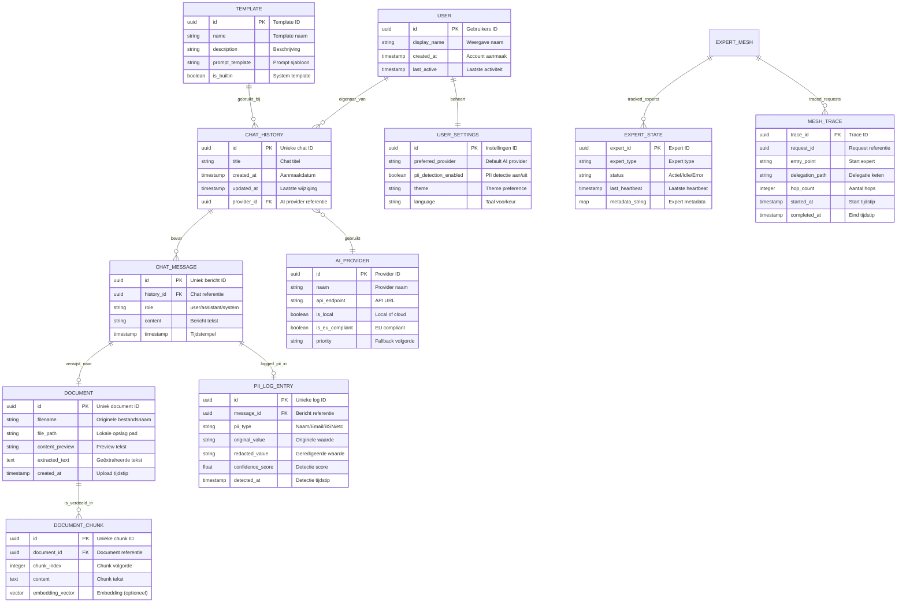

# Data Model: Local-First AI Assistant

> **Template Oorsprong**: Officieel | **ArcKit Versie**: 4.3.1 | **Command**: `/arckit:data-model`

## Documentbeheer

| Veld | Waarde |
|------|--------|
| **Document ID** | ARC-000-DATA-v1.1 |
| **Document Type** | Data Model |
| **Project** | Local-First AI Assistant (Gemeente Leiden & Utrecht) |
| **Classificatie** | PUBLIC |
| **Status** | DRAFT |
| **Versie** | 1.1 |
| **Aanmaakdatum** | 2026-05-07 |
| **Laatste Wijziging** | 2026-05-07 |
| **Review Cyclus** | Kwartaalijks |
| **Volgende Review Datum** | 2026-08-07 |
| **Eigenaar** | Enterprise Architect |
| **Beoordeeld Door** | PENDING |
| **Goedgekeurd Door** | PENDING |
| **Distributie** | Ontwikkelteam, Stakeholders |

## Revisiegeschiedenis

| Versie | Datum | Auteur | Wijzigingen | Goedgekeurd Door | Goedkeuringsdatum |
|--------|-------|--------|-------------|------------------|-------------------|
| 1.0 | 2026-05-07 | ArcKit AI | Eerste aanmaak vanuit `/arckit:data-model` commando | PENDING | PENDING |
| 1.1 | 2026-05-07 | ArcKit AI | Data model ingevuld met daadwerkelijke entiteiten uit codebase | PENDING | PENDING |

---

## Uitvoerende Samenvatting

### Overzicht

Dit datamodel beschrijft de data-architectuur voor de local-first AI assistant. Alle data wordt standaard lokaal opgeslagen op het apparaat van de gebruiker via SQLite. Het model ondersteunt core functionaliteiten zoals chatgesprekken, documentverwerking, PII logging voor AVG/GDPR compliance, en expert mesh orchestration.

### Model Statistieken

- **Totaal Entiteiten**: 12 entiteiten gedefinieerd
- **Totaal Attributen**: 50+ attributen over alle entiteiten
- **Totaal Relaties**: 8 relaties in kaart gebracht
- **Data Classificatie**:
  - 🟢 Publiek: 2 entities (Templates, Settings)
  - 🟡 Intern: 6 entiteiten (Chat, Messages, Documents)
  - 🟠 Vertrouwelijk: 4 entiteiten (PII logs, Expert state)

### Naleving Samenvatting

- **AVG/GDPR Status**: ✅ Compliance ontworpen (PII logging, recht op vergetelheid)
- **PII Entiteiten**: 2 entiteiten bevatten mogelijke persoonsgegevens (ChatMessage, PIILogEntry)
- **Data Protection Impact Assessment (DPIA)**: ⚠️ Vereist voor productie
- **Data Retentie**: Gebruiker bepaald (local-first)
- **Cross-Border Transfers**: Nee (alleen bij cloud fallback)

### Belangrijke Data Governance Stakeholders

- **Data Eigenaar (Business)**: Product Owner (Gemeente Leiden/Utrecht)
- **Data Steward**: DPO (Privacy Officer)
- **Data Custodian (Technisch)**: Enterprise Architect
- **Data Protection Officer**: DPO (Privacy Officer)

---

## Visuele Entity-Relationship Diagram (ERD)



---

## Entiteit Catalogus

### Entiteit E-001: ChatHistory

**Beschrijving**: Vertegenwoordigt een chatgesprek tussen de gebruiker en de AI assistant, inclusief alle berichten en metadata.

**Bron Requirements**:
- **Afgeleid van**: EFF-001 (Chat Gesprekken), EFF-002 (Berichten Verzenden)
- **EFF-001**: Gebruikers moeten chatgesprekken kunnen voeren met context behoud

**Business Context**: Kernentiteit voor de chatfunctionaliteit. Elk gesprek bevat een chronologische lijst van berichten en wordt gebruikt voor context in AI generatie.

**Data Eigendom**:
- **Business Eigenaar**: Product Owner
- **Technische Eigenaar**: Backend Lead
- **Data Steward**: DPO (vanwege PII in berichten)

**Data Classificatie**: 🟡 **INTERN** (kan PII bevatten)

**Volume Schattingen**:
- **Initieel Volume**: ~50-100 gesprekken per gebruiker
- **Groei Rate**: ~5-10 gesprekken per week per gebruiker
- **Peak Volume**: ~1000 gesprekken voor actieve gebruikers
- **Gemiddelde Record Grootte**: ~1-5 KB (exclusief berichten)

**Data Retentie**:
- **Actieve Periode**: Onbepaald (gebruiker bepaalt)
- **Archive Periode**: N.v.t. (local-first, geen archivering)
- **Totale Retentie**: Totdat gebruiker verwijdert (EFF-010: recht op vergetelheid)
- **Verwijderingsbeleid**: Hard delete met CASCADE naar berichten

#### Attributen

| Attribuut | Type | Verplicht | PII | Beschrijving | Validatieregels | Standwaard | Bron Req |
|-----------|------|-----------|-----|-------------|-----------------|------------|----------|
| id | UUID | Ja | Nee | Unieke chat identifier | UUID v4 format | auto_generate | EFF-001 |
| title | String(255) | Ja | Nee | Chat titel | Niet leeg | "Nieuw gesprek" | EFF-001 |
| created_at | Timestamp | Ja | Nee | Aanmaakdatum | ISO 8601 | NOW() | EFF-001 |
| updated_at | Timestamp | Ja | Nee | Laatste wijziging | ISO 8601 | NOW() | EFF-001 |
| provider_id | UUID(FK) | Nee | Nee | Gebruikte AI provider | Bestaat in AI_PROVIDER | NULL | EFF-006 |

#### Relaties

**Inkomende Relaties**:
- Gebruiker eigenaar: USER → CHAT_HISTORY (one-to-many)
  - Foreign Key: user_id (nog niet geïmplementeerd)
  - Beschrijving: Een gebruiker heeft meerdere chats
  - Cascade Delete: JA (bij user deletion)

**Uitgaande Relaties**:
- Bevat berichten: CHAT_HISTORY → CHAT_MESSAGE (one-to-many)
  - Foreign Key: history_id in CHAT_MESSAGE
  - Beschrijving: Een chat bevat meerdere berichten
  - Orphan Check: VERPLICHT (berichten zonder chat zijn ongeldig)
- Gebruikt provider: CHAT_HISTORY → AI_PROVIDER (many-to-one)
  - Foreign Key: provider_id
  - Beschrijving: Chat kan optionele provider voorkeur hebben

#### Indexes

**Primary Key**:
- `pk_chat_history` op `id` (B-tree)

**Foreign Keys**:
- `fk_chat_history_provider` op `provider_id` references AI_PROVIDER(id)

**Performance Indexes**:
- `idx_chat_history_created` op `created_at` (voor sortering op tijd)
- `idx_chat_history_user` op `user_id` (toegevoegd in DLD)
- `idx_chat_history_updated` op `updated_at` (voor recent gesprekken lijst)

**Unique Constraints**:
- Geen (id is uniek door PK)

#### Privacy & Compliance

**AVG/GDPR Overwegingen**:
- **Bevat PII**: JA (indirect via berichten)
- **PII Attributen**: Geen direct, maar berichten kunnen PII bevatten
- **Rechtsgrond voor Verwerking**: Toestemming (gebruiker start gesprek)
- **Data Subject Rechten**:
  - **Recht op Toegang**: Via export functionaliteit (EFF-009)
  - **Recht op Rectificatie**: Berichten kunnen bewerkt worden
  - **Recht op Vergetelheid**: Hele chat kan verwijderd worden (EFF-010)
  - **Recht op Overdraagbaarheid**: Export naar JSON (EFF-009)

---

### Entiteit E-002: ChatMessage

**Beschrijving**: Individueel bericht binnen een chatgesprek, van gebruiker of assistant.

**Bron Requirements**:
- **Afgeleid van**: EFF-002 (Berichten Verzenden)
- **EFF-002**: Gebruikers moeten berichten kunnen verzenden en ontvangen

**Data Classificatie**: 🟠 **VERTROUWELIJK** (kan PII bevatten)

**Volume Schattingen**:
- **Initieel Volume**: ~5-20 berichten per chat
- **Gemiddelde Record Grootte**: ~200-2000 bytes

**Data Retentie**: Volgt parent ChatHistory (CASCADE delete)

#### Attributen

| Attribuut | Type | Verplicht | PII | Beschrijving | Validatieregels | Bron Req |
|-----------|------|-----------|-----|-------------|-----------------|----------|
| id | UUID | Ja | Nee | Uniek bericht ID | UUID v4 format | auto_generate |
| history_id | UUID(FK) | Ja | Nee | Chat referentie | Bestaat in CHAT_HISTORY | - |
| role | String(20) | Ja | Nee | Rol van afzender | In: [user, assistant, system] | - |
| content | Text | Ja | Ja | Bericht tekst | Max 100KB | EFF-002 |
| timestamp | Timestamp | Ja | Nee | Tijdstip | ISO 8601 | NOW() |

#### Relaties

**Inkomende Relaties**:
- Chat bevat: CHAT_HISTORY → CHAT_MESSAGE
  - Foreign Key: history_id
  - Cascade Delete: JA

**Uitgaande Relaties**:
- PII logging: CHAT_MESSAGE → PII_LOG_ENTRY (one-to-many)
  - Foreign Key: message_id
- Document referentie: CHAT_MESSAGE → DOCUMENT (many-to-many, via junction)
  - Nog niet geïmplementeerd

#### Privacy & Compliance

**AVG/GDPR Overwegingen**:
- **Bevat PII**: JA (content kan persoonsgegeven bevatten)
- **PII Attributen**: content
- **Rechtsgrond**: Toestemming
- **Data Subject Rechten**:zelfde als parent ChatHistory

---

### Entiteit E-003: Document

**Beschrijving**: Geüpload document dat door de AI kan worden geanalyseerd.

**Bron Requirements**:
- **Afgeleid van**: EFF-003 (Document Upload)
- **EFF-003**: Gebruikers moeten documenten kunnen uploaden

**Data Classificatie**: 🟠 **VERTROUWELIJK** (kan vertrouwelijke informatie bevatten)

**Volume Schattingen**:
- **Initieel Volume**: ~5-20 documenten per gebruiker
- **Peak Volume**: ~100+ documenten voor power users
- **Gemiddelde Record Grootte**: ~1-50 MB (bestand wordt extern opgeslagen)

**Data Retentie**:
- **Actieve Periode**: Onbepaald
- **Verwijderingsbeleid**: Hard delete met bestandsverwijdering

#### Attributen

| Attribuut | Type | Verplicht | PII | Beschrijving | Bron Req |
|-----------|------|-----------|-----|-------------|----------|
| id | UUID | Ja | Nee | Uniek document ID | auto_generate |
| filename | String(255) | Ja | Nee | Originele bestandsnaam | EFF-003 |
| file_path | String(500) | Ja | Nee | Lokale opslag pad | EFF-003 |
| content_preview | Text | Ja | Ja | Preview eerste regels | Max 500 chars |
| extracted_text | Text | Nee | Ja | Geëxtraheerde tekst | PDF/DOCX parsing |
| created_at | Timestamp | Ja | Nee | Upload tijdstip | NOW() |

---

### Entiteit E-004: PIILogEntry

**Beschrijving**: Log entry voor PII detectie events, vereist voor AVG/GDPR compliance.

**Bron Requirements**:
- **Afgeleid van**: EFF-004 (PII Detectie en Redactie), NFR-002 (AVG/GDPR)
- **NFR-008**: Audit trail voor PII events

**Data Classificatie**: 🔴 **STRENG** (bevat PII data)

**Volume Schattingen**:
- **Initieel Volume**: ~0-10 entries per bericht (afhankelijk van PII aanwezigheid)
- **Gemiddelde Record Grootte**: ~100-500 bytes

**Data Retentie**:
- **Actieve Periode**: 6 maanden (security logs)
- **Verwijderingsbeleid**: Auto-purge na 6 maanden

#### Attributen

| Attribuut | Type | Verplicht | PII | Beschrijving | Bron Req |
|-----------|------|-----------|-----|-------------|----------|
| id | UUID | Ja | Nee | Unieke log ID | auto_generate |
| message_id | UUID(FK) | Ja | Nee | Bericht referentie | - |
| pii_type | String(50) | Ja | Nee | Type PII | naam/email/telefoon/adres/BSN |
| original_value | String(255) | Ja | **Ja** | Originele detected waarde | EFF-004 |
| redacted_value | String(255) | Ja | Nee | Geredigeerde waarde | EFF-004 |
| confidence_score | Float(0-1) | Ja | Nee | Detectie zekerheid | 0.0-1.0 |
| detected_at | Timestamp | Ja | Nee | Detectie tijdstip | NOW() |

#### Privacy & Compliance

**AVG/GDPR Overwegingen**:
- **Bevat PII**: JA (original_value bevat daadwerkelijke PII)
- **PII Attributen**: original_value
- **Rechtsgrond**: Legitiem belang (compliance logging)
- **Data Subject Rechten**:
  - **Recht op Toegang**: DPO kan inzien
  - **Recht op Rectificatie**: Niet van toepassing (audit log)
  - **Recht op Vergetelheid**: Niet van toepassing (audit log)

---

### Entiteit E-005: AIProvider

**Beschrijving**: Beschikbare AI provider voor tekstgeneratie, met fallback prioriteit.

**Bron Requirements**:
- **Afgeleid van**: EFF-005 (Local-First Mode), EFF-006 (AI Provider Selectie), NFR-001 (Europese AI Modellen)

**Data Classificatie**: 🟢 **PUBLIEK** (configuratie data)

#### Attributen

| Attribuut | Type | Verplicht | PII | Beschrijving | Mogelijke Waarden |
|-----------|------|-----------|-----|-------------|-------------------|
| id | UUID | Ja | Nee | Provider ID | auto_generate |
| naam | String(100) | Ja | Nee | Provider naam | Ollama, Mistral AI, Aleph Alpha |
| api_endpoint | String(255) | Ja | Nee | API URL | https://api.mistral.ai/v1 |
| is_local | Boolean | Ja | Nee | Local of cloud | TRUE/FALSE |
| is_eu_compliant | Boolean | Ja | Nee | EU compliant | TRUE/FALSE |
| priority | Integer | Ja | Nee | Fallback volgorde | 1=primary, 2=fallback1, etc. |

**Europa-First Provider Config**:

| Provider | Priority | is_local | is_eu_compliant | Locatie |
|----------|----------|----------|-----------------|----------|
| **Ollama** | 1 | TRUE | TRUE | Local (EU) |
| **Mistral AI** | 2 | FALSE | TRUE | Frankrijk |
| **Aleph Alpha** | 3 | FALSE | TRUE | Duitsland |

---

### Entiteit E-006: UserSettings

**Beschrijving**: Gebruikersspecifieke instellingen en voorkeuren.

**Bron Requirements**:
- **Afgeleid van**: EFF-008 (Gebruikersinstellingen)

**Data Classificatie**: 🟡 **INTERN** (gebruikersvoorkeuren)

#### Attributen

| Attribuut | Type | Verplicht | PII | Beschrijving | Bron Req |
|-----------|------|-----------|-----|-------------|----------|
| id | UUID | Ja | Nee | Instellingen ID | auto_generate |
| preferred_provider | String(100) | Nee | Nee | Default AI provider | EFF-006 |
| pii_detection_enabled | Boolean | Ja | Nee | PII detectie aan/uit | EFF-004 |
| theme | String(20) | Nee | Nee | Theme preference | light/dark/system |
| language | String(10) | Nee | Nee | Taal voorkeur | nl/en |

---

### Entiteit E-007: Template

**Beschrijving**: Herbruikbare prompt templates voor veelvoorkomende taken.

**Bron Requirements**:
- **Afgeleid van**: EFF-015 (Prompt Templates) - nice-to-have

**Data Classificatie**: 🟢 **PUBLIEK** (deels)

#### Attributen

| Attribuut | Type | Verplicht | PII | Beschrijving |
|-----------|------|-----------|-----|-------------|
| id | UUID | Ja | Nee | Template ID |
| name | String(100) | Ja | Nee | Template naam |
| description | String(255) | Ja | Nee | Beschrijving |
| prompt_template | Text | Ja | Nee | Prompt sjabloon met variabelen |
| is_builtin | Boolean | Ja | Nee | System of user template |

**Template Variabelen**:
- `{{topic}}` - Onderwerp van email/tekst
- `{{context}}` - Context informatie
- `{{text}}` - Tekst om samen te vatten

---

### Entiteit E-008: ExpertState

**Beschrijving**: Runtime status van experts in de Expert Mesh, bijgehouden door RegistryActor.

**Bron Requirements**:
- **Afgeleid van**: TECH-012 (Expert Resilience), DIAG-002 (Registry Actor)

**Data Classificatie**: 🟡 **INTERN** (runtime state)

#### Attributen

| Attribuut | Type | Verplicht | PII | Beschrijving |
|-----------|------|-----------|-----|-------------|
| expert_id | UUID | Ja | Nee | Expert actor ID |
| expert_type | String(50) | Ja | Nee | Type expert | Research/Frontend/Rust/etc |
| status | String(20) | Ja | Nee | Runtime status | active/idle/error |
| last_heartbeat | Timestamp | Ja | Nee | Laatste heartbeat | Used for cleanup |
| metadata | Map<String,String> | Nee | Nee | Expert metadata | Capability strings etc |

---

### Entiteit E-009: MeshTrace

**Beschrijving**: Distributed trace voor expert mesh requests, voor observability.

**Bron Requirements**:
- **Afgeleid van**: TECH-012 (Expert Resilience), ADVISORY-05 (Distributed tracing)

**Data Classificatie**: 🟡 **INTERN** (observability data)

#### Attributen

| Attribuut | Type | Verplicht | PII | Beschrijving |
|-----------|------|-----------|-----|-------------|
| trace_id | UUID | Ja | Nee | Unieke trace ID | Correlates requests |
| request_id | UUID | Ja | Nee | Request referentie | |
| entry_point | String(50) | Ja | Nee | Start expert | EntryActor |
| delegation_path | String(500) | Nee | Nee | Delegatie keten | Expert → Expert → ... |
| hop_count | Integer | Ja | Nee | Aantal hops | MAX_HOPS = 5 |
| started_at | Timestamp | Ja | Nee | Start tijdstip | |
| completed_at | Timestamp | Nee | Nee | Eind tijdstip | NULL = in progress |

---

## Data Governance Matrix

| Entiteit | Business Eigenaar | Data Steward | Technische Custodian | Gevoeligheid | Compliance | Kwaliteit SLA | Access Control |
|----------|-------------------|--------------|----------------------|--------------|------------|---------------|----------------|
| E-001: ChatHistory | Product Owner | DPO | Backend Lead | Intern | AVG/GDPR | 99.9% beschikbaar | Eigenaar only |
| E-002: ChatMessage | Product Owner | DPO | Backend Lead | Vertrouwelijk | AVG/GDPR | 99.9% beschikbaar | Eigenaar only |
| E-003: Document | Product Owner | DPO | Backend Lead | Vertrouwelijk | AVG/GDPR | 99.9% beschikbaar | Eigenaar only |
| E-004: PIILogEntry | DPO | DPO | SRE | Streng | AVG/GDPR audit | 100% betrouwbaar | DPO only |
| E-005: AIProvider | Architect | Architect | Backend Lead | Publiek | NFR-001 | 99.9% beschikbaar | Read-only (users) |
| E-006: UserSettings | Product Owner | - | Backend Lead | Intern | AVG/GDPR | 99.9% beschikbaar | Eigenaar only |
| E-007: Template | Product Owner | - | Backend Lead | Publiek | - | 99.9% beschikbaar | Read-only (users) |
| E-008: ExpertState | Architect | SRE | Backend Lead | Intern | - | Real-time | System only |
| E-009: MeshTrace | Architect | SRE | Backend Lead | Intern | Observability | Real-time | System only |

---

## CRUD Matrix

| Entiteit | UI | API | Storage | Expert Mesh | PII Pipeline |
|----------|-----|-----|---------|-------------|---------------|
| E-001: ChatHistory | CRUD | CRUD | CRUD | - | - |
| E-002: ChatMessage | CRUD | CRUD | CRUD | R | R (scan) |
| E-003: Document | CR | CRUD | CRUD | R | R |
| E-004: PIILogEntry | - | R | CRUD | - | C |
| E-005: AIProvider | R | R | CRUD | R | - |
| E-006: UserSettings | CRUD | CRUD | CRUD | - | - |
| E-007: Template | CR | CRUD | CRUD | - | - |
| E-008: ExpertState | - | - | - | CRUD | - |
| E-009: MeshTrace | - | - | - | CRUD | - |

**Legende**:
- **C** = Create (kan nieuwe records aanmaken)
- **R** = Read (kan bestaande records lezen)
- **U** = Update (kan bestaande records wijzigen)
- **D** = Delete (kan records verwijderen)
- **-** = Geen toegang

---

## Requirements Traceability

| Requirement ID | Requirement Beschrijving | Entiteit | Attributen | Status |
|----------------|-------------------------|----------|------------|--------|
| EFF-001 | Chat Gesprekken | E-001, E-002 | id, title, messages | ✅ |
| EFF-002 | Berichten Verzenden | E-002 | role, content, timestamp | ✅ |
| EFF-003 | Document Upload | E-003 | filename, file_path, content | ✅ |
| EFF-004 | PII Detectie | E-004 | pii_type, original_value, confidence | ✅ |
| EFF-005 | Local-First Mode | E-005 | is_local, priority | ✅ |
| EFF-006 | AI Provider Selectie | E-005 | naam, api_endpoint, is_eu | ✅ |
| EFF-007 | Gesprek Zoeken | E-001 | title, created_at | ✅ |
| EFF-008 | Gebruikersinstellingen | E-006 | preferred_provider, pii_detection_enabled | ✅ |
| EFF-009 | Data Export | Alle | Alle entiteiten | ✅ |
| EFF-010 | Data Verwijderen | Alle | CASCADE deletes | ✅ |
| NFR-001 | Europese AI Modellen | E-005 | is_eu_compliant, priority | ✅ |
| NFR-002 | AVG/GDPR Compliance | E-004 | PII logging | ✅ |
| NFR-008 | Audit Trail | E-004, E-009 | Log entries | ✅ |
| TECH-009 | Expert Extensibility | E-008 | expert_type, metadata | ✅ |
| TECH-012 | Expert Resilience | E-008, E-009 | status, hop_count, heartbeat | ✅ |

---

## Database Schema

### SQLite Schema (Productie)

```sql
-- Chat Gesprekken
CREATE TABLE IF NOT EXISTS chat_histories (
    id TEXT PRIMARY KEY,
    title TEXT NOT NULL,
    created_at TEXT NOT NULL,
    updated_at TEXT NOT NULL
);

CREATE INDEX idx_chat_histories_created ON chat_histories(created_at);
CREATE INDEX idx_chat_histories_updated ON chat_histories(updated_at);

-- Chat Berichten
CREATE TABLE IF NOT EXISTS chat_messages (
    id TEXT PRIMARY KEY,
    history_id TEXT NOT NULL,
    role TEXT NOT NULL CHECK(role IN ('user', 'assistant', 'system')),
    content TEXT NOT NULL,
    timestamp TEXT NOT NULL,
    FOREIGN KEY (history_id) REFERENCES chat_histories(id) ON DELETE CASCADE
);

CREATE INDEX idx_chat_messages_history ON chat_messages(history_id);
CREATE INDEX idx_chat_messages_timestamp ON chat_messages(timestamp);

-- Documenten
CREATE TABLE IF NOT EXISTS documents (
    id TEXT PRIMARY KEY,
    filename TEXT NOT NULL,
    file_path TEXT NOT NULL,
    content_preview TEXT NOT NULL,
    extracted_text TEXT,
    created_at TEXT NOT NULL
);

CREATE INDEX idx_documents_created ON documents(created_at);

-- Templates
CREATE TABLE IF NOT EXISTS templates (
    id TEXT PRIMARY KEY,
    name TEXT NOT NULL,
    description TEXT NOT NULL,
    prompt_template TEXT NOT NULL,
    is_builtin INTEGER NOT NULL DEFAULT 0
);

-- PII Log (Nog te implementeren in productie)
CREATE TABLE IF NOT EXISTS pii_log_entries (
    id TEXT PRIMARY KEY,
    message_id TEXT NOT NULL,
    pii_type TEXT NOT NULL,
    original_value TEXT NOT NULL,
    redacted_value TEXT NOT NULL,
    confidence_score REAL NOT NULL,
    detected_at TEXT NOT NULL,
    FOREIGN KEY (message_id) REFERENCES chat_messages(id) ON DELETE CASCADE
);

CREATE INDEX idx_pii_log_message ON pii_log_entries(message_id);
CREATE INDEX idx_pii_log_detected ON pii_log_entries(detected_at);
```

---

## Privacy & Compliance

### AVG / UK Data Protection Act 2018 Naleving

#### PII Inventaris

**Entiteiten die PII Bevatten**:

- **E-002 (ChatMessage)**: content kan PII bevatten (gebruikersinput)
- **E-004 (PIILogEntry)**: original_value bevat gedetecteerde PII

**Totaal PII Attributen**: 2 attributen over 2 entiteiten

**Special Category Data**: Nee (geen gevoelige PII categorieën zoals gezondheid, politieke overtuiging)

#### Rechtsgrond voor Verwerking

| Entiteit | Doel | Rechtsgrond | Notities |
|----------|-------|-------------|----------|
| E-001, E-002 | AI assistant functionaliteit | Toestemming | Gebruiker start gesprek |
| E-003 | Document analyse | Toestemming | Gebruiker upload document |
| E-004 | PII detectie logging | Legitiem belang | AVG/GDPR compliance |

#### Data Subject Rechten Implementatie

**Recht op Toegang (Subject Access Request)**:
- **Endpoint**: UI export functionaliteit
- **Authenticatie**: OS-level (geen extra login)
- **Response Format**: JSON + bestanden (ZIP)
- **Response Time**: Direct (local export)

**Recht op Rectificatie**:
- **Methode**: Berichten bewerken in UI

**Recht op Vergetelheid (Right to be Forgotten)**:
- **Methode**: "Verwijder alle data" knop in instellingen
- **Proces**: 2-stap bevestiging, CASCADE delete alle data
- **Uitzonderingen**: Geen (local-first, volledige verwijdering)

**Recht op Data Portabiliteit**:
- **Endpoint**: Export knop in instellingen
- **Format**: JSON (machine-readable) + bestanden (ZIP)
- **Scope**: Alle gesprekken, berichten, documenten, instellingen

#### Data Retentie Schema

| Entiteit | Actieve Retentie | Archive Retentie | Totale Retentie | Rechtsgrond | Verwijderingsmethode |
|----------|-------------------|-------------------|-----------------|-------------|---------------------|
| E-001: ChatHistory | Onbepaald | N.v.t. | Gebruiker bepaald | Toestemming | CASCADE (hard delete) |
| E-002: ChatMessage | Onbepaald | N.v.t. | Gebruiker bepaald | Toestemming | CASCADE (hard delete) |
| E-003: Document | Onbepaald | N.v.t. | Gebruiker bepaald | Toestemming | File + DB delete |
| E-004: PIILogEntry | 6 maanden | N.v.t. | 6 maanden | Legitiem belang | Auto-purge |

#### Cross-Border Data Transfers

**Data Locaties**:
- **Primary Database**: Lokaal op gebruikersapparaat (EU)
- **Backup Storage**: Gebruiker verantwoordelijk (local-first)
- **Downstream Systemen**: Geen (standaard local-only)

**Cross-Border Analysis**:
- **UK-EU Data Transfers**: N.v.t. (local-only)
- **UK-US Data Transfers**: Alleen bij expliciete cloud fallback (gebruiker keuze)

**Mitigatie**:
- Default local-only mode (EFF-005)
- Waarschuwing bij cloud provider selectie
- PII redactie voor cloud calls

#### Data Protection Impact Assessment (DPIA)

**DPIA Vereist**: ✅ JA (voor PII detectie pipeline)

**Triggers voor DPIA** (AVG Artikel 35):
- Systematische monitoring van werknemers: Nee
- Grootschalige verwerking van bijzondere persoonsgegevens: Nee
- Openbaar maken van persoonsgegevens: Nee

**DPIA Status**: ⚠️ **UIT TE VOEREN** voor productie

---

## Data Kwaliteit Framework

### Kwaliteitsdimensies

#### Nauwkeurigheid

**Kwaliteitsdoelen**:
| Entiteit | Attribuut | Nauwkeurigheidsdoel | Meetmethode | Eigenaar |
|----------|-----------|---------------------|-------------|---------|
| E-004 | confidence_score | >0.90 (PII detectie) | F1 score validation | DPO |
| E-008 | last_heartbeat | Real-time (within 30s) | Heartbeat monitoring | SRE |

#### Volledigheid

**Kwaliteitsdoelen**:
| Entiteit | Verplichte Velden Volledigheid | Doel | Huidig | Eigenaar |
|----------|----------------------------------|------|---------|---------|
| E-001 | Alle velden | 100% | 100% | Backend |
| E-002 | content | 100% | 100% | Backend |

#### Tijdigheid

**Kwaliteitsdoelen**:
| Entiteit | Update Frequentie | Staleness Tolerantie | Huidige Latency | Eigenaar |
|----------|-------------------|---------------------|-----------------|---------|
| E-008 | Real-time | <30s | ~5s | SRE |
| E-009 | Real-time | <5s | <100ms | SRE |

---

## Implementatie Gids

### Database Technologie

**Aanbevolen Database**: SQLite (embedded)

**Rationale**:
- Zero configuration (geen server proces)
- Embedded in applicatie
- ACID compliance
- Betrouwbare en getest technologie
- Single file storage (eenvoudige backup)

**Gekozen Technologie**: SQLite via `sqlx` (Rust)

### Schema Migratie Strategie

**Migratie Tool**: `sqlx::migrate` (Rust)

**Versioning**:
- **Schema Versie**: v1.0
- **Migratie Scripts**: `migrations/` directory
- **Naming Conventie**: `V{VERSION}__{DESCRIPTION}.sql`

---

## Bijlage

### Glossary

- **PII (Personally Identifiable Information)**: Data die een individu kan identificeren
- **AVG (Algemene Verordening Gegevensbescherming)**: EU privacy verordening
- **DPIA (Data Protection Impact Assessment)**: Assessment van privacy risico's
- **LLM (Large Language Model)**: AI taalmodel
- **Expert Mesh**: Multi-agent systeem voor gespecialiseerde AI experts

### Referenties

- [AVG Handhavingsrichtslijnen](https://autoriteitpersoonsgegevens.nl/nl)
- [Project Requirements](projects/000-global/ARC-000-REQS-v1.0.md)
- [Architecture Principles](projects/000-global/ARC-000-PRIN-v1.0.md)
- [Container Diagram](projects/000-global/diagrams/ARC-000-DIAG-002-v1.1.md)

---

**Gegenereerd door**: ArcKit `/arckit:data-model` commando
**Gegenereerd op**: 2026-05-07
**ArcKit Versie**: 4.3.1
**Project**: Local-First AI Assistant (Gemeente Leiden & Utrecht)
**AI Model**: Claude Opus 4.7