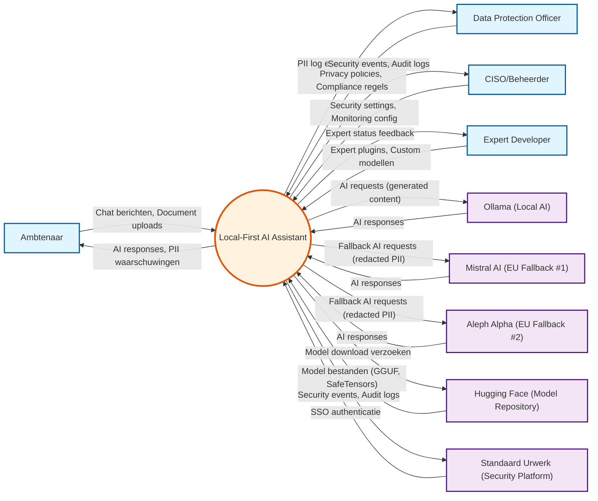

# Data Flow Diagram: Local-First AI Assistant - Context Level

> **Template Oorsprong**: Officieel | **ArcKit Versie**: 4.3.1 | **Command**: `/arckit:dfd`

## Documentbeheer

| Veld | Waarde |
|------|--------|
| **Document ID** | ARC-000-DFD-001-v1.0 |
| **Document Type** | Data Flow Diagram |
| **Project** | Local-First AI Assistant (Project 000) |
| **Classificatie** | PUBLIC |
| **Status** | DRAFT |
| **Versie** | 1.0 |
| **Aanmaakdatum** | 2026-05-07 |
| **Laatste Wijziging** | 2026-05-07 |
| **Review Cyclus** | Per Kwartaal |
| **Volgende Review Datum** | 2026-08-07 |
| **Eigenaar** | Enterprise Architect |
| **Beoordeeld Door** | PENDING |
| **Goedgekeurd Door** | PENDING |
| **Distributie** | Projectteam, Stakeholders, Architecture Board |
| **DFD Level** | Context (Level 0) |
| **Notatie** | Yourdon-DeMarco |

## Revisiegeschiedenis

| Versie | Datum | Auteur | Wijzigingen | Goedgekeurd Door | Goedkeuringsdatum |
|--------|-------|--------|-------------|------------------|-------------------|
| 1.0 | 2026-05-07 | ArcKit AI | Eerste aanmaak vanuit `/arckit:dfd` commando | PENDING | PENDING |

---

## Yourdon-DeMarco Notatie Sleutel

| Symbool | Vorm | Beschrijving |
|---------|------|-------------|
| **External Entity** | Rechthoek | Bron of bestemming van data buiten de systeemgrens |
| **Process** | Cirkel | Transformeert inkomende data flows naar uitgaande data flows |
| **Data Store** | Open rechthoek (parallelle lijnen) | Repository van data in rust |
| **Data Flow** | Benoemde pijl | Data in beweging tussen componenten |

---

## Context Diagram (Level 0)

### `data-flow-diagram` Format

Render met: `pip install data-flow-diagram` dan `dfd < file.dfd` (produceert SVG/PNG met echte Yourdon-DeMarco notatie)

```dfd
title Context Diagram - Local-First AI Assistant

entity    AMBT    "Ambtenaar"
entity    DPO     "Data Protection\nOfficer"
entity    CISO    "CISO/Beheerder"
entity    EXPDEV  "Expert\nDeveloper"
entity    OLLAMA  "Ollama\n(Local AI)"
entity    MISTRAL "Mistral AI\n(EU Fallback #1)"
entity    ALEPH   "Aleph Alpha\n(EU Fallback #2)"
entity    HF      "Hugging Face\n(Model Repository)"
entity    SUP     "Standaard Urwerk\n(Security Platform)"

process   P0      "Local-First\nAI Assistant"

%% User flows
AMBT  --> P0    "Chat berichten,\nDocument uploads"
P0    --> AMBT  "AI responses,\nPII waarschuwingen"

%% DPO flows
DPO   --> P0    "Privacy policies,\nCompliance regels"
P0    --> DPO   "PII log entries,\nData export"

%% CISO flows
CISO  --> P0    "Security settings,\nMonitoring config"
P0    --> CISO  "Security events,\nAudit logs"

%% Expert Developer flows
EXPDEV --> P0    "Expert plugins,\nCustom modellen"
P0    --> EXPDEV "Expert status feedback"

%% Local AI Provider (Primary)
P0    --> OLLAMA "AI requests\n(generated content)"
OLLAMA --> P0    "AI responses"

%% European Fallback #1
P0    --> MISTRAL "Fallback AI requests\n(redacted PII)"
MISTRAL --> P0    "AI responses"

%% European Fallback #2
P0    --> ALEPH  "Fallback AI requests\n(redacted PII)"
ALEPH  --> P0    "AI responses"

%% Model Repository
P0    --> HF     "Model download\nverzoeken"
HF    --> P0     "Model bestanden\n(GGUF, SafeTensors)"

%% Security Platform
P0    --> SUP    "Security events,\nAudit logs"
SUP   --> P0    "SSO authenticatie"
```

### Mermaid Format

Bekijk op [mermaid.live](https://mermaid.live) of in GitHub/VS Code markdown preview.



---

## Systeem Beschrijving

### Proces 0: Local-First AI Assistant

**Beschrijving**: Het centrale systeem dat AI assistentie biedt aan ambtenaren met local-first architectuur. Het systeem verwerkt chat berichten, documenten, en beheert PII detectie/redactie volgens AVG/GDPR eisen.

**Verantwoordelijkheden**:
- Chat gesprekken beheren met context bewaring
- Document upload en verwerking (PDF, DOCX, TXT, MD)
- PII detectie en redactie met audit logging
- Expert Mesh orchestration voor uitbreidbare AI agents
- AI provider selectie (local primary, EU fallbacks)
- Privacy en security configuratie
- Expert plugin beheer

**Inkomende Data Flows**: 9
- Chat berichten, document uploads (van Ambtenaar)
- Privacy policies, compliance regels (van DPO)
- Security settings, monitoring config (van CISO)
- Expert plugins, custom modellen (van Expert Developer)
- AI responses (van Ollama, Mistral AI, Aleph Alpha)
- Model bestanden (van Hugging Face)
- SSO authenticatie (van SUP)

**Uitgaande Data Flows**: 10
- AI responses, PII waarschuwingen (naar Ambtenaar)
- PII log entries, data export (naar DPO)
- Security events, audit logs (naar CISO, SUP)
- Expert status feedback (naar Expert Developer)
- AI requests (naar Ollama, Mistral AI, Aleph Alpha)
- Model download verzoeken (naar Hugging Face)

---

## Externe Entiteiten Beschrijving

| Entity ID | Naam | Type | Beschrijving | Rollen |
|-----------|------|------|-------------|--------|
| AMBT | Ambtenaar | Persoon | Eindgebruiker van de AI assistant | Chat gebruiker, document uploader |
| DPO | Data Protection Officer | Persoon | Beheert privacy compliance | Policy configureerder, data export |
| CISO | CISO/Beheerder | Persoon | Beheert security en infrastructuur | Security settings, monitoring |
| EXPDEV | Expert Developer | Persoon | Ontwikkelt custom expert agents | Plugin ontwikkelaar |
| OLLAMA | Ollama | Systeem | Local AI model hosting | Primary AI provider |
| MISTRAL | Mistral AI | Systeem | Europese AI provider (Parijs) | Performance fallback #1 |
| ALEPH | Aleph Alpha | Systeem | Europese AI provider (Duitsland) | Performance fallback #2 |
| HF | Hugging Face | Systeem | Model repository (Frankrijk) | Custom expert modellen |
| SUP | Standaard Urwerk | Systeem | Gemeentelijk security platform | SSO, security logging |

---

## Data Dictionary

| Data Flow | Samenstelling | Bron | Bestemming | Formaat |
|-----------|---------------|------|------------|--------|
| **Chat berichten** | {message_text, timestamp, conversation_id, role} | Ambtenaar | P0 | JSON/UTF-8 |
| **Document uploads** | {file_binary, filename, mime_type, file_size} | Ambtenaar | P0 | Binary (PDF/DOCX/TXT/MD) |
| **AI responses** | {generated_text, model_used, tokens_used, latency_ms} | P0 | Ambtenaar | JSON/UTF-8 |
| **PII waarschuwingen** | {pii_count, pii_types, redaction_method} | P0 | Ambtenaar | JSON/UTF-8 |
| **Privacy policies** | {pii_detection_enabled, retention_days, data_export_enabled} | DPO | P0 | JSON/UTF-8 |
| **PII log entries** | {message_id, pii_type, original_value, redacted_value, confidence_score, detected_at} | P0 | DPO | JSON/UTF-8 |
| **Data export** | {conversations_json, documents_zip, pii_logs_csv, export_timestamp} | P0 | DPO | JSON/ZIP/CSV |
| **Security settings** | {api_keys, rate_limits, audit_log_enabled} | CISO | P0 | JSON/UTF-8 |
| **Security events** | {event_type, severity, timestamp, details} | P0 | CISO, SUP | JSON/UTF-8 |
| **Audit logs** | {user_action, resource, outcome, timestamp} | P0 | CISO, SUP | JSON/UTF-8 |
| **Expert plugins** | {plugin_binary, metadata_json, signature, version} | Expert Developer | P0 | Binary/JSON |
| **Expert status feedback** | {expert_id, status, health_check, last_heartbeat} | P0 | Expert Developer | JSON/UTF-8 |
| **AI requests (local)** | {prompt, model_name, parameters, context} | P0 | Ollama | JSON/HTTP |
| **AI requests (fallback)** | {prompt_redacted, model_name, parameters, context} | P0 | Mistral, Aleph | JSON/HTTPS |
| **Model download verzoeken** | {model_id, revision, format (GGUF/SafeTensors)} | P0 | Hugging Face | HTTPS/Git |
| **Model bestanden** | {model_weights, config, tokenizer} | Hugging Face | P0 | Binary (GGUF/Safetensors) |
| **SSO authenticatie** | {saml_token, user_id, session_expiry} | SUP | P0 | SAML/OIDC |

---

## Requirements Traceability

| DFD Element | Element Type | Requirement ID | Requirement Beschrijving | Coverage |
|-------------|-------------|----------------|-------------------------|----------|
| P0 | Process | EFF-001 | Chat Gesprekken | ✅ Full |
| P0 | Process | EFF-002 | Berichten Verzenden | ✅ Full |
| P0 | Process | EFF-003 | Document Upload | ✅ Full |
| P0 | Process | EFF-004 | PII Detectie en Redactie | ✅ Full |
| P0 | Process | EFF-005 | Local-First Mode | ✅ Full |
| P0 | Process | EFF-006 | AI Provider Selectie | ✅ Full |
| P0 ↔ OLLAMA | Data Flow | EFF-005, NFR-001 | Local AI provider | ✅ Full |
| P0 ↔ MISTRAL | Data Flow | NFR-001, PRIN-004 | Europese fallback #1 | ✅ Full |
| P0 ↔ ALEPH | Data Flow | NFR-001, PRIN-004 | Europese fallback #2 | ✅ Full |
| P0 ↔ AMBT | Data Flow | EFF-001, EFF-002 | User interactie | ✅ Full |
| P0 ↔ DPO | Data Flow | EFF-004, NFR-002 | Privacy compliance | ✅ Full |
| P0 ↔ CISO | Data Flow | NFR-005 | Security management | ✅ Full |
| P0 ↔ EXPDEV | Data Flow | TECH-009 | Expert extensibility | ✅ Full |
| P0 ↔ HF | Data Flow | TECH-009, PRIN-004 | Model repository | ✅ Full |
| P0 | Process | NFR-002 | AVG/GDPR Compliance | ✅ Full |
| P0 | Process | NFR-003 | Performance (fallbacks) | ⚠️ Partial |
| P0 | Process | NFR-008 | Audit Trail | ⚠️ Partial |

**Coverage Samenvatting**:

- **Totaal Requirements Mapped**: 17
- **Volledig Covered**: 14 (82%)
- **Gedeeltelijk Covered**: 3 (18%)
- **Niet Covered**: 0 (0%)

**Coverage Gaps**:
- **NFR-003** (Performance): Thresholds niet gedefinieerd, maar fallback architectuur zichtbaar
- **NFR-008** (Audit Trail): Logging aanwezig maar complete strategie ontbreekt (ADVISORY-01 open)

---

## Privacy en PII Data Flows

### PII Verwerkingsstromen

| Stap | Locatie | PII Type | Actie | Legal Basis |
|------|---------|----------|-------|-------------|
| 1 | Ambtenaar → P0 | Naam, email, BSN, adres | Invoer (chat/document) | Toestemming |
| 2 | P0 (Interne verwerking) | Alle PII types | Detectie (NER) | Compliance verplichting |
| 3 | P0 → Local DB | Geredigeerde PII | Opslag (gelogged) | Toestemming, legitiem belang |
| 4 | P0 → Cloud AI | Geredigeerde PII | Verwerking (fallback) | Toestemming met opt-out |
| 5 | P0 → DPO | PII log entries | Rapportage | Compliance verplichting |

### Data Residatie

| Data Flow | Residatie | Jurisdictie | Compliance |
|-----------|-----------|-------------|------------|
| Ambtenaar → P0 | Local workstations | Nederland | ✅ AVG/GDPR |
| P0 ↔ Ollama | Local IPC | Nederland | ✅ AVG/GDPR |
| P0 ↔ Mistral AI | EU (Frankrijk) | Europese Unie | ✅ AVG/GDPR |
| P0 ↔ Aleph Alpha | EU (Duitsland) | Europese Unie | ✅ AVG/GDPR |
| P0 ↔ Hugging Face | EU (Frankrijk) | Europese Unie | ✅ AVG/GDPR |
| P0 → SUP | Local network | Nederland | ✅ AVG/GDPR |

### DPIA Status

- **DPIA Vereist**: ✅ Ja (voor PII detectie en redactie pipeline)
- **DPO Geraadpleegd**: ✅ Ja (via DPO actor in diagram)
- **Data Protection by Design**: ✅ Ontworpen (local-first, PII redactie voor cloud)
- **Data Protection by Default**: ✅ Standaard (local-only default modus)

---

## Rendering Tools

| Tool | Type | Yourdon-DeMarco | Hoe te gebruiken |
|------|------|-----------------|------------------|
| **data-flow-diagram** | CLI (Python) | True notation | `pip install data-flow-diagram` dan `dfd < file.dfd` |
| **Mermaid** | Text-to-diagram | Approximate | Plak in [mermaid.live](https://mermaid.live) of bekijk in GitHub |
| **draw.io** | Online editor | True notation | Open [app.diagrams.net](https://app.diagrams.net), enable "Data Flow Diagrams" shapes |

---

## Gelinkte Artifacts

**Requirements**: `projects/000-global/ARC-000-REQS-v1.0.md`
**Data Model**: `projects/000-global/ARC-000-DATA-v1.1.md`
**Context Diagram**: `projects/000-global/diagrams/ARC-000-DIAG-001-v1.1.md`
**Container Diagram**: `projects/000-global/diagrams/ARC-000-DIAG-002-v1.0.md`
**Architecture Principles**: `projects/000-global/ARC-000-PRIN-v1.0.md`
**Wardley Map**: `projects/000-local-assistant/wardley-maps/ARC-000-WARD-001-v1.0.md`

---

## Quality Gate

| # | Criterium | Target | Resultaat | Status |
|---|-----------|--------|-----------|--------|
| 1 | Edge crossings | < 3 voor medium complexiteit | 0 | ✅ PASS |
| 2 | Visuele hiërarchie | Systeemgrens is meest prominent | Centrale proces duidelijk | ✅ PASS |
| 3 | Grouping | Gerelateerde elementen zijn proximous | Links: gebruikers, Rechts: providers | ✅ PASS |
| 4 | Flow richting | Consistent links-naar-rechts | Left-to-right throughout | ✅ PASS |
| 5 | Relationship traceability | Elke lijn is te volgen zonder ambiguïteit | Alle relaties duidelijk | ✅ PASS |
| 6 | Abstractie level | Eén DFD level | Context (Level 0) only | ✅ PASS |
| 7 | Edge label leesbaarheid | Alle labels leesbaar en niet overlappend | Alle labels duidelijk | ✅ PASS |
| 8 | Node placement | Geen onnodig lange edges | Verbonden elementen zijn dichtbij | ✅ PASS |
| 9 | Element count | Binnen threshold voor type (max 12) | 10/12 | ✅ PASS |

**Quality Gate Status**: ✅ PASSED

---

## Volgende Stappen

Na dit Context Diagram (Level 0) zijn de aanbevolen volgende stappen:

1. **Level 1 DFD** (`/arckit:dfd level 1`)
   - Decomposeer P0 in major sub-processes:
     - P1: Chat & Gespreksbeheer
     - P2: Document Verwerking
     - P3: PII Detectie & Redactie
     - P4: Expert Mesh Orchestration
     - P5: AI Provider Abstraction
     - P6: Security & Logging
   - Voeg data stores toe (D1: Chat DB, D2: Document Store, D3: PII Log)

2. **Level 2 DFD** (`/arckit:dfd level 2`)
   - Detail P3 (PII Detectie & Redactie) met NER pipeline
   - Detail P4 (Expert Mesh Orchestration) met actor flows

3. **PII Data Flow Analyse**
   - Documenteer alle PII routes door het systeem
   - Valideer AVG/GDPR compliance voor elke flow

4. **Level 1 Diagram Update** (`/arckit:diagram`)
   - Update container diagram met nieuwe inzichten

---

**Gegenereerd door**: ArcKit `/arckit:dfd` commando
**Gegenereerd op**: 2026-05-07 13:30 GMT
**ArcKit Versie**: 4.3.1
**Project**: Local-First AI Assistant (Gemeente Leiden & Utrecht)
**AI Model**: Claude Opus 4.7
**DFD Level**: Context (Level 0)
