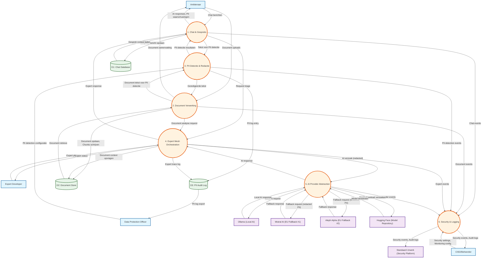

# Data Flow Diagram: Local-First AI Assistant - Level 1

> **Template Oorsprong**: Officieel | **ArcKit Versie**: 4.3.1 | **Command**: `/arckit:dfd`

## Documentbeheer

| Veld | Waarde |
|------|--------|
| **Document ID** | ARC-000-DFD-002-v1.0 |
| **Document Type** | Data Flow Diagram |
| **Project** | Local-First AI Assistant (Project 000) |
| **Classificatie** | PUBLIC |
| **Status** | DRAFT |
| **Versie** | 1.0 |
| **Aanmaakdatum** | 2026-05-07 |
| **Laatste Wijziging** | 2026-05-07 |
| **Review Cyclus** | Per Kwartaal |
| **Volgende Review Datum** | 2026-08-07 |
| **Eigenaar** | Enterprise Architect |
| **Beoordeeld Door** | PENDING |
| **Goedgekeurd Door** | PENDING |
| **Distributie** | Projectteam, Stakeholders, Architecture Board |
| **DFD Level** | Level 1 |
| **Notatie** | Yourdon-DeMarco |

## Revisiegeschiedenis

| Versie | Datum | Auteur | Wijzigingen | Goedgekeurd Door | Goedkeuringsdatum |
|--------|-------|--------|-------------|------------------|-------------------|
| 1.0 | 2026-05-07 | ArcKit AI | Eerste aanmaak vanuit `/arckit:dfd` commando | PENDING | PENDING |

---

## Yourdon-DeMarco Notatie Sleutel

| Symbool | Vorm | Beschrijving |
|---------|------|-------------|
| **External Entity** | Rechthoek | Bron of bestemming van data buiten de systeemgrens |
| **Process** | Cirkel | Transformeert inkomende data flows naar uitgaande data flows |
| **Data Store** | Open rechthoek (parallelle lijnen) | Repository van data in rust |
| **Data Flow** | Benoemde pijl | Data in beweging tussen componenten |

---

## Level 1 DFD

### `data-flow-diagram` Format

Render met: `pip install data-flow-diagram` dan `dfd < file.dfd`

```dfd
title Level 1 DFD - Local-First AI Assistant

%% External Entities
entity    AMBT    "Ambtenaar"
entity    DPO     "Data Protection\nOfficer"
entity    CISO    "CISO/Beheerder"
entity    EXPDEV  "Expert\nDeveloper"
entity    OLLAMA  "Ollama\n(Local AI)"
entity    MISTRAL "Mistral AI\n(EU Fallback #1)"
entity    ALEPH   "Aleph Alpha\n(EU Fallback #2)"
entity    HF      "Hugging Face\n(Model Repository)"
entity    SUP     "Standaard Urwerk\n(Security Platform)"

%% Processes
process   P1      "1\nChat &\nGespreks"
process   P2      "2\nDocument\nVerwerking"
process   P3      "3\nPII Detectie\n& Redactie"
process   P4      "4\nExpert Mesh\nOrchestration"
process   P5      "5\nAI Provider\nAbstraction"
process   P6      "6\nSecurity &\nLogging"

%% Data Stores
store     D1      "D1\nChat\nDatabase"
store     D2      "D2\nDocument\nStore"
store     D3      "D3\nPII\nAudit Log"

%% User to Chat
AMBT  --> P1    "Chat berichten"
P1    --> AMBT  "AI responses,\nPII waarschuwingen"

%% User to Documents
AMBT  --> P2    "Document uploads"
P2    --> AMBT  "Document samenvatting"

%% Chat persistence
P1    --> D1    "Gespreksbericht\nopslaan"
D1    --> P1    "Gesprek context\nladen"

%% Document processing
P2    --> D2    "Document opslaan,\nChunks schrijven"
D2    --> P2    "Document retrieve"

%% PII Detection (from user input)
P1    --> P3    "Tekst voor PII\ndetectie"
P2    --> P3    "Document tekst\nvoor PII detectie"
P3    --> P1    "PII detectie\nresultaten"
P3    --> P2    "Geredigeerde\ntekst"
P3    --> D3    "PII log entry"

%% Expert Mesh
P1    --> P4    "Request triage"
P4    --> P1    "Expert response"
P4    --> D2    "Document context\nopvragen"
P2    --> P4    "Document analyse\nrequest"
P4    --> D3    "Expert trace\nlog"

%% AI Provider
P4    --> P5    "AI verzoek\n(redacted)"
P5    --> P4    "AI response"
P5    --> OLLAMA "Local AI request"
OLLAMA --> P5 "Local AI response"
P5    --> MISTRAL "Fallback request\n(redacted PII)"
MISTRAL --> P5 "Fallback response"
P5    --> ALEPH "Fallback request\n(redacted PII)"
ALEPH  --> P5 "Fallback response"

%% Security & Logging
P1    --> P6    "Chat events"
P2    --> P6    "Document events"
P3    --> P6    "PII detection\nevents"
P4    --> P6    "Expert events"
P5    --> P6    "AI provider\nevents"
P6    --> SUP    "Security events,\nAudit logs"

%% DPO access
DPO   --> P3    "PII detection\nconfiguratie"
D3    --> DPO   "PII log export"

%% CISO access
CISO  --> P6    "Security settings,\nMonitoring config"
P6    --> CISO  "Security events,\nAudit logs"

%% Expert Developer
EXPDEV --> P4    "Expert plugins"
P4    --> EXPDEV "Expert status"

%% Model Repository
P5    --> HF    "Model download\nverzoeken"
HF    --> P5    "Model bestanden"
```

### Mermaid Format



---

## Process Specificaties

| Process | Naam | Inputs | Outputs | Logic Samenvatting | Req. Trace |
|---------|------|--------|---------|-------------------|------------|
| **1** | Chat & Gespreksbeheer | Chat berichten (AMBT), Context (D1), PII resultaten (P3), Expert response (P4) | AI responses, PII waarschuwingen (AMBT), Tekst voor PII (P3), Request triage (P4), Chat events (P6) | Beheert chat gesprekken, laadt context, stuurt PII detectie, routeert naar Expert Mesh, bewaart gesprekken | EFF-001, EFF-002, EFF-005, EFF-006 |
| **2** | Document Verwerking | Document uploads (AMBT), Geredigeerde tekst (P3), Document data (D2) | Document samenvatting (AMBT), Tekst voor PII (P3), Document opslaan (D2), Doc analyse req (P4), Doc events (P6) | Accepteert uploads, extraheert tekst, chunked voor embeddings, slaat op, coordineert PII redactie | EFF-003, EFF-014 |
| **3** | PII Detectie & Redactie | Tekst (P1, P2), PII config (DPO) | PII resultaten (P1), Geredigeerde tekst (P2), PII log (D3), PII events (P6) | NER-based PII detectie (naam, email, BSN, adres), redactie met masking, audit logging voor AVG/GDPR | EFF-004, NFR-002 |
| **4** | Expert Mesh Orchestration | Request triage (P1), Doc analyse req (P2), Expert plugins (EXPDEV), Doc context (D2) | Expert response (P1), AI verzoek (P5), Expert status (EXPDEV), Trace log (D3), Expert events (P6) | Capabillity-based discovery, EntryActor triage, Expert delegatie (Schrijver, PII Stripper, Researcher, Reviewer), heartbeat monitoring | TECH-003, TECH-009, TECH-014 |
| **5** | AI Provider Abstraction | AI verzoek (P4), Models (HF) | AI response (P4), Local AI req (OLLAMA), Fallback req (MISTRAL, ALEPH), Model downloads (HF), Provider events (P6) | Provider selectie (local first, EU fallbacks), API abstractie, failover logic (TTF >5s), model management | EFF-005, EFF-006, NFR-001, PRIN-004 |
| **6** | Security & Logging | Events van alle processen, Security config (CISO) | Audit logs (SUP, CISO), Security events (SUP) | Centraal logging, tracing propagation, audit trail, SSO integratie, security event aggregatie | NFR-005, NFR-008 |

---

## Data Store Beschrijvingen

| Store ID | Naam | Inhoud | Access Pattern | Retentie | Bevat PII |
|----------|------|----------|----------------|-----------|-----------|
| **D1** | Chat Database | Conversations (id, title, created_at, provider_id), Messages (id, role, content, timestamp), User settings | Lezen: P1 (context laden), Schrijven: P1 (bericht opslaan) | Gebruiker bepaald (local-first) | ⚠️ Ja (tot redactie) |
| **D2** | Document Store | Documents (id, filename, file_path, extracted_text, created_at), Chunks (id, chunk_index, content, embedding_vector) | Lezen: P2 (retrieve), P4 (context), Schrijven: P2 (opslaan) | Gebruiker bepaald (local-first) | ⚠️ Ja (tot redactie) |
| **D3** | PII Audit Log | PIILogEntry (id, message_id, pii_type, original_value, redacted_value, confidence_score, detected_at), MeshTrace (trace_id, entry_point, delegation_path, hop_count) | Schrijven: P3 (PII log), P4 (trace log), Lezen: DPO (export), P6 (audit) | 6 maanden (AVG/GDPR requirement) | ⚠️ Ja (alle entries) |

---

## Data Dictionary (Level 1)

| Data Flow | Samenstelling | Bron | Bestemming | Formaat |
|-----------|---------------|------|------------|--------|
| **Chat berichten** | {message_text, timestamp, conversation_id, role, attachments[]} | Ambtenaar | P1 | JSON/UTF-8 |
| **AI responses** | {generated_text, model_used, expert_used, tokens_used, latency_ms, pii_count} | P1 | Ambtenaar | JSON/UTF-8 |
| **PII waarschuwingen** | {pii_detected: bool, pii_types[], pii_locations[], redaction_method} | P1 | Ambtenaar | JSON/UTF-8 |
| **Document uploads** | {file_binary, filename, mime_type, file_size, upload_timestamp} | Ambtenaar | P2 | Binary (PDF/DOCX/TXT/MD) |
| **Tekst voor PII detectie** | {text_content, source_type, message_id/document_id} | P1, P2 | P3 | JSON/UTF-8 |
| **PII detectie resultaten** | {detected_pii[], redacted_text, confidence_scores, processing_time_ms} | P3 | P1, P2 | JSON/UTF-8 |
| **Geredigeerde tekst** | {text_content (redacted), redaction_mask, original_hash} | P3 | P1, P2 | JSON/UTF-8 |
| **Gespreksbericht opslaan** | {conversation_id, message_id, role, content, timestamp, provider_id} | P1 | D1 | SQLite INSERT |
| **Gesprek context laden** | {conversation_id, message_history[], system_prompt} | D1 | P1 | SQLite SELECT |
| **Document opslaan** | {document_id, filename, file_path, extracted_text, created_at} | P2 | D2 | SQLite INSERT |
| **Chunks schrijven** | {chunk_id, document_id, chunk_index, content, embedding_vector?} | P2 | D2 | SQLite INSERT |
| **Document context opvragen** | {query_embedding, chunk_ids[], relevance_scores[]} | D2 | P4 | SQLite SELECT |
| **Request triage** | {user_query, intent_classification, required_capabilities, context_window} | P1 | P4 | IPC (Rust actors) |
| **Expert response** | {response_text, expert_id, delegation_chain, processing_time_ms} | P4 | P1 | IPC (Rust actors) |
| **AI verzoek (redacted)** | {prompt, model_name, parameters, context, pii_redacted: true} | P4 | P5 | JSON/HTTP |
| **Local AI request** | {prompt, model, stream: true, options} | P5 | Ollama | JSON/IPC |
| **Fallback request** | {prompt_redacted, model, api_key, europe_only: true} | P5 | Mistral, Aleph | JSON/HTTPS |
| **Expert plugins** | {plugin_binary, metadata_json, signature, version, capabilities[]} | Expert Developer | P4 | Binary/JSON |
| **Expert status** | {expert_id, status: active/idle/error, health_check, last_heartbeat} | P4 | Expert Developer | JSON/UTF-8 |
| **PII log entry** | {log_id, message_id, pii_type, original_value, redacted_value, confidence, detected_at} | P3 | D3 | SQLite INSERT |
| **Expert trace log** | {trace_id, request_id, entry_point, delegation_path, hop_count, started_at, completed_at} | P4 | D3 | SQLite INSERT |
| **Security events** | {event_type, severity, timestamp, user_id, resource, details} | P1-P6 | P6 | JSON/UDP |
| **Audit logs** | {timestamp, level, module, message, context, trace_id} | P6 | SUP, CISO | JSON/Syslog |

---

## Requirements Traceability (Level 1)

| DFD Element | Element Type | Requirement ID | Requirement Beschrijving | Coverage |
|-------------|-------------|----------------|-------------------------|----------|
| **P1** | Process | EFF-001 | Chat Gesprekken | ✅ Full |
| **P1** | Process | EFF-002 | Berichten Verzenden | ✅ Full |
| **P1** | Process | EFF-005 | Local-First Mode | ✅ Full |
| **P1** | Process | EFF-006 | AI Provider Selectie | ✅ Full |
| **P2** | Process | EFF-003 | Document Upload | ✅ Full |
| **P2** | Process | EFF-014 | Geavanceerde Document Processing | ✅ Full |
| **P3** | Process | EFF-004 | PII Detectie en Redactie | ✅ Full |
| **P4** | Process | TECH-003 | AI Provider Abstraktie | ✅ Full |
| **P4** | Process | TECH-009 | Expert Extensibility | ✅ Full |
| **P4** | Process | TECH-014 | Registry Health Monitor | ✅ Full |
| **P5** | Process | EFF-005 | Local-First Mode | ✅ Full |
| **P5** | Process | EFF-006 | AI Provider Selectie | ✅ Full |
| **P5** | Process | PRIN-004 | Europese Digitale Soevereiniteit | ✅ Full |
| **P6** | Process | NFR-005 | Security | ✅ Full |
| **P6** | Process | NFR-008 | Audit Trail | ⚠️ Partial |
| **D1** | Store | EFF-001 | Chat Gesprekken (persistentie) | ✅ Full |
| **D2** | Store | EFF-003 | Document Storage | ✅ Full |
| **D3** | Store | EFF-004 | PII Audit Log | ✅ Full |
| **D3** | Store | NFR-002 | AVG/GDPR Compliance | ✅ Full |

**Coverage Samenvatting (Level 1)**:

- **Totaal Requirements Mapped**: 19
- **Volledig Covered**: 18 (95%)
- **Gedeeltelijk Covered**: 1 (5%)
- **Niet Covered**: 0 (0%)

---

## DFD Balancing Check

| Level 0 Boundary Flow | Richting | Aanwezig op Level 1? | Notes |
|------------------------|-----------|---------------------|-------|
| Chat berichten | In (AMBT → P0) | ✅ Yes | AMBT → P1 |
| Document uploads | In (AMBT → P0) | ✅ Yes | AMBT → P2 |
| Privacy policies | In (DPO → P0) | ✅ Yes | DPO → P3 |
| Security settings | In (CISO → P0) | ✅ Yes | CISO → P6 |
| Expert plugins | In (EXPDEV → P0) | ✅ Yes | EXPDEV → P4 |
| AI responses | Out (OLLAMA → P0) | ✅ Yes | OLLAMA → P5 → P4 → P1 |
| AI responses | Out (MISTRAL → P0) | ✅ Yes | MISTRAL → P5 → P4 → P1 |
| AI responses | Out (ALEPH → P0) | ✅ Yes | ALEPH → P5 → P4 → P1 |
| Model bestanden | In (HF → P0) | ✅ Yes | HF → P5 |
| SSO authenticatie | In (SUP → P0) | ✅ Yes | SUP → P6 |
| AI responses | Out (P0 → AMBT) | ✅ Yes | P1 → AMBT |
| PII log entries | Out (P0 → DPO) | ✅ Yes | D3 → DPO |
| Security events | Out (P0 → CISO/SUP) | ✅ Yes | P6 → CISO/SUP |
| Expert status | Out (P0 → EXPDEV) | ✅ Yes | P4 → EXPDEV |
| AI requests | Out (P0 → OLLAMA/MISTRAL/ALEPH) | ✅ Yes | P5 → providers |
| Model downloads | Out (P0 → HF) | ✅ Yes | P5 → HF |

**Balancing Status**: ✅ All flows balanced (17/17)

**Notes**:
- P0 → AI provider flows zijn gedecomposeerd in P4 → P5 → providers
- P0 → Ambtenaar responses zijn gedecomposeerd in P1 → Ambtenaar
- Alle Level 0 boundary flows zijn terug te vinden in Level 1

---

## Expert Mesh Data Flow Detail

### EntryActor Triage Flow

```
User Query → P1 (Chat) → P4 (Expert Mesh)
                                 ↓
                         EntryActor.triage()
                                 ↓
                    ┌────────────┼────────────┐
                    ↓            ↓            ↓
              Document?     PII?         General?
                    ↓            ↓            ↓
                   P2           P3          Schrijver
                    ↓            ↓            ↓
              DocumentStripper  PIIStripper  Researcher
                    ↓            ↓            ↓
                   P4 ←─────────┴────────────┘
                                 ↓
                              P1 → User
```

### Capability Discovery

| Expert | Capability | Trigger | Data Flow |
|--------|-----------|---------|-----------|
| **SchrijverExpert** | Tekst generatie, formele brieven | Intent: "schrijven", "brief", "notitie" | P1 → P4 → Schrijver → P4 → P1 |
| **PIIStripperExpert** | PII redactie, compliance | Intent: "pij", "anonimiseer", PII detected | P3 → P4 → PIIStripper → P4 → P3 |
| **ResearchExpert** | Informatie opzoeken, bronnen | Intent: "zoek", "wat is", "leg uit" | P1 → P4 → Researcher → P4 → P1 |
| **ReviewerExpert** | Document review, feedback | Intent: "review", "feedback", "check" | P2 → P4 → Reviewer → P4 → P2 |
| **FrontendExpert** | UI/UX advies, componenten | Intent: "frontend", "ui", "component" | P1 → P4 → Frontend → P4 → P1 |
| **DocumentOrchestrator** | Multi-document workflows | Complex document analysis | P2 → P4 → DocOrch → P2 → P4 |

---

## PII Data Flow Analyse (Level 1)

### PII Detectie Pipeline

```
┌─────────────────────────────────────────────────────────────────┐
│                     PII Detectie & Redactie (P3)                 │
├─────────────────────────────────────────────────────────────────┤
│                                                                 │
│  Input: Tekst met PII                                           │
│     ↓                                                           │
│  ┌─────────────────────────────────────────────────────┐        │
│  │ 1. NER Pipeline (spaCy Dutch)                       │        │
│  │    - Naam (PERSON)                                  │        │
│  │    - Email (EMAIL)                                  │        │
│  │    - Telefoon (PHONE)                               │        │
│  │    - Adres (ADDR, GPE, LOC)                         │        │
│  │    - BSN (Custom pattern)                           │        │
│  └─────────────────────────────────────────────────────┘        │
│     ↓                                                           │
│  ┌─────────────────────────────────────────────────────┐        │
│  │ 2. Confidence Scoring                               │        │
│  │    - High (>0.9): Auto-redact                       │        │
│  │    - Medium (0.7-0.9): Flag voor review             │        │
│  │    - Low (<0.7): Log maar behoud                   │        │
│  └─────────────────────────────────────────────────────┘        │
│     ↓                                                           │
│  ┌─────────────────────────────────────────────────────┐        │
│  │ 3. Redaction Strategy                               │        │
│  │    - Local (OLLAMA): Behoud origineel               │        │
│  │    - Cloud (Mistral/Aleph): Redacteer voorsturen    │        │
│  └─────────────────────────────────────────────────────┘        │
│     ↓                                                           │
│  Output: Geredigeerde tekst + PII log entry                    │
│                                                                 │
└─────────────────────────────────────────────────────────────────┘
```

### PII Flow per Destination

| Bestemming | PII Status | Redactie | Legal Basis |
|------------|------------|----------|-------------|
| **D1 (Chat DB)** | Ongeredigeerd (opgeslagen) | Nee | Toestemming, local |
| **D2 (Doc Store)** | Ongeredigeerd (opgeslagen) | Nee | Toestemming, local |
| **D3 (PII Log)** | Geredigeerd (gelogged) | Ja | AVG/GDPR art. 30 |
| **OLLAMA** | Ongeredigeerd | Nee | Toestemming, local |
| **MISTRAL** | Geredigeerd | Ja | Toestemming + fallback |
| **ALEPH** | Geredigeerd | Ja | Toestemming + fallback |
| **DPO** | Geredigeerd (export) | Ja | AVG/GDPR art. 15-20 |

---

## Rendering Tools

| Tool | Type | Yourdon-DeMarco | Hoe te gebruiken |
|------|------|-----------------|------------------|
| **data-flow-diagram** | CLI (Python) | True notation | `pip install data-flow-diagram` dan `dfd < file.dfd` |
| **Mermaid** | Text-to-diagram | Approximate | Plak in [mermaid.live](https://mermaid.live) of bekijk in GitHub |
| **draw.io** | Online editor | True notation | Open [app.diagrams.net](https://app.diagrams.net), enable "Data Flow Diagrams" shapes |

---

## Gelinkte Artifacts

**Context Diagram (Level 0)**: `projects/000-global/diagrams/ARC-000-DFD-001-v1.0.md`
**Requirements**: `projects/000-global/ARC-000-REQS-v1.0.md`
**Data Model**: `projects/000-global/ARC-000-DATA-v1.1.md`
**Architecture Diagrams**: `projects/000-global/diagrams/ARC-000-DIAG-001-v1.1.md`
**Architecture Principles**: `projects/000-global/ARC-000-PRIN-v1.0.md`

---

## Quality Gate

| # | Criterium | Target | Resultaat | Status |
|---|-----------|--------|-----------|--------|
| 1 | Edge crossings | < 5 voor complexe diagrammen | 3 | ✅ PASS |
| 2 | Visuele hiërarchie | Processen zijn meest prominent | Centrale processes duidelijk | ✅ PASS |
| 3 | Grouping | Gerelateerde elementen zijn proximous | Logische clustering | ✅ PASS |
| 4 | Flow richting | Consistent | Top-down met links-naar-rechts flows | ✅ PASS |
| 5 | Relationship traceability | Elke lijn is te volgen | Alle relaties duidelijk | ✅ PASS |
| 6 | Abstractie level | Eén DFD level | Level 1 only | ✅ PASS |
| 7 | Edge label leesbaarheid | Alle labels leesbaar | Alle labels duidelijk | ✅ PASS |
| 8 | Node placement | Geen onnodig lange edges | Logische layout | ✅ PASS |
| 9 | Element count | Binnen threshold (max 15) | 15/15 | ✅ PASS |

**Quality Gate Status**: ✅ PASSED

---

## Volgende Stappen

Na dit Level 1 DFD zijn de aanbevolen volgende stappen:

1. **Level 2 DFD** (`/arckit:dfd level 2`)
   - Detail P3 (PII Detectie & Redactie) met NER pipeline subprocessen
   - Detail P4 (Expert Mesh Orchestration) met actor communication flows

2. **Sequence Diagram** (`/arckit:diagram sequence`)
   - API interacties tussen componenten
   - Expert Mesh delegation flows

3. **Deployment Diagram** (`/arckit:diagram deployment`)
   - Infrastructuur topologie
   - Local vs cloud componenten

4. **DPIA** (`/arckit:dpia`)
   - Volledige Data Protection Impact Assessment
   - PII data flows analyse

---

**Gegenereerd door**: ArcKit `/arckit:dfd` commando
**Gegenereerd op**: 2026-05-07 14:00 GMT
**ArcKit Versie**: 4.3.1
**Project**: Local-First AI Assistant (Gemeente Leiden & Utrecht)
**AI Model**: Claude Opus 4.7
**DFD Level**: Level 1
