# Data Flow Diagram: Local-First AI Assistant - Expert Mesh (Level 2)

> **Template Oorsprong**: Officieel | **ArcKit Versie**: 4.3.1 | **Command**: `/arckit:dfd`

## Documentbeheer

| Veld | Waarde |
|------|--------|
| **Document ID** | ARC-000-DFD-003-v1.0 |
| **Document Type** | Data Flow Diagram |
| **Project** | Local-First AI Assistant (Project 000) |
| **Classificatie** | PUBLIC |
| **Status** | DRAFT |
| **Versie** | 1.0 |
| **Aanmaakdatum** | 2026-05-07 |
| **Laatste Wijziging** | 2026-05-07 |
| **Review Cyclus** | Per Kwartaal |
| **Volgende Review Datum** | 2026-08-07 |
| **Eigenaar** | Enterprise Architect |
| **Beoordeeld Door** | PENDING |
| **Goedgekeurd Door** | PENDING |
| **Distributie** | Projectteam, Stakeholders, Architecture Board |
| **DFD Level** | Level 2 (Expert Mesh Detail) |
| **Parent Process** | P4 - Expert Mesh Orchestration |
| **Notatie** | Yourdon-DeMarco |

## Revisiegeschiedenis

| Versie | Datum | Auteur | Wijzigingen | Goedgekeurd Door | Goedkeuringsdatum |
|--------|-------|--------|-------------|------------------|-------------------|
| 1.0 | 2026-05-07 | ArcKit AI | Eerste aanmaak Level 2 DFD voor Expert Mesh | PENDING | PENDING |

---

## Yourdon-DeMarco Notatie Sleutel

| Symbool | Vorm | Beschrijving |
|---------|------|-------------|
| **External Entity** | Rechthoek | Bron of bestemming van data buiten de systeemgrens |
| **Process** | Cirkel | Transformeert inkomende data flows naar uitgaande data flows |
| **Data Store** | Open rechthoek (parallelle lijnen) | Repository van data in rust |
| **Data Flow** | Benoemde pijl | Data in beweging tussen componenten |

---

## Level 2 DFD: Expert Mesh Orchestration (P4)

### Overzicht

Dit diagram detailleert proces **P4: Expert Mesh Orchestration** uit het Level 1 DFD. Het toont de interne architectuur van het Expert Mesh systeem, inclusief:
- **EntryActor** (P4.1): Ingangspunt en triage
- **RegistryActor** (P4.2): Expert discovery en health monitoring
- **Expert Actors** (P4.3-P4.9): Gespecialiseerde experts
- **Capability-based routing**: Dynamische routing op basis van expert capaciteiten

### `data-flow-diagram` Format

Render met: `pip install data-flow-diagram` dan `dfd < file.dfd`

```dfd
title Level 2 DFD - Expert Mesh Orchestration

%% External Entities (from Level 1 context)
entity    AMBT    "Ambtenaar"
entity    EXPDEV  "Expert\\nDeveloper"
entity    P5      "P5: AI Provider\\nAbstraction"

%% Internal Data Stores
store     D2      "D2\\nDocument\\nStore"
store     D3      "D3\\nPII\\nAudit Log"

%% Processes - Entry & Registry
process   P41     "4.1\\nEntry Actor\\n(Triage)"
process   P42     "4.2\\nRegistry Actor\\n(Discovery)"

%% Processes - Expert Actors
process   P43     "4.3\\nResearch\\nExpert"
process   P44     "4.4\\nSchrijver\\nExpert"
process   P45     "4.5\\nFrontend\\nExpert"
process   P46     "4.6\\nRust\\nExpert"
process   P47     "4.7\\nPII Stripper\\nExpert"
process   P48     "4.8\\nReviewer\\nExpert"
process   P49     "4.9\\nDocument\\nOrchestrator"

%% User request enters mesh
AMBT  --> P41   "User query,\\nContext"
P41   --> AMBT  "Expert response"

%% Expert Developer manages experts
EXPDEV --> P41  "Expert plugins,\\nCapabilities"
EXPDEV --> P43  "Research config"
EXPDEV --> P44  "Writing templates"
EXPDEV --> P45  "Frontend patterns"
EXPDEV --> P46  "Rust patterns"

%% Registry manages expert discovery
P43 --> P42   "Register capability"
P44 --> P42   "Register capability"
P45 --> P42   "Register capability"
P46 --> P42   "Register capability"
P47 --> P42   "Register capability"
P48 --> P42   "Register capability"
P49 --> P42   "Register capability"

P43 --> P42   "Heartbeat"
P44 --> P42   "Heartbeat"
P45 --> P42   "Heartbeat"
P46 --> P42   "Heartbeat"
P47 --> P42   "Heartbeat"
P48 --> P42   "Heartbeat"
P49 --> P42   "Heartbeat"

%% Entry Actor queries registry
P41   --> P42  "Resolve capability\\n(research/frontend/rust/etc)"
P42   --> P41  "Expert actor ref"

%% Entry Actor routes to experts
P41   --> P43  "Research request\\n(HTTP URLs)"
P41   --> P44  "Writing request\\n(Draft content)"
P41   --> P45  "Frontend request\\n(UI/React)"
P41   --> P46  "Rust request\\n(Memory/Wasm)"
P41   --> P47  "PII request\\n(Anonymize)"
P41   --> P48  "Review request\\n(Critique)"
P41   --> P49  "Document pipeline\\n(URL + intent)"

%% Expert responses back to Entry
P43   --> P41  "Research results"
P44   --> P41  "Generated content"
P45   --> P41  "Frontend code"
P46   --> P41  "Rust guidance"
P47   --> P41  "Redacted data"
P48   --> P41  "Review feedback"
P49   --> P41  "Document output"

%% Expert to AI Provider (P5)
P43   --> P5   "AI request"
P44   --> P5   "AI request"
P45   --> P5   "AI request"
P46   --> P5   "AI request"
P47   --> P5   "AI request"
P48   --> P5   "AI request"
P49   --> P5   "AI request"

P5    --> P43  "AI response"
P5    --> P44  "AI response"
P5    --> P45  "AI response"
P5    --> P46  "AI response"
P5    --> P47  "AI response"
P5    --> P48  "AI response"
P5    --> P49  "AI response"

%% Expert to Document Store
P49   --> D2   "Store document"
P43   --> D2   "Cache research"
P49   --> D2   "Load chunks"

%% Expert to PII Audit Log
P41   --> D3   "Trace log"
P47   --> D3   "PII detection log"

%% Expert delegation (peer-to-peer)
P43   --> P44  "Delegate content creation"
P43   --> P47  "Delegate PII stripping"
P49   --> P44  "Delegate writing"
P49   --> P48  "Delegate review"
P49   --> P47  "Delegate PII check"
```

### Mermaid Format

```mermaid
flowchart TB
    %% External Entities
    AMBT["Ambtenaar"]
    EXPDEV["Expert Developer"]
    P5["P5: AI Provider"]

    %% Data Stores
    D2[("D2: Document Store")]
    D3[("D3: PII Audit Log")]

    %% Processes - Core Mesh
    P41(("4.1 Entry Actor<br/>(Triage)"))
    P42(("4.2 Registry Actor<br/>(Discovery)"))

    %% Processes - Experts
    P43(("4.3 Research<br/>Expert"))
    P44(("4.4 Schrijver<br/>Expert"))
    P45(("4.5 Frontend<br/>Expert"))
    P46(("4.6 Rust<br/>Expert"))
    P47(("4.7 PII Stripper<br/>Expert"))
    P48(("4.8 Reviewer<br/>Expert"))
    P49(("4.9 Document<br/>Orchestrator"))

    %% User to Entry
    AMBT -->|"User query, Context"| P41
    P41 -->|"Expert response"| AMBT

    %% Expert Developer management
    EXPDEV -->|"Expert plugins, Capabilities"| P41
    EXPDEV -->|"Research config"| P43
    EXPDEV -->|"Writing templates"| P44
    EXPDEV -->|"Frontend patterns"| P45
    EXPDEV -->|"Rust patterns"| P46

    %% Registry flows
    P43 -->|"Register capability"| P42
    P44 -->|"Register capability"| P42
    P45 -->|"Register capability"| P42
    P46 -->|"Register capability"| P42
    P47 -->|"Register capability"| P42
    P48 -->|"Register capability"| P42
    P49 -->|"Register capability"| P42

    P43 -.->|"Heartbeat"| P42
    P44 -.->|"Heartbeat"| P42
    P45 -.->|"Heartbeat"| P42
    P46 -.->|"Heartbeat"| P42
    P47 -.->|"Heartbeat"| P42
    P48 -.->|"Heartbeat"| P42
    P49 -.->|"Heartbeat"| P42

    %% Discovery
    P41 -->|"Resolve capability"| P42
    P42 -->|"Expert ref"| P41

    %% Routing to experts
    P41 -->|"Research request"| P43
    P41 -->|"Writing request"| P44
    P41 -->|"Frontend request"| P45
    P41 -->|"Rust request"| P46
    P41 -->|"PII request"| P47
    P41 -->|"Review request"| P48
    P41 -->|"Document pipeline"| P49

    %% Expert responses
    P43 -->|"Research results"| P41
    P44 -->|"Generated content"| P41
    P45 -->|"Frontend code"| P41
    P46 -->|"Rust guidance"| P41
    P47 -->|"Redacted data"| P41
    P48 -->|"Review feedback"| P41
    P49 -->|"Document output"| P41

    %% AI Provider integration
    P43 -->|"AI request"| P5
    P44 -->|"AI request"| P5
    P45 -->|"AI request"| P5
    P46 -->|"AI request"| P5
    P47 -->|"AI request"| P5
    P48 -->|"AI request"| P5
    P49 -->|"AI request"| P5

    P5 -->|"AI response"| P43
    P5 -->|"AI response"| P44
    P5 -->|"AI response"| P45
    P5 -->|"AI response"| P46
    P5 -->|"AI response"| P47
    P5 -->|"AI response"| P48
    P5 -->|"AI response"| P49

    %% Data Store access
    P49 -->|"Store document"| D2
    P43 -->|"Cache research"| D2
    P49 -->|"Load chunks"| D2

    P41 -->|"Trace log"| D3
    P47 -->|"PII detection log"| D3

    %% Expert delegation
    P43 -->|"Delegate content"| P44
    P43 -->|"Delegate PII strip"| P47
    P49 -->|"Delegate writing"| P44
    P49 -->|"Delegate review"| P48
    P49 -->|"Delegate PII check"| P47

    %% Styling
    classDef entity fill:#e1f5fe,stroke:#01579b,stroke-width:2px
    classDef process fill:#fff3e0,stroke:#e65100,stroke-width:3px
    classDef registry fill:#fce4ec,stroke:#880e4f,stroke-width:3px
    classDef store fill:#e8f5e9,stroke:#1b5e20,stroke-width:2px

    class AMBT,EXPDEV,P5 entity
    class P41,P43,P44,P45,P46,P47,P48,P49 process
    class P42 registry
    class D2,D3 store
```



---

## Proces Specificaties (Level 2)

| Process | Naam | Inputs | Outputs | Logic Samenvatting | Req. Trace |
|---------|------|--------|---------|-------------------|------------|
| **4.1** | Entry Actor (Triage) | User query (AMBT), Expert ref (P42), Responses (P4.3-4.9) | Expert response (AMBT), Requests (P4.3-4.9), Resolve cap (P42), Trace log (D3) | Analyseert query, bepaalt intent (URL→research, write→schrijver, etc.), resolvet experts via Registry, routeert werk, beheert timeouts (60s), onderhoudt pending requests map | TECH-009, TECH-014 |
| **4.2** | Registry Actor (Discovery) | Register req (P4.3-4.9), Heartbeats (P4.3-4.9), Resolve req (P4.1) | Expert refs (P4.1) | Onderhoudt capability→experts mapping, health monitoring (30s timeout), cleanup stale actors, heartbeat tracking | TECH-009, TECH-012 |
| **4.3** | Research Expert | Request (P4.1), AI response (P5), Config (EXPDEV), Delegate req (P4.1) | Research results (P4.1), Register (P42), Heartbeat (P42), AI req (P5) | HTTP URL scraping/extraction, content fetch, onderzoek van externe bronnen, delegateert naar Schrijver/PII Stripper | TECH-014 |
| **4.4** | Schrijver Expert | Request (P4.1), AI response (P5), Templates (EXPDEV), Delegate req (P4.1, P4.3) | Content (P4.1), Register (P42), Heartbeat (P42), AI req (P5) | Genereert teksten, rapporten, memo's, gebruikt templates, ontvangt delegation van Research/DocumentOrchestrator | TECH-014 |
| **4.5** | Frontend Expert | Request (P4.1), AI response (P5), Patterns (EXPDEV) | Frontend code (P4.1), Register (P42), Heartbeat (P42), AI req (P5) | UI/React component advies, frontend patterns, HTML/CSS/JavaScript generatie | TECH-014 |
| **4.6** | Rust Expert | Request (P4.1), AI response (P5), Patterns (EXPDEV) | Rust guidance (P4.1), Register (P42), Heartbeat (P42), AI req (P5) | Memory management, Wasm, threading advies, Rust-specifieke code analyse | TECH-014 |
| **4.7** | PII Stripper Expert | Request (P4.1), AI response (P5), Delegate req (P4.1, P4.3) | Redacted data (P4.1), Register (P42), Heartbeat (P42), AI req (P5), PII log (D3) | NER-based PII detectie, data redactie/anonimisatie, ontvangt delegation van Research/DocumentOrchestrator, logt PII events | EFF-004, TECH-008 |
| **4.8** | Reviewer Expert | Request (P4.1), AI response (P5), Delegate req (P4.9) | Review feedback (P4.1), Register (P42), Heartbeat (P42), AI req (P5) | Document critique, annotaties, verbeter suggesties, ontvangt delegation van DocumentOrchestrator | TECH-014 |
| **4.9** | Document Orchestrator | Request (P4.1), AI response (P5), Doc data (D2), Delegate req (P4.1) | Document output (P4.1), Register (P42), Heartbeat (P42), AI req (P5), Store doc (D2), Load chunks (D2) | Multi-step document workflow: fetch URLs → PII strip → Schrijver → Reviewer, coördineert expert delegatie keten | EFF-014, TECH-014 |

---

## Data Store Beschrijvingen (Level 2)

| Store ID | Naam | Inhoud | Access Pattern | Retentie | Bevat PII |
|----------|------|----------|----------------|-----------|-----------|
| **D2** | Document Store | Documents, Chunks, Embeddings | Schrijven: P4.9 (opslaan), Lezen: P4.3 (cache), P4.9 (chunks) | Gebruiker bepaald | ⚠️ Ja (tot redactie) |
| **D3** | PII Audit Log | Trace entries (EntryActor), PII detections (PIIStripper) | Schrijven: P4.1 (traces), P4.7 (PII log), Lezen: DPO (export) | 6 maanden | ⚠️ Ja |

---

## Data Dictionary (Level 2 - Expert Mesh)

| Data Flow | Samenstelling | Bron | Bestemming | Formaat |
|-----------|---------------|------|------------|--------|
| **User query, Context** | {query_text, conversation_id, session_id, user_id} | Ambtenaar | P4.1 | JSON |
| **Expert response** | {response_text, expert_id, trace_id, delegation_chain, processing_time_ms} | P4.1 | Ambtenaar | JSON |
| **Resolve capability** | {capability: "research/frontend/rust/etc", max_results: 5} | P4.1 | P4.2 | IPC (Rust actors) |
| **Expert ref** | {actor_id, capability, health_status, last_heartbeat} | P4.2 | P4.1 | ActorRef |
| **Register capability** | {actor_id, capability: string, metadata: {}} | P4.3-P4.9 | P4.2 | IPC |
| **Heartbeat** | {actor_id, timestamp} | P4.3-P4.9 | P4.2 | IPC |
| **Research request** | {urls[], intent, trace_id} | P4.1 | P4.3 | WorkEnvelope |
| **Writing request** | {topic, context, template_id, trace_id} | P4.1 | P4.4 | WorkEnvelope |
| **Frontend request** | {ui_requirement, framework, trace_id} | P4.1 | P4.5 | WorkEnvelope |
| **Rust request** | {code_snippet, question, trace_id} | P4.1 | P4.6 | WorkEnvelope |
| **PII request** | {text_content, redaction_level, trace_id} | P4.1 | P4.7 | WorkEnvelope |
| **Review request** | {document_id, criteria, trace_id} | P4.1/P4.9 | P4.8 | WorkEnvelope |
| **Document pipeline** | {urls[], document_type, intent, trace_id} | P4.1 | P4.9 | WorkEnvelope |
| **Delegate content** | {content, requirements, trace_id} | P4.3, P4.9 | P4.4 | BatonPass |
| **Delegate PII strip** | {text, trace_id} | P4.3, P4.9 | P4.7 | BatonPass |
| **Delegate review** | {document, trace_id} | P4.9 | P4.8 | BatonPass |
| **AI request** | {prompt, model, context, expert_type} | P4.3-P4.9 | P5 | JSON/HTTP |
| **AI response** | {generated_text, tokens_used, model} | P5 | P4.3-P4.9 | JSON |
| **Trace log** | {trace_id, entry_point, expert_chain, hop_count, started_at, completed_at} | P4.1 | D3 | SQLite |
| **PII detection log** | {trace_id, pii_type, original_value, redacted_value, confidence, detected_at} | P4.7 | D3 | SQLite |

---

## Expert Capabilities Mapping

| Expert | Capability String | Triage Keywords | Delegeert Naar |
|--------|-------------------|-----------------|----------------|
| **4.3 Research Expert** | `research` | "research", "scrape", "gather", URL detection | P4.4, P4.7 |
| **4.4 Schrijver Expert** | `write` | "write", "draft", "compose", "schrijf" | - |
| **4.5 Frontend Expert** | `frontend` | "frontend", "ui", "react" | - |
| **4.6 Rust Expert** | `rust` | "rust", "memory", "thread", "wasm" | - |
| **4.7 PII Stripper Expert** | `pii` | "pii", "anonymize", "scrub" | - |
| **4.8 Reviewer Expert** | `review` | "review", "critique", "edit" | - |
| **4.9 Document Orchestrator** | `document` | "document", "create doc", URL + "summarize/report/brief" | P4.4, P4.7, P4.8 |

**Triage Regels (EntryActor P4.1)**:

1. **Document Pipeline**: Als query ≥1 HTTP URL EN intent phrase ("op basis van", "samenvat", "rapport") → `document`
2. **URL zonder output-intent**: Als "wat is/wie is" + URL → `research` (lookup, geen pipeline)
3. **Capability keywords**:
   - "rust" / "memory" / "thread" / "wasm" → `rust`
   - "frontend" / "ui" / "react" → `frontend`
   - "database" / "sql" → `database` (niet geïmplementeerd)
   - "research" / "scrape" / "gather" → `research`
   - "write" / "draft" / "compose" → `write`
   - "pii" / "anonymize" / "scrub" → `pii`
   - "review" / "critique" / "edit" → `review`
   - "document" / "create doc" → `document`
4. **Default**: Als geen match → `general` (gaat naar default LLM)

---

## Expert Delegation Patronen

### Patron 1: Research → Content Generation

```
P4.1 → P4.3: Research request (URLs)
P4.3 → P5: Fetch content
P4.3 → P4.4: Delegate content writing
P4.4 → P5: Generate text
P4.4 → P4.1: Final response
```

**Gebruik voor**: "Schrijf een samenvatting van deze pagina"

### Patron 2: Document Pipeline (Multi-Expert)

```
P4.1 → P4.9: Document pipeline (URLs + intent)
P4.9 → P5: Fetch URLs
P4.9 → P4.7: Delegate PII stripping
P4.7 → P5: Detect/redact PII
P4.9 → P4.4: Delegate writing
P4.4 → P5: Generate content
P4.9 → P4.8: Delegate review
P4.8 → P5: Critique document
P4.9 → P4.1: Final document
```

**Gebruik voor**: "Maak een rapport op basis van deze link"

### Patron 3: PII-First Processing

```
P4.1 → P4.7: PII request (text)
P4.7 → P5: Detect PII
P4.7 → D3: Log PII detections
P4.7 → P4.1: Redacted data
```

**Gebruik voor**: "Anonimiseer deze tekst"

---

## Actor Communication Protocol

### EntryActor (P4.1) Messages

| Message | Van | Richting | Beschrijving |
|---------|----|----------|-------------|
| `EntryMsg::Query` | User/UI | → P4.1 | Nieuwe user query met context |
| `EntryMsg::ExpertResult` | Expert | → P4.1 | Antwoord van expert (eind of tussenstap) |
| `EntryMsg::Timeout` | Internal | → P4.1 | Request timeout (60s default) |
| `RegistryMsg::ResolveCapability` | P4.1 | → P4.2 | Zoek expert voor capability |
| `RegistryMsg::Resolved` | P4.2 | → P4.1 | Expert actor refs |

### RegistryActor (P4.2) Messages

| Message | Van | Richting | Beschrijving |
|---------|----|----------|-------------|
| `RegistryMsg::Register` | Expert | → P4.2 | Registreer capability |
| `RegistryMsg::ResolveCapability` | P4.1 | → P4.2 | Zoek experts voor capability |
| `RegistryMsg::Heartbeat` | Expert | → P4.2 | Health check |

### Expert Messages (P4.3-P4.9)

| Message | Van | Richting | Beschrijving |
|---------|----|----------|-------------|
| `ExpertMsg::Work` | P4.1/Peer | → Expert | Nieuwe taak (WorkEnvelope) |
| `ExpertMsg::BatonPass` | Peer | → Expert | Delegatie naar peer expert |
| `ExpertMsg::Result` | Expert | → P4.1/Peer | Taak resultaat |

---

## Health Monitoring & Timeouts

| Component | Timeout | Actie |
|-----------|---------|-------|
| **EntryActor PendingRequest** | 60s | Verwijderen uit pending_requests, log timeout |
| **RegistryActor Heartbeat** | 30s | Actor markeren als stale, verwijderen uit registry |
| **Expert Actor Task** | Geen (actor-gebonden) | Experts draaien permanent, timeout door EntryActor |

**Health Check Flow**:

```
Expert --[heartbeat elke 10s]--> Registry
Registry --[cleanup na 30s]--> Stale actors verwijderen
EntryActor --[resolve capability]--> Registry (incl. cleanup)
Registry --[alleen actieve experts]--> EntryActor
```

---

## Requirements Traceability

| DFD Element | Element Type | Requirement ID | Requirement Beschrijving | Coverage |
|-------------|-------------|----------------|-------------------------|----------|
| **P4.3** | Process | TECH-014 | Expert extensibiliteit voor specifieke domeinen | ✅ |
| **P4.7** | Process | EFF-004, TECH-008 | PII detectie en redactie pipeline | ✅ |
| **P4.9** | Process | EFF-014, EFF-003 | Geavanceerde document processing | ✅ |
| **P4.1** | Process | TECH-009 | Expert Resilience via EntryActor triage | ✅ |
| **P4.2** | Process | TECH-012 | Expert Registry met health monitoring | ✅ |
| **D3** | Data Store | NFR-008 | Audit trail voor compliance | ✅ |

**Coverage Summary**:

- Total Requirements Mapped: 6
- Fully Covered: 6
- Partially Covered: 0
- Not Covered: 0

---

## DFD Balancing Check (Level 2 vs Level 1)

| Level 1 Boundary Flow | Van | Naar | Present at Level 2? | Notes |
|------------------------|-----|------|---------------------|-------|
| **Request triage** | P1 | P4 | ✅ P4.1 | EntryActor ontvangt van P1 (Chat) |
| **Expert response** | P4 | P1 | ✅ P4.1 | EntryActor stuurt naar P1 |
| **Document context opvragen** | P4 | D2 | ✅ P4.3, P4.9 | Experts lezen uit D2 |
| **AI verzoek (redacted)** | P4 | P5 | ✅ P4.3-P4.9 | Alle experts sturen naar P5 |
| **Expert trace log** | P4 | D3 | ✅ P4.1, P4.7 | Traces en PII logs |
| **Expert plugins** | EXPDEV | P4 | ✅ P4.1, P4.3-P4.6 | Plugins/config naar Entry en Experts |
| **Expert status** | P4 | EXPDEV | ✅ P4.2 | Registry health status |

**Balancing Status**: ✅ All flows balanced

---

## Rendering Tools

| Tool | Type | Yourdon-DeMarco | How to Use |
|------|------|-----------------|------------|
| **data-flow-diagram** | CLI (Python) | True notation | `pip install data-flow-diagram` then `dfd < file.dfd` |
| **Mermaid** | Text-to-diagram | Approximate | Paste into [mermaid.live](https://mermaid.live) or view in GitHub |

---

## Linked Artifacts

**Requirements**: `projects/000-global/ARC-000-REQS-v1.0.md`
**Data Model**: `projects/000-global/ARC-000-DATA-v1.1.md`
**Level 0 DFD**: `projects/000-global/diagrams/ARC-000-DFD-001-v1.0.md`
**Level 1 DFD**: `projects/000-global/diagrams/ARC-000-DFD-002-v1.0.md`

---

## Generation Metadata

**Generated by**: ArcKit `/arckit:dfd` command
**Generated on**: 2026-05-07
**ArcKit Version**: 4.3.1
**Project**: Local-First AI Assistant (Project 000)
**AI Model**: Claude Opus 4.7
**DFD Level**: Level 2 (Expert Mesh Orchestration)

---

**END OF DFD LEVEL 2**
