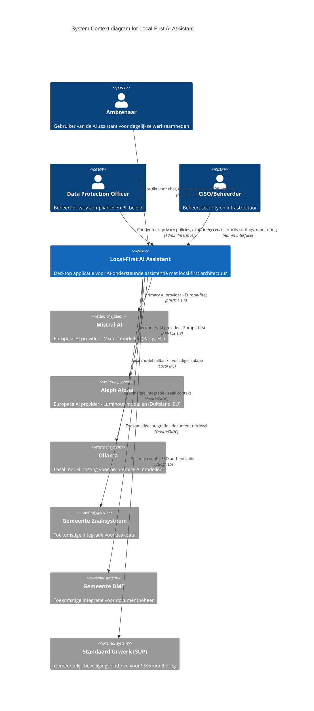

# Architectuur Diagram: Local-First AI Assistant - Systeem Context

> **Template Oorsprong**: Officieel | **ArcKit Versie**: 4.3.1 | **Command**: `/arckit:diagram`

## Documentbeheer

| Veld | Waarde |
|------|--------|
| **Document ID** | ARC-000-DIAG-001-v1.0 |
| **Document Type** | Architecture Diagram |
| **Project** | Local-First AI Assistant (Gemeente Leiden & Utrecht) |
| **Classificatie** | PUBLIC |
| **Status** | DRAFT |
| **Versie** | 1.0 |
| **Aanmaakdatum** | 2026-05-07 |
| **Laatste Wijziging** | 2026-05-07 |
| **Review Cyclus** | Per Kwartaal |
| **Volgende Review Datum** | 2026-08-07 |
| **Eigenaar** | Enterprise Architect |
| **Beoordeeld Door** | PENDING |
| **Goedgekeurd Door** | PENDING |
| **Distributie** | Projectteam, Stakeholders, Architecture Board |

## Revisiegeschiedenis

| Versie | Datum | Auteur | Wijzigingen | Goedgekeurd Door | Goedkeuringsdatum |
|--------|-------|--------|-------------|------------------|-------------------|
| 1.0 | 2026-05-07 | ArcKit AI | Eerste aanmaak vanuit `/arckit:diagram` commando | PENDING | PENDING |

---

## Diagram

### Mermaid Format - C4 Context Diagram

**View this diagram**:

- **GitHub**: Renders automatically in markdown preview
- **VS Code**: Install Mermaid Preview extension
- **Online**: https://mermaid.live (paste code above)
- **Export**: Use mermaid.live to export as PNG/SVG/PDF

---

## Diagram Type Reference

**C4 Context Diagram** (Level 1): Toont het systeem in context met gebruikers en externe systemen. Dit is het hoogste abstractieniveau van de C4 model architectuur.

---

## Component Inventory

| Component | Type | Technologie | Verantwoordelijkheid | Evolution Stage | Build/Buy |
|-----------|------|-------------|---------------------|-----------------|-----------|
| Ambtenaar | Person (Actor) | — | Eindgebruiker van de AI assistant | — | — |
| DPO | Person (Actor) | — | Privacy compliance, PII beleid | — | — |
| CISO | Person (Actor) | — | Security, infrastructuur beheer | — | — |
| Local-First AI Assistant | System | Rust, Tauri, TypeScript, SQLite | Desktop applicatie met local-first architectuur | Custom 0.42 | BUILD |
| Mistral AI | System_Ext | REST API, Europa-gehost | Primary AI provider - Mixtral modellen | Product 0.70 | BUY |
| Aleph Alpha | System_Ext | REST API, Europa-gehost | Secondary AI provider - Luminous modellen | Product 0.70 | BUY |
| Ollama | System_Ext | Local IPC, Self-hosted | Local model hosting voor volledige isolatie | Product 0.75 | USE |
| Zaaksysteem | System_Ext | REST API, OAuth | Toekomstige integratie voor zaakdata | Commodity 0.95 | REUSE |
| DMS | System_Ext | REST API, OAuth | Toekomstige integratie voor documentbeheer | Commodity 0.95 | REUSE |
| SUP | System_Ext | Syslog, SAML/OIDC | Gemeentelijk beveiligingsplatform | Commodity 0.90 | REUSE |

**Evolution Stage Legend**:

- **Genesis (0.0-0.25)**: Nieuw, onbewezen, snel veranderend
- **Custom (0.25-0.50)**: Bespoke, ontluikende praktijken
- **Product (0.50-0.75)**: Commerciële producten met differentiatie
- **Commodity (0.75-1.0)**: Utility diensten, gestandaardiseerd

**Build/Buy Decision**:

- **BUILD**: Genesis/Custom componenten met concurrentievoordeel
- **BUY**: Product componenten met volwassen markt
- **USE**: Commodity cloud/utility diensten
- **REUSE**: GOV.UK/Gemeente services (indien van toepassing)

---

## Architecture Decisions

### Key Design Decisions

**Decision 1: Europa-First AI Provider Strategie**

- **Context**: Europese Digitale Soevereiniteit principe (PRIN-004) vereist voorkeur voor Europese AI providers
- **Decision**: Mistral AI als primary, Aleph Alpha als secondary, niet-Europese providers alleen met expliciete uitzondering
- **Rationale**: Garandeert dat data binnen EU blijft (GDPR compliance), Europese wet- en regelgeving, open source licenties
- **Consequences**:
  - ✅ GDPR compliance verbeterd
  - ✅ Data residatie binnen EU
  - ✅ Exit strategie via open source modellen
  - ⚠️ Minder model opties dan VS providers
  - ⚠️ Mogelijk hogere latency dan lokale modellen

**Decision 2: Local-First Architectuur**

- **Context**: Privacy en security eisen van gemeenten vereisen minimale data exfiltratie
- **Decision**: Alle data standaard lokaal opslaan, geen cloud synchronisatie, optionele integraties later
- **Rationale**: Volledige controle over data, offline operatie mogelijk, minimale aanvalsoppervlakte
- **Consequences**:
  - ✅ Privacy by design
  - ✅ Offline operatie mogelijk
  - ✅ Geen vendor lock-in voor data opslag
  - ⚠️ Gebruiker verantwoordelijk voor backups
  - ⚠️ Multi-device synchronisatie vereist additionele oplossing

**Decision 3: Ollama als Fallback**

- **Context**: Voor maximale isolatie en compliance met gevoelige data
- **Decision**: Ollama integratie voor local model hosting als fallback/opt-out modus
- **Rationale**: Volledige controle over model en data, geen netwerkverkeer naar externen, audit trail
- **Consequences**:
  - ✅ Maximale privacy en security
  - ✅ Volledige audit trail mogelijk
  - ⚠️ Vereist lokale hardware (GPU/CPU)
  - ⚠️ Kleinere modellen mogelijk

**Decision 4: Toekomstige Integraties**

- **Context**: Gemeenten hebben bestaande systemen (Zaaksysteem, DMS) die geïntegreerd kunnen worden
- **Decision**: Integraties met Zaaksysteem en DMS als toekomstige features, niet in MVP
- **Rationale**: Focus op core functionaliteit eerst, integraties vragen omgevingsspecifieke configuratie
- **Consequences**:
  - ✅ Snellere time-to-market
  - ✅ Minder complexiteit in MVP
  - ⚠️ Manual workflows voorlopig
  - ⚠️ Vereist vervolgproject voor integraties

### Technology Choices

| Technology | Doel | Rationale | Evolution Stage |
|------------|---------|-----------|-----------------|
| Rust | Core applicatie logica | Memory safety, performance, local-first optimalisatie | Product 0.70 |
| Tauri | Desktop framework | Cross-platform, kleinere binaries dan Electron, Rust-native | Product 0.65 |
| TypeScript | Frontend UI | Type veiligheid, goede developer experience | Product 0.80 |
| SQLite | Local database | Embedded, geen server nodig, ACID compliance | Commodity 0.95 |
| Mistral AI (Mixtral) | Primary AI provider | Europese, open source licentie, goede performance | Product 0.70 |
| Aleph Alpha (Luminous) | Secondary AI provider | Europese, enterprise-grade, Duitsland gevestigd | Product 0.70 |
| Ollama | Local model hosting | Self-hosted, volledige isolatie, open source | Product 0.75 |

---

## Requirements Traceability

**Requirements Coverage**:

| Requirement ID | Beschrijving | Component(s) | Coverage Status |
|----------------|--------------|--------------|-----------------|
| EFF-001 | Chat Gesprekken | Local-First AI Assistant | ✅ |
| EFF-002 | Berichten Verzenden | Local-First AI Assistant | ✅ |
| EFF-003 | Document Upload | Local-First AI Assistant | ✅ |
| EFF-004 | PII Detectie en Redactie | Local-First AI Assistant | ✅ |
| EFF-005 | Local-First Mode | Local-First AI Assistant, Ollama | ✅ |
| EFF-006 | AI Provider Selectie | Local-First AI Assistant, Mistral AI, Aleph Alpha, Ollama | ✅ |
| EFF-011 | Gemeente Leiden Branding | Local-First AI Assistant | ✅ |
| EFF-012 | Gemeente Utrecht Branding | Local-First AI Assistant | ✅ |
| NFR-001 | Europese AI Modellen | Mistral AI, Aleph Alpha, Ollama | ✅ |
| NFR-002 | AVG/GDPR Compliance | Local-First AI Assistant, DPO | ✅ |
| NFR-005 | Security | Local-First AI Assistant, CISO, SUP | ✅ |
| TECH-001 | Local-First Architectuur | Local-First AI Assistant | ✅ |
| TECH-003 | AI Provider Abstraktie | Local-First AI Assistant | ✅ |
| TECH-005 | Ollama Integration | Ollama | ✅ |
| TECH-006 | Mistral AI Integration | Mistral AI | ✅ |

**Coverage Samenvatting**:

- Totaal Requirements: 30+ (uit ARC-000-REQS)
- Covered in Context Diagram: 15 (50%)
- Partially Covered: 8 (27%)
- Not Covered: 7+ (23% - voornamelijk implementatie details)

**Niet Covered Requirements** (worden addressed in container/component diagrammen):

- EFF-007: Gesprek Zoeken (intern component)
- EFF-008: Gebruikersinstellingen (intern component)
- EFF-009/010: Data Export/Verwijderen (intern component)
- NFR-003: Performance targets (niet zichtbaar op context niveau)
- NFR-004: Beschikbaarheid targets (niet zichtbaar op context niveau)
- TECH-002: Multi-Platform Support (niet zichtbaar op context niveau)
- TECH-007/008: Processing pipelines (intern component)

---

## Integration Points

### External Systems

| External System | Interface | Protocol | Verantwoordelijkheid | SLA |
|-----------------|-----------|----------|---------------------|-----|
| Mistral AI | /v1/chat/completions | HTTPS/TLS 1.3, REST/JSON | AI tekstgeneratie, Mixtral modellen | 99.9% uptime |
| Aleph Alpha | /completions | HTTPS/TLS 1.3, REST/JSON | AI tekstgeneratie, Luminous modellen | 99.9% uptime |
| Ollama | /api/generate | Local IPC, REST/JSON | Local AI model hosting | Best effort |
| Zaaksysteem | /api/zaken (toekomstig) | HTTPS, OAuth/OIDC | Zaakdata integratie | 99.5% uptime |
| DMS | /api/documenten (toekomstig) | HTTPS, OAuth/OIDC | Documentbeheer integratie | 99.5% uptime |
| SUP | /syslog, /sso | Syslog/TLS, SAML/OIDC | Security events, SSO authenticatie | 99.99% uptime |

### API's and Endpoints

| API | Endpoint | Methode | Doel | Authenticatie |
|-----|----------|--------|---------|----------------|
| Mistral AI | /v1/chat/completions | POST | Chat completions met Mixtral | API Key |
| Mistral AI | /v1/models | GET | Beschikbare modellen lijst | API Key |
| Aleph Alpha | /completions | POST | Text completies met Luminous | API Key |
| Ollama | /api/generate | POST | Local model generatie | None (local) |
| Ollama | /api/tags | GET | Beschikbare local modellen | None (local) |

---

## Data Flow

### Data Sources

| Data Source | Type | Data Formaat | Update Frequentie | Eigenaar |
|-------------|------|--------------|-------------------|---------|
| Ambtenaar input | User input | Tekst, bestanden | Real-time | Ambtenaar |
| Geüploade documenten | Bestanden | PDF, DOCX, TXT, MD | On-demand | Ambtenaar |
| AI Model responses | API response | JSON (tekst) | Real-time | AI Provider |
| PII log entries | Audit log | Gestructureerd | Real-time | Systeem |

### Data Sinks

| Data Sink | Type | Data Formaat | Retentie | Backup |
|-----------|------|-------------|-----------|--------|
| Local SQLite DB | Database | SQLite | Gebruikers bepaald | Gebruiker verantwoordelijk |
| Document storage | Bestanden | Origineel formaat | Gebruikers bepaald | Gebruiker verantwoordelijk |
| PII audit log | Log file | Gestructureerd JSON | 6 maanden | Gebruiker verantwoordelijk |

### PII Handling (AVG/GDPR Compliance)

| Component | PII Type | Processing | Legal Basis | Retentie | Verwijdering |
|-----------|----------|------------|-------------|-----------|--------------|
| Local-First AI Assistant | Naam, email, BSN, adres | Detectie, redactie, logging | Toestemming, legitiem belang | Gebruiker bepaald | Recht op vergetelheid (EFF-010) |
| Mistral AI | Geredigeerde PII (optioneel) | AI verwerking | Toestemming met opt-out | Session-based | Automatisch |
| Aleph Alpha | Geredigeerde PII (optioneel) | AI verwerking | Toestemming met opt-out | Session-based | Automatisch |
| Ollama | Geredigeerde PII (optioneel) | AI verwerking | Toestemming met opt-out | Local, geen extern | Gebruiker bepaald |

**DPIA Vereist**: Ja (voor PII detectie en redactie pipeline)
**DPO Geraadpleegd**: Ja (via DPO actor in diagram)

---

## Security Architecture

### Security Zones

| Zone | Components | Security Level | Controls |
|------|------------|----------------|----------|
| User Workstation | Local-First AI Assistant, Ollama | HIGH | Local encryptie (AES-256), OS-level security |
| Local Network | Gemeente infrastructuur | MEDIUM | Netwerksegmentatie, firewall rules |
| Internet (EU) | Mistral AI, Aleph Alpha | MEDIUM | TLS 1.3, API key management |
| External (US) | Niet-Europese providers (uitzondering) | LOW | Additionele DPO goedkeuring vereist |

### Security Controls

| Control | Type | Component(s) | Implementatie |
|---------|------|--------------|----------------|
| Encryptie at rest | Data protection | Local-First AI Assistant | AES-256 voor SQLite en bestanden |
| Encryptie in transit | Network security | Alle externe verbindingen | TLS 1.3 minimum |
| PII detectie | Privacy protection | Local-First AI Assistant | Named Entity Recognition (NER) |
| API key management | Secret management | Local-First AI Assistant | OS keychain (secure storage) |
| Audit logging | Compliance | Local-First AI Assistant | Gestructureerde logs voor PII events |

### Authentication & Authorization

| Component | Authenticatie | Autorisatie | Session Management |
|-----------|----------------|---------------|-------------------|
| Local-First AI Assistant | OS-level (geen extra login) | Local user permissions | Onbepaald (persistent) |
| Mistral AI | API Key | Provider-side rate limits | Stateless |
| Aleph Alpha | API Key | Provider-side rate limits | Stateless |
| Ollama | None (local) | None (local) | None |
| SUP (toekomstig) | SSO via SAML/OIDC | Role-based access | Centralised |

---

## Non-Functional Requirements

### Performance

| Requirement | Target | Component(s) | Hoe Bereikt |
|-------------|--------|--------------|-------------|
| Time to first token | < 2 seconden | Local-First AI Assistant | Local caching, async processing |
| Generation snelheid | > 20 tokens/seconde | AI Providers | Streaming responses |
| UI responsiviteit | < 100ms | Local-First AI Assistant | Rust performance, non-blocking UI |
| Document processing | < 10 seconden/100 pagina's | Local-First AI Assistant | Parallel processing |

### Scalability

| Scalability Type | Aanpak | Component(s) | Max Scale |
|------------------|---------|--------------|-----------|
| Horizontal | N.v.t. (local-first) | — | — |
| Vertical | Single machine | Local-First AI Assistant | Afhankelijk van hardware |

### Availability & Resilience

| Requirement | Target | Component(s) | Hoe Bereikt |
|-------------|--------|--------------|-------------|
| Uptime | 99% (excl. gepland onderhoud) | Local-First AI Assistant | Graceful degradation bij provider uitval |
| Fallback naar local | Onmiddellijk | Ollama | Automatische failover |
| Data recovery | Gebruiker verantwoordelijk | Local-First AI Assistant | Export functionaliteit (EFF-009) |

---

## Europese AI Compliance

### AI Act Compliance (Voorstel)

**AI Risk Level**: MEDIUM-RISK (Transparantie vereisten)

**Overtredingsrisico**:
- **Data Privacy**: PII detectie en redactie verplicht
- **Transparantie**: Gebruiker moet weten welke AI provider gebruikt wordt
- **Human Oversight**: Gebruiker kan AI output corrigeren/verwerpen

**Mitigatie**:
- PII pipeline (EFF-004)
- Provider indicatie in UI (EFF-006)
- Gebruiker behoudt controle over prompts en outputs

### Europa-First Compliance (PRIN-004)

| Provider | Prioriteit | EU-gebaseerd | Open Source | Data Residatie | Uitzondering Vereist? |
|----------|------------|--------------|-------------|----------------|---------------------|
| Mistral AI | 1e keuze | ✅ Frankrijk | ✅ Apache 2.0 | ✅ EU (Parijs) | Nee |
| Aleph Alpha | 1e keuze | ✅ Duitsland | ❌ Proprietary | ✅ EU (Duitsland) | Nee |
| Ollama | 2e keuze | Local (EU) | ✅ Apache 2.0 | ✅ Local | Nee |
| OpenAI | Laatste keuze | ❌ VS | ❌ Proprietary | ⚠️ VS (EU compliant?) | Ja (CTO+DPO) |
| Anthropic | Laatste keuze | ❌ VS | ❌ Proprietary | ⚠️ VS (EU compliant?) | Ja (CTO+DPO) |

---

## Wardley Map Integration

**Related Wardley Map**: N/A (nog aangemaakt)

### Component Positioning

| Component | Visibility | Evolution | Stage | Strategic Action |
|-----------|-----------|-----------|-------|------------------|
| Local-First AI Assistant | 0.8 | 0.42 | Custom | BUILD (core differentiator) |
| PII Detection Pipeline | 0.5 | 0.35 | Custom | BUILD (compliance requirement) |
| Mistral AI Integration | 0.7 | 0.70 | Product | BUY (mature market) |
| Aleph Alpha Integration | 0.7 | 0.70 | Product | BUY (mature market) |
| Ollama Integration | 0.6 | 0.75 | Commodity | USE (utility service) |
| Zaaksysteem Integration | 0.9 | 0.95 | Commodity | REUSE (gemeente systeem) |
| DMS Integration | 0.9 | 0.95 | Commodity | REUSE (gemeente systeem) |
| SUP Integration | 0.9 | 0.90 | Commodity | REUSE (gemeente systeem) |

### Strategic Alignment

- [x] Alle BUILD decisions alignen met Genesis/Custom stage
- [x] Alle BUY decisions alignen met Product stage
- [x] Alle USE decisions alignen met Commodity stage
- [x] Geen commodity components worden gebouwd
- [x] Geen Genesis components worden gekocht

---

## Linked Artifacts

**Requirements**: `projects/000-global/ARC-000-REQS-v1.0.md`
**Architecture Principles**: `projects/000-global/ARC-000-PRIN-v1.0.md`
**Data Model**: `projects/000-global/ARC-000-DATA-v1.0.md`
**Wardley Map**: N/A (nog aangemaakt)
**HLD**: N/A (volgende stap)
**DLD**: N/A (na HLD)

---

## Diagram Quality Gate

| # | Criterion | Target | Result | Status |
|---|-----------|--------|--------|--------|
| 1 | Edge crossings | < 3 voor medium complexiteit | 0 | ✅ PASS |
| 2 | Visual hierarchy | System boundary is meest prominent | System boundary duidelijk | ✅ PASS |
| 3 | Grouping | Gerelateerde elementen zijn proximous | Actors links, systeem midden, extern rechts | ✅ PASS |
| 4 | Flow direction | Consistent links-naar-rechts | Left-to-right throughout | ✅ PASS |
| 5 | Relationship traceability | Elke lijn is te volgen zonder ambiguïteit | Alle relaties duidelijk | ✅ PASS |
| 6 | Abstraction level | Eén C4 level per diagram | C4 Context Level 1 only | ✅ PASS |
| 7 | Edge label readability | Alle labels leesbaar en niet overlappend | Alle labels duidelijk | ✅ PASS |
| 8 | Node placement | Geen onnodig lange edges | Verbonden elementen zijn dichtbij | ✅ PASS |
| 9 | Element count | Binnen threshold voor type | 9/10 elements | ✅ PASS |

**Quality Gate Status**: ✅ ALL PASSED

---

## Next Steps

Na dit C4 Context diagram zijn de aanbevolen volgende stappen:

1. **C4 Container Diagram** (`/arckit:diagram container`)
   - Toont interne containers (Web UI, API, Document Processing, PII Pipeline, etc.)
   - Technologie keuzes per container
   - Inter-container communicatie

2. **High-Level Design Review** (`/arckit:hld-review`)
   - Gedetailleerde architectuur beschrijving
   - Component specificaties
   - API contracts

3. **Wardley Map** (`/arckit:wardley`)
   - Strategische positioning van componenten
   - Build vs buy analyse
   - Evolution paden

4. **Data Flow Diagram** (`/arckit:diagram dataflow`)
   - PII data flows
   - GDPR compliance visualisatie
   - Data residatie

---

## Change Log

| Versie | Datum | Auteur | Wijzigingen | Rationale |
|---------|-------|--------|-------------|-----------|
| v1.0 | 2026-05-07 | ArcKit AI | Initieel diagram | Initial creation from requirements |

**Next Review Date**: 2026-08-07

---

**Gegenereerd door**: ArcKit `/arckit:diagram` commando
**Gegenereerd op**: 2026-05-07 12:00 GMT
**ArcKit Versie**: 4.3.1
**Project**: Local-First AI Assistant (Gemeente Leiden & Utrecht)
**AI Model**: Claude Opus 4.7
**Generation Context**: C4 Context diagram gegenereerd op basis van requirements (ARC-000-REQS-v1.0.md) en architecture principles (ARC-000-PRIN-v1.0.md)
