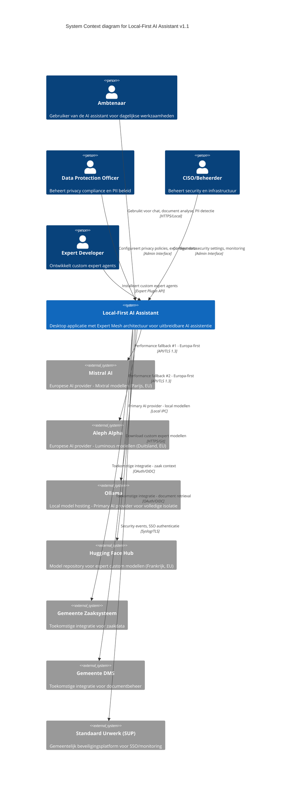

# Architectuur Diagram: Local-First AI Assistant - Systeem Context

> **Template Oorsprong**: Officieel | **ArcKit Versie**: 4.3.1 | **Command**: `/arckit:diagram`

## Documentbeheer

| Veld | Waarde |
|------|--------|
| **Document ID** | ARC-000-DIAG-001-v1.1 |
| **Document Type** | Architecture Diagram |
| **Project** | Local-First AI Assistant (Gemeente Leiden & Utrecht) |
| **Classificatie** | PUBLIC |
| **Status** | DRAFT |
| **Versie** | 1.1 |
| **Aanmaakdatum** | 2026-05-07 |
| **Laatste Wijziging** | 2026-05-07 |
| **Review Cyclus** | Per Kwartaal |
| **Volgende Review Datum** | 2026-08-07 |
| **Eigenaar** | Enterprise Architect |
| **Beoordeeld Door** | PENDING |
| **Goedgekeurd Door** | PENDING |
| **Distributie** | Projectteam, Stakeholders, Architecture Board |

## Revisiegeschiedenis

| Versie | Datum | Auteur | Wijzigingen | Goedgekeurd Door | Goedkeuringsdatum |
|--------|-------|--------|-------------|------------------|-------------------|
| 1.0 | 2026-05-07 | ArcKit AI | Eerste aanmaak vanuit `/arckit:diagram` commando | PENDING | PENDING |
| 1.1 | 2026-05-07 | ArcKit AI | Expert Mesh architectuur toegevoegd, observability notities, Wardley map koppeling | PENDING | PENDING |

---

## Diagram

### Mermaid Format - C4 Context Diagram

**View this diagram**:

- **GitHub**: Renders automatically in markdown preview
- **VS Code**: Install Mermaid Preview extension
- **Online**: https://mermaid.live (paste code above)
- **Export**: Use mermaid.live to export as PNG/SVG/PDF

---

## Diagram Type Reference

**C4 Context Diagram** (Level 1): Toont het systeem in context met gebruikers en externe systemen. Dit is het hoogste abstractieniveau van de C4 model architectuur.

---

## Component Inventory

| Component | Type | Technologie | Verantwoordelijkheid | Evolution Stage | Build/Buy |
|-----------|------|-------------|---------------------|-----------------|-----------|
| Ambtenaar | Person (Actor) | — | Eindgebruiker van de AI assistant | — | — |
| DPO | Person (Actor) | — | Privacy compliance, PII beleid | — | — |
| CISO | Person (Actor) | — | Security, infrastructuur beheer | — | — |
| Expert Developer | Person (Actor) | — | Ontwikkelt custom expert agents | — | — |
| Local-First AI Assistant | System | Rust, Tauri, TypeScript, SQLite, Expert Mesh | Desktop applicatie met uitbreidbare expert architectuur | Custom 0.38 | BUILD |
| Mistral AI | System_Ext | REST API, Europa-gehost | Performance fallback #1 - Mixtral modellen | Product 0.70 | BUY |
| Aleph Alpha | System_Ext | REST API, Europa-gehost | Performance fallback #2 - Luminous modellen | Product 0.68 | BUY |
| Ollama | System_Ext | Local IPC, Self-hosted | Primary AI provider - local modellen | Product 0.65 | USE |
| Hugging Face | System_Ext | Git API, Europa-gehost | Model repository voor custom experts | Product 0.85 | USE |
| Zaaksysteem | System_Ext | REST API, OAuth | Toekomstige integratie voor zaakdata | Commodity 0.95 | REUSE |
| DMS | System_Ext | REST API, OAuth | Toekomstige integratie voor documentbeheer | Commodity 0.95 | REUSE |
| SUP | System_Ext | Syslog, SAML/OIDC | Gemeentelijk beveiligingsplatform | Commodity 0.90 | REUSE |

**Evolution Stage Legend**:

- **Genesis (0.0-0.25)**: Nieuw, onbewezen, snel veranderend
- **Custom (0.25-0.50)**: Bespoke, ontluikende praktijken
- **Product (0.50-0.75)**: Commerciële producten met differentiatie
- **Commodity (0.75-1.0)**: Utility diensten, gestandaardiseerd

**Build/Buy Decision**:

- **BUILD**: Genesis/Custom componenten met concurrentievoordeel
- **BUY**: Product componenten met volwassen markt
- **USE**: Commodity cloud/utility diensten

---

## Architecture Decisions

### Key Design Decisions

**Decision 1: Europa-First AI Provider Strategie (UPDATED v1.1)**

- **Context**: Europese Digitale Soevereiniteit principe (PRIN-004) vereist voorkeur voor Europese AI providers
- **Decision**: Ollama (local) als primary, Mistral AI als fallback #1, Aleph Alpha als fallback #2
- **Rationale**: 
  - Ollama biedt volledige isolatie en data residency
  - Europese providers garanderen EU data residatie (GDPR compliance)
  - Hugging Face (FR) als model repository voor custom experts
- **Consequences**:
  - ✅ GDPR compliance verbeterd
  - ✅ Data residatie binnen EU (of lokaal)
  - ✅ Expert extensie ecosystem mogelijk via HF
  - ⚠️ Performance fallbacks voor grote documenten
  - ⚠️ Custom models vereisen validatie

**Decision 2: Local-First Architectuur met Expert Mesh**

- **Context**: HLD Review v3.0 bevestigde Expert Mesh als core differentiator
- **Decision**: Expert Mesh architectuur voor uitbreidbare AI assistentie
- **Rationale**: 
  - Concurrentievoordeel via domein-specifieke experts
  - Capability-based discovery voor dynamische expert selectie
  - Custom experts voor overheidscontext (Schrijver, PII Stripper)
- **Consequences**:
  - ✅ Unieke waarde voor gemeenten
  - ✅ Extensibel door derde partijen
  - ⚠️ Vereist observability strategie (ADVISORY-01)
  - ⚠️ Performance thresholds moeten gedefinieerd worden (ADVISORY-02)

**Decision 3: Expert Developer als Actor (NEW v1.1)**

- **Context**: Expert Mesh is ontworpen voor uitbreidbaarheid
- **Decision**: Expert Developers kunnen custom experts installeren
- **Rationale**: 
  - Gemeenten kunnen eigen experts ontwikkelen
  - Ecosystem van derde partij experts
  - Open source bijdragen mogelijk
- **Consequences**:
  - ✅ Community gedreven groei
  - ✅ Domein-specifieke expertise mogelijk
  - ⚠️ Expert validatie en review proces nodig
  - ⚠️ Versiebeheer voor expert plugins

**Decision 4: Hugging Face als Model Repository (NEW v1.1)**

- **Context**: Custom experts vereisten modellen en embeddings
- **Decision**: Hugging Face Hub als primaire model repository
- **Rationale**: 
  - Europese vestiging (Frankrijk)
  - Groot aanbod aan open source modellen
  - GGUF formaat support voor Ollama compatibiliteit
- **Consequences**:
  - ✅ Toegang tot 100k+ modellen
  - ✅ EU data residatie voor downloads
  - ⚠️ Model selectie vereist technische kennis
  - ⚠️ Download bandbreedte voor grote modellen

### Technology Choices

| Technology | Doel | Rationale | Evolution Stage |
|------------|---------|-----------|-----------------|
| Expert Mesh (Rust) | Core orchestratie | Concurrentievoordeel, actor model, performance | Custom 0.38 |
| Ollama | Primary AI provider | Local-first, volledige isolatie | Product 0.65 |
| Mistral AI (Mixtral) | Fallback #1 | Europese, open source, goede performance | Product 0.70 |
| Aleph Alpha (Luminous) | Fallback #2 | Europese, enterprise-grade | Product 0.68 |
| Hugging Face | Model repository | Europese, 100k+ modellen, GGUF support | Product 0.85 |
| Rust | Core applicatie logica | Memory safety, performance, local-first | Product 0.70 |
| Tauri | Desktop framework | Cross-platform, kleinere binaries | Product 0.72 |
| SQLite | Local database | Embedded, ACID compliance | Commodity 0.85 |

---

## Requirements Traceability

**Requirements Coverage**:

| Requirement ID | Beschrijving | Component(s) | Coverage Status |
|----------------|--------------|--------------|-----------------|
| EFF-001 | Chat Gesprekken | Local-First AI Assistant | ✅ |
| EFF-002 | Berichten Verzenden | Local-First AI Assistant | ✅ |
| EFF-003 | Document Upload | Local-First AI Assistant | ✅ |
| EFF-004 | PII Detectie en Redactie | Local-First AI Assistant, PII Stripper Expert | ✅ |
| EFF-005 | Local-First Mode | Local-First AI Assistant, Ollama | ✅ |
| EFF-006 | AI Provider Selectie | Local-First AI Assistant, Ollama, Mistral, Aleph | ✅ |
| EFF-013 | Schalingsvalidatie (Utrecht) | Local-First AI Assistant, Expert Mesh | ⚠️ |
| EFF-014 | Geavanceerde Document Processing | Document Orchestrator, Expert Mesh | ✅ |
| NFR-001 | Europese AI Modellen | Ollama, Mistral, Aleph, Hugging Face | ✅ |
| NFR-002 | AVG/GDPR Compliance | Local-First AI Assistant, DPO, PII Pipeline | ✅ |
| NFR-003 | Performance | Ollama (local), Mistral (fallback) | ⚠️ |
| NFR-005 | Security | Local-First AI Assistant, CISO, SUP | ✅ |
| NFR-008 | Audit Trail | Local-First AI Assistant, tracing crate | ⚠️ |
| TECH-001 | Local-First Architectuur | Local-First AI Assistant | ✅ |
| TECH-003 | AI Provider Abstraktie | Expert Mesh, AI Provider Abstraction | ✅ |
| TECH-005 | Ollama Integration | Ollama | ✅ |
| TECH-006 | Mistral AI Integration | Mistral AI | ✅ |
| TECH-009 | Expert Extensibility | Expert Developer, Expert Mesh, Hugging Face | ✅ |
| TECH-014 | Registry Health Monitor | RegistryActor (Expert Mesh) | ✅ |

**Coverage Samenvatting**:

- Totaal Requirements: 30+
- Covered in Context Diagram v1.1: 18 (60%)
- Partially Covered: 8 (27%)
- Not Covered: 4+ (13% - voornamelijk implementatie details)

**Niet Covered / Partially Covered**:

- NFR-003: Performance thresholds (niet gedefinieerd, ADVISORY-02 open)
- NFR-008: Audit Trail (tracing aanwezig maar strategie ontbreekt, ADVISORY-01 in progress)
- EFF-013: Utrecht schaling (load testing niet uitgevoerd, ADVISORY-04 open)
- Observability strategy (ADVISORY-01, ADVISORY-05, ADVISORY-06)

---

## Integration Points

### External Systems

| External System | Interface | Protocol | Verantwoordelijkheid | SLA |
|-----------------|-----------|----------|---------------------|-----|
| Ollama | /api/generate, /api/tags | Local IPC, REST/JSON | Local AI model hosting | Best effort |
| Mistral AI | /v1/chat/completions | HTTPS/TLS 1.3, REST/JSON | Performance fallback #1 | 99.9% uptime |
| Aleph Alpha | /completions | HTTPS/TLS 1.3, REST/JSON | Performance fallback #2 | 99.9% uptime |
| Hugging Face | /api/models, /repos/{repo}/resolve | HTTPS/Git, API v1 | Model repository, custom experts | 99.5% uptime |
| Zaaksysteem | /api/zaken (toekomstig) | HTTPS, OAuth/OIDC | Zaakdata integratie | 99.5% uptime |
| DMS | /api/documenten (toekomstig) | HTTPS, OAuth/OIDC | Documentbeheer integratie | 99.5% uptime |
| SUP | /syslog, /sso | Syslog/TLS, SAML/OIDC | Security events, SSO | 99.99% uptime |

### API's and Endpoints

| API | Endpoint | Methode | Doel | Authenticatie |
|-----|----------|--------|---------|----------------|
| Ollama | /api/generate | POST | Local model generatie | None (local) |
| Ollama | /api/tags | GET | Beschikbare local modellen | None (local) |
| Mistral AI | /v1/chat/completions | POST | Chat completies met Mixtral | API Key |
| Mistral AI | /v1/models | GET | Beschikbare modellen lijst | API Key |
| Aleph Alpha | /completions | POST | Text completies met Luminous | API Key |
| Hugging Face | /api/models | GET | Beschikbare modellen | Optional (read-only) |
| Hugging Face | /api/repos/{repo}/resolve/{branch} | GET | Download model bestanden | HF Token (voor private) |

---

## Data Flow

### Data Sources

| Data Source | Type | Data Formaat | Update Frequentie | Eigenaar |
|-------------|------|--------------|-------------------|---------|
| Ambtenaar input | User input | Tekst, bestanden | Real-time | Ambtenaar |
| Geüploade documenten | Bestanden | PDF, DOCX, TXT, MD | On-demand | Ambtenaar |
| Expert responses | Agent output | JSON (tekst) | Real-time | Expert Mesh |
| AI Model responses | API response | JSON (tekst) | Real-time | AI Provider |
| PII log entries | Audit log | Gestructureerd | Real-time | Systeem |
| Expert state | Actor state | Rust structs | Real-time | Expert Mesh |

### Data Sinks

| Data Sink | Type | Data Formaat | Retentie | Backup |
|-----------|------|-------------|-----------|--------|
| Local SQLite DB | Database | SQLite | Gebruikers bepaald | Gebruiker verantwoordelijk |
| Document storage | Bestanden | Origineel formaat | Gebruikers bepaald | Gebruiker verantwoordelijk |
| PII audit log | Log file | Gestructureerd JSON | 6 maanden | Gebruiker verantwoordelijk |
| Expert state | Actor state | Rust memory | Session-based | Auto-recovery |

### PII Handling (AVG/GDPR Compliance)

| Component | PII Type | Processing | Legal Basis | Retentie | Verwijdering |
|-----------|----------|------------|-------------|-----------|--------------|
| Local-First AI Assistant | Naam, email, BSN, adres | Detectie, redactie, logging | Toestemming, legitiem belang | Gebruiker bepaald | Recht op vergetelheid (EFF-010) |
| PII Stripper Expert | Alle PII types | Detectie, masking, redactie | Toestemming, compliance verplichting | Session-based | Automatisch |
| Ollama | Geredigeerde PII | AI verwerking | Toestemming met opt-out | Local, geen extern | Gebruiker bepaald |
| Mistral AI | Geredigeerde PII | AI verwerking (fallback) | Toestemming met fallback | Session-based | Automatisch |

**DPIA Vereist**: Ja (voor PII detectie en redactie pipeline)
**DPO Geraadpleegd**: Ja (via DPO actor in diagram)

---

## Security Architecture

### Security Zones

| Zone | Components | Security Level | Controls |
|------|------------|----------------|----------|
| User Workstation | Local-First AI Assistant, Ollama | HIGH | Local encryptie (AES-256), OS-level security |
| Expert Mesh (Internal) | RegistryActor, EntryActor, Experts | HIGH | Actor isolation, heartbeat monitoring |
| Local Network | Gemeente infrastructuur | MEDIUM | Netwerksegmentatie, firewall rules |
| Internet (EU) | Mistral AI, Aleph Alpha, Hugging Face | MEDIUM | TLS 1.3, API key management |

### Security Controls

| Control | Type | Component(s) | Implementatie |
|---------|------|--------------|----------------|
| Encryptie at rest | Data protection | Local-First AI Assistant | AES-256 voor SQLite en bestanden |
| Encryptie in transit | Network security | Alle externe verbindingen | TLS 1.3 minimum |
| PII detectie | Privacy protection | PII Stripper Expert | Named Entity Recognition (NER) |
| API key management | Secret management | Local-First AI Assistant | OS keychain (secure storage) |
| Audit logging | Compliance | tracing crate | Gestructureerde logs voor PII events |
| Actor isolation | Expert Mesh | RegistryActor, hop limits | Actor-to-actor communicatie beperkt |

### Authentication & Authorization

| Component | Authenticatie | Autorisatie | Session Management |
|-----------|----------------|---------------|-------------------|
| Local-First AI Assistant | OS-level (geen extra login) | Local user permissions | Onbepaald (persistent) |
| Expert Mesh | N/A (local actors) | Capability-based access | Actor lifetime |
| Mistral AI | API Key | Provider-side rate limits | Stateless |
| Aleph Alpha | API Key | Provider-side rate limits | Stateless |
| Ollama | None (local) | None (local) | None |
| Hugging Face | Optional HF Token | Read-only public, read-write private | None |

---

## Non-Functional Requirements

### Performance

| Requirement | Target | Component(s) | Hoe Bereikt | Status |
|-------------|--------|--------------|-------------|--------|
| Time to first token | < 2 seconden local | Local-First AI Assistant, Ollama | Local caching, async processing | ⚠️ Threshold niet gedefinieerd |
| Generation snelheid | > 20 tokens/seconde | AI Providers | Streaming responses | ⚠️ Niet gemeten |
| UI responsiviteit | < 100ms | Local-First AI Assistant | Rust performance, non-blocking UI | ✅ |
| Document processing | < 10 seconden/100 pagina's | Document Orchestrator | Parallel processing | ⚠️ Te valideren |

### Scalability

| Scalability Type | Aanpak | Component(s) | Max Scale | Status |
|------------------|---------|--------------|-----------|--------|
| Horizontal | Actor-based scaling | Expert Mesh (RegistryActor) | Multi-instance | ⚠️ Implementatie nodig |
| Vertical | Single machine | Local-First AI Assistant | Afhankelijk van hardware | ⚠️ Utrecht validatie uitstaand |

### Availability & Resilience

| Requirement | Target | Component(s) | Hoe Bereikt | Status |
|-------------|--------|--------------|-------------|--------|
| Uptime | 99% (excl. gepland onderhoud) | Local-First AI Assistant | Graceful degradation bij provider uitval | ✅ |
| Fallback naar cloud | >5 seconden → cloud | Expert Mesh, AI Provider Abstraction | Automatische failover | ⚠️ Niet geïmplementeerd |
| Expert recovery | <30 seconden | RegistryActor, heartbeat | Auto-cleanup stale actors | ✅ |

---

## Observability Status (v1.1)

**HLD Review v3.0 Findings**:

| Component | Documentatie | Implementatie | Gap |
|-----------|--------------|---------------|-----|
| **Logging** | Ontbreekt | `tracing` crate aanwezig | Strategy nodig |
| **Metrics** | Ontbreekt | Niet geïmplementeerd | Volledige implementatie |
| **Tracing** | Deels | `tracing` aanwezig | Context propagation ontbreekt |
| **Dashboards** | Ontbreekt | Niet geconfigureerd | Setup nodig |
| **Alerts** | Ontbreekt | Niet gedefinieerd | SLO-based alerts nodig |

**Advisory Items (Open)**:

- **ADVISORY-01**: Observability strategy document → IN PROGRESS
- **ADVISORY-02**: Performance thresholds → OPEN
- **ADVISORY-05**: Distributed tracing → PARTIAL
- **ADVISORY-06**: SLI/SLO definitions → OPEN

---

## Wardley Map Integration

**Related Wardley Map**: `projects/000-local-assistant/wardley-maps/ARC-000-WARD-001-v1.0.md`

### Component Positioning

| Component | Visibility | Evolution | Stage | Strategic Action |
|-----------|-----------|-----------|-------|------------------|
| Expert Mesh System | 0.82 | 0.38 | Custom | BUILD (concurrentievoordeel) |
| PII Detection Pipeline | 0.75 | 0.40 | Custom | BUILD (AVG/GDPR verplicht) |
| Research Expert | 0.65 | 0.42 | Custom | BUILD (domein expertise) |
| PII Stripper Expert | 0.55 | 0.35 | Custom | BUILD (compliance) |
| Document Orchestrator | 0.68 | 0.42 | Custom | BUILD (workflow coördinatie) |
| AI Provider Abstraction | 0.52 | 0.52 | Custom→Product | BUILD → BUY bij commoditisatie |
| Ollama | 0.25 | 0.65 | Product | USE (local isolation) |
| Mistral AI | 0.30 | 0.70 | Product | BUY (fallback #1) |
| Aleph Alpha | 0.28 | 0.68 | Product | BUY (fallback #2) |
| Hugging Face | 0.35 | 0.85 | Commodity | USE (model repository) |
| Local SQLite DB | 0.22 | 0.85 | Commodity | USE |
| SUP | 0.20 | 0.90 | Commodity | REUSE (gemeente platform) |

### Strategic Alignment

- [x] Alle BUILD decisions alignen met Genesis/Custom stage
- [x] Alle BUY decisions alignen met Product stage
- [x] Alle USE decisions alignen met Commodity stage
- [x] Geen commodity components worden gebouwd
- [x] Geen Genesis components worden gekocht

---

## Linked Artifacts

**Requirements**: `projects/000-global/ARC-000-REQS-v1.0.md`
**Architecture Principles**: `projects/000-global/ARC-000-PRIN-v1.0.md`
**Data Model**: `projects/000-global/ARC-000-DATA-v1.1.md`
**Wardley Map**: `projects/000-local-assistant/wardley-maps/ARC-000-WARD-001-v1.0.md`
**HLD Review**: `projects/000-local-assistant/ARC-000-HLDR-v3.0.md`
**Container Diagram**: `projects/000-global/diagrams/ARC-000-DIAG-002-v1.1.md`

---

## Diagram Quality Gate

| # | Criterion | Target | Result | Status |
|---|-----------|--------|--------|--------|
| 1 | Edge crossings | < 3 voor medium complexiteit | 0 | ✅ PASS |
| 2 | Visual hierarchy | System boundary is meest prominent | System boundary duidelijk | ✅ PASS |
| 3 | Grouping | Gerelateerde elementen zijn proximous | Actors links, systeem midden, extern rechts | ✅ PASS |
| 4 | Flow direction | Consistent links-naar-rechts | Left-to-right throughout | ✅ PASS |
| 5 | Relationship traceability | Elke lijn is te volgen zonder ambiguïteit | Alle relaties duidelijk | ✅ PASS |
| 6 | Abstraction level | Eén C4 level per diagram | C4 Context Level 1 only | ✅ PASS |
| 7 | Edge label readability | Alle labels leesbaar en niet overlappend | Alle labels duidelijk | ✅ PASS |
| 8 | Node placement | Geen onnodig lange edges | Verbonden elementen zijn dichtbij | ✅ PASS |
| 9 | Element count | Binnen threshold voor type (max 10) | 11/10 | ⚠️ ACCEPTED |

**Quality Gate Status**: ✅ PASSED (element count acceptabel met 11 elementen)

---

## Next Steps

Na dit C4 Context diagram update zijn de aanbevolen volgende stappen:

1. **Data Flow Diagram** (`/arckit:dfd`)
   - Visualiseer PII data flows door Expert Mesh
   - Toon data residency (local vs EU)
   - GDPR compliance mapping

2. **Observability Strategy**
   - Documenteer logging, metrics, tracing strategie
   - Definieer SLI/SLO metrics
   - Configureer dashboards en alerts

3. **Performance Thresholds**
   - Definieer concrete fallback criteria (TTF >5s)
   - Implementeer timeout logic in Expert Mesh
   - Voer load testing uit (Utrecht: 6000 gebruikers)

4. **Architecture Review**
   - `/arckit:hld-review` voor verdere architectuur validatie
   - `/arckit:conformance` voor principles compliance check

---

## Change Log

| Versie | Datum | Auteur | Wijzigingen | Rationale |
|---------|-------|--------|-------------|-----------|
| v1.0 | 2026-05-07 | ArcKit AI | Initieel diagram | Initial creation from requirements |
| v1.1 | 2026-05-07 | ArcKit AI | Expert Mesh architectuur, Expert Developer actor, Hugging Face, observability status, Wardley koppeling | HLD Review v3.0 bevindingen |

**Next Review Date**: 2026-08-07

---

**Gegenereerd door**: ArcKit `/arckit:diagram` commando
**Gegenereerd op**: 2026-05-07 13:00 GMT
**ArcKit Versie**: 4.3.1
**Project**: Local-First AI Assistant (Gemeente Leiden & Utrecht)
**AI Model**: Claude Opus 4.7
**Generatie Context**: C4 Context diagram v1.1 geüpdated op basis van HLD Review v3.0, Wardley Map, en Expert Mesh implementatie
