# Architecture Diagram: Local-First AI Assistant - Container Architecture

> **Template Oorsprong**: Officieel | **ArcKit Versie**: 4.3.1 | **Command**: `/arckit:diagram`

## Documentbeheer

| Veld | Waarde |
|------|--------|
| **Document ID** | ARC-000-DIAG-002-v1.1 |
| **Document Type** | Architecture Diagram |
| **Project** | Local-First AI Assistant (Gemeente Leiden & Utrecht) |
| **Classificatie** | PUBLIC |
| **Status** | DRAFT |
| **Versie** | 1.1 |
| **Aanmaakdatum** | 2026-05-07 |
| **Laatste Wijziging** | 2026-05-07 |
| **Review Cyclus** | Per Kwartaal |
| **Volgende Review Datum** | 2026-08-07 |
| **Eigenaar** | Enterprise Architect |
| **Beoordeeld Door** | PENDING |
| **Goedgekeurd Door** | PENDING |
| **Distributie** | Projectteam, Stakeholders, Architecture Board |

## Revisiegeschiedenis

| Versie | Datum | Auteur | Wijzigingen | Goedgekeurd Door | Goedkeuringsdatum |
|--------|-------|--------|-------------|------------------|-------------------|
| 1.0 | 2026-05-07 | ArcKit AI | Eerste aanmaak vanuit `/arckit:diagram` commando | PENDING | PENDING |
| 1.1 | 2026-05-07 | ArcKit AI | HLD review updates: Expert Mesh container toegevoegd, Local-First priority gecorrigeerd (Ollama primary, cloud fallback) | PENDING | PENDING |

---

## Diagram

### Mermaid Format - C4 Container Diagram

```mermaid
C4Container
    title Container Diagram for Local-First AI Assistant v1.1

    Person(ambtenaar, "Ambtenaar", "Gebruiker van de AI assistant")
    Person(dpo, "DPO", "Beheert privacy compliance")
    Person(ciso, "CISO", "Beheert security en infrastructuur")

    System_Ext(ollama, "Ollama", "Local model hosting - Primary AI provider")
    System_Ext(mistral, "Mistral AI", "Europese AI provider - Performance fallback")
    System_Ext(aleph, "Aleph Alpha", "Europese AI provider - Secondary fallback")

    System_Boundary(localassistant, "Local-First AI Assistant") {
        Container(desktop, "Desktop Application", "Tauri, Rust, TypeScript", "Cross-platform desktop shell met embedded WebView")
        Container(ui, "Web UI", "React, TypeScript, TailwindCSS", "Gebruikersinterface met chat, documenten, instellingen [Custom 0.35]")
        Container(api, "API Service", "Rust, Actix-web", "RESTful API voor business logic en orchestratie [Custom 0.42]")
        Container(expert_mesh, "Expert Mesh", "Rust, ractor", "Uitbreidbaar expert agent systeem met capability discovery [Custom 0.40]")
        Container(docproc, "Document Processing Pipeline", "Rust, pdf-extract", "Document parsing, chunking, embedding [Custom 0.40]")
        Container(pii, "PII Detection Pipeline", "Python, spaCy, Transformers", "Named Entity Recognition voor PII detectie en redactie [Custom 0.35]")
        Container(ai, "AI Provider Abstraction", "Rust, async traits", "Uniform interface voor alle AI providers [Custom 0.45]")
        ContainerDb(db, "Conversation Database", "SQLite", "Berichten, gesprekken, instellingen, audit log [Commodity 0.95]")
        Container(docs, "Document Storage", "Filesystem", "Geüploade documenten, chunks, embeddings [Commodity 0.90]")
    }

    Rel(ambtenaar, desktop, "Startt applicatie", "Local Process")
    Rel(desktop, ui, "Embedded WebView", "IPC")
    Rel(ambtenaar, ui, "Chat interactie, document upload", "Local HTTP")
    Rel(ui, api, "RESTful API calls", "HTTP/JSON, WebSocket")
    Rel(api, expert_mesh, "Expert work delegation", "Function Call")
    Rel(expert_mesh, docproc, "Document processing", "Function Call")
    Rel(expert_mesh, pii, "PII scrubbing", "Function Call")
    Rel(api, docproc, "Direct document verwerking", "IPC/MessagePassing")
    Rel(api, pii, "Direct PII scan", "IPC/MessagePassing")
    Rel(api, ai, "AI generation request", "Function Call")
    Rel(ai, ollama, "Primary - Local models", "IPC")
    Rel(ai, mistral, "Fallback 1 - Performance trigger", "HTTPS/TLS 1.3, API Key")
    Rel(ai, aleph, "Fallback 2 - Secondary", "HTTPS/TLS 1.3, API Key")
    Rel(api, db, "CRUD operaties", "SQL")
    Rel(docproc, docs, "Slaag verwerkte chunks", "File I/O")
    Rel(dpo, api, "Privacy configuratie", "Admin API")
    Rel(ciso, api, "Security configuratie", "Admin API")

    UpdateLayoutConfig($c4ShapeInRow="4", $c4BoundaryInRow="1")
```



**View this diagram**:

- **GitHub**: Renders automatically in markdown preview
- **VS Code**: Install Mermaid Preview extension
- **Online**: https://mermaid.live (paste code above)
- **Export**: Use mermaid.live to export as PNG/SVG/PDF

---

## Diagram Type Reference

**C4 Container Diagram** (Level 2): Toont technische containers en technologiekeuzes binnen de systeemgrens. Dit diagram zoomt in op de interne architectuur van het Local-First AI Assistant systeem.

---

## Component Inventory

| Component | Type | Technologie | Verantwoordelijkheid | Evolution Stage | Build/Buy |
|-----------|------|-------------|---------------------|-----------------|-----------|
| Desktop Application | Container | Tauri, Rust | Cross-platform desktop shell | Product 0.65 | BUY (framework) |
| Web UI | Container | React, TypeScript, TailwindCSS | User interface met chat, documenten, instellingen | Custom 0.35 | BUILD |
| API Service | Container | Rust, Actix-web | RESTful API, business logic, orchestratie | Custom 0.42 | BUILD |
| **Expert Mesh** | Container | Rust, ractor | Uitbreidbaar expert agent systeem met capability discovery, delegation, en resilience | Custom 0.40 | BUILD |
| Document Processing Pipeline | Container | Rust, pdf-extract | Document parsing, chunking, embedding | Custom 0.40 | BUILD |
| PII Detection Pipeline | Container | Python, spaCy, Transformers | NER voor PII detectie en redactie | Custom 0.35 | BUILD |
| AI Provider Abstraction | Container | Rust, async traits | Uniform interface voor alle AI providers | Custom 0.45 | BUILD |
| Conversation Database | ContainerDb | SQLite | Berichten, gesprekken, instellingen, audit log | Commodity 0.95 | USE |
| Document Storage | Container | Filesystem | Geüploade documenten, chunks, embeddings | Commodity 0.90 | USE |

---

## Expert Mesh Architecture

### Overzicht

De Expert Mesh is een uitbreidbaar multi-agent systeem dat dynamische delegatie van taken tussen gespecialiseerde expert agents mogelijk maakt. Het systeem is volledig geïmplementeerd in `agent-service/src/mesh/` en gebruikt het ractor framework voor actor-based concurrency.

### Componenten

| Component | Beschrijving |
|-----------|--------------|
| **EntryActor** | Gateway voor externe requests, triageert naar juiste experts |
| **RegistryActor** | Capability discovery en health monitoring |
| **Expert Actors** | Gespecialiseerde agents (Research, Frontend, Rust, Schrijver, Reviewer, PII) |
| **DocumentOrchestrator** | Multi-expert workflow voor document creatie |
| **DocumentImprover** | Document verbetering workflow |

### Expert Capabilities

| Expert | Capabilities | Beschrijving |
|--------|--------------|--------------|
| FrontendExpert | `frontend`, `css`, `html`, `design` | Frontend technical expertise |
| ResearchExpert | `research`, `http`, `urls` | Web research en data extraction |
| ReviewerExpert | `review`, `critique`, `quality` | Content review en feedback |
| PIIStripperExpert | `pii`, `privacy`, `scrub` | PII detectie en redactie |
| RustExpert | `rust`, `systems`, `memory` | Rust systems programming |
| SchrijverExpert | `write`, `content`, `dutch` | Nederlandse content creatie |

### Uitbreidbaarheid

Nieuwe experts toevoegen:
1. Implementeer `ExpertMsg` handler
2. Definieer capabilities (strings)
3. Registreer bij `RegistryActor`
4. Voeg toe aan `PeerMap` voor delegatie

### Resilientie Mechanismen

- **Hop Limits**: `MAX_HOPS = 5`, `MAX_DELEGATION_DEPTH = 3`
- **Timeouts**: `DEFAULT_TIMEOUT_SECS = 30`
- **Heartbeat**: Registry monitort expert health
- **Poison Pill**: Cascade cancellation via `MeshSignal::Cancel`
- **Recovery**: Automatic recovery van expired tasks

### Message Flow

```
User Request → EntryActor → Expert (primary)
                          ↓
                    Delegate → Expert (secondary)
                          ↓
                    PeerResponse → EntryActor → User
```

---

## Architecture Decisions

- **Genesis (0.0-0.25)**: Nieuw, onbewezen, snel veranderend
- **Custom (0.25-0.50)**: Bespoke, ontluikende praktijken
- **Product (0.50-0.75)**: Commerciële producten met differentiatie
- **Commodity (0.75-1.0)**: Utility diensten, gestandaardiseerd

**Build/Buy Decision**:

- **BUILD**: Genesis/Custom componenten met concurrentievoordeel
- **BUY**: Product componenten met volwassen markt
- **USE**: Commodity cloud/utility diensten

---

## Architecture Decisions

### Key Design Decisions

**Decision 1: Local-First AI Strategy (PRIMARY = Local)**

- **Context**: Privacy en security eisen vereisen minimal data exfiltratie, met cloud fallback voor performance
- **Decision**: Local models (Ollama) als primary, cloud modellen (Mistral/Aleph) als performance fallback
- **Rationale**:
  - Volledige data controle bij local processing
  - Privacy by design - geen data verlaat apparaat
  - Cloud fallback voor complexe queries waar local te traag is
- **Consequences**:
  - ✅ Maximale privacy en security
  - ✅ Offline operatie mogelijk
  - ✅ GDPR compliance verbeterd
  - ⚠️ Vereist lokale hardware (CPU/GPU)
  - ⚠️ Performance thresholds moeten gedefinieerd worden
  - ⚠️ Fallback decision logic noodzakelijk

**Fallback Decision Tree**:
```
User Request → Local model available? → YES: Use Ollama
                              → NO + Performance >5s: Use Mistral (EU)
                              → NO + Unavailable: Use Aleph Alpha (EU)
```

---

**Decision 2: Tauri als Desktop Framework**

- **Context**: Cross-platform desktop applicatie nodig voor Windows en macOS
- **Decision**: Tauri (Rust + WebView) in plaats van Electron (Node.js + Chromium)
- **Rationale**:
  - Kleinere binaries (~10MB vs ~200MB)
  - Lagere memory footprint
  - Rust memory safety
  - Betere performance op oudere hardware
- **Consequences**:
  - ✅ Kleinere distributie
  - ✅ Snellere startup tijd
  - ✅ Betere performance
  - ⚠️ Kleinere developer community dan Electron
  - ⚠️ Minder third-party packages

**Decision 2: Separation of Concerns - Modular Architecture**

- **Context**: Local-first applicatie met meerdere verantwoordelijkheden (chat, documents, PII, AI)
- **Decision**: Separate containers voor elke verantwoordelijkheid met duidelijke interfaces
- **Rationale**:
  - Onafhankelijke ontwikkeling en testing
  - Mogelijkheid om modules te vervangen
  - Clear ownership per team
- **Consequences**:
  - ✅ Parallelle ontwikkeling mogelijk
  - ✅ Eenvoudiger testing per module
  - ⚠️ Meer IPC overhead
  - ⚠️ Complexere deployment

**Decision 3: PII Detection als Separate Pipeline**

- **Context**: AVG/GDPR compliance vereist PII detectie en redactie
- **Decision**: Gebruik Python spaCy/Transformers in plaats van Rust NLP libraries
- **Rationale**:
  - Betere NLP modellen beschikbaar in Python ecosystem
  - spaCy heeft uitstekende NER voor Nederlandse tekst (naam, BSN, adres)
  - Transformers state-of-the-art modellen
- **Consequences**:
  - ✅ Betere PII detection accuracy
  - ✅ Snellere implementatie met bestaande modellen
  - ⚠️ Python runtime dependency vereist
  - ⚠️ IPC overhead tussen Rust en Python

**Decision 4: SQLite als Local Database**

- **Context**: Local-first architectuur vereist embedded database
- **Decision**: SQLite in plaats van PostgreSQL/MySQL
- **Rationale**:
  - Zero configuration (geen server proces)
  - Embedded in applicatie
  - ACID compliance
  - Betrouwbare en getest technologie
- **Consequences**:
  - ✅ Geen database server nodig
  - ✅ Eenvoudige backup (single file)
  - ✅ Transactele integriteit
  - ⚠️ Single writer limitation
  - ⚠️ Gebruiker verantwoordelijk voor backup

**Decision 5: Document Processing Pipeline**

- **Context**: Documenten moeten geanalyseerd worden voor RAG (Retrieval Augmented Generation)
- **Decision**: Separate container voor document parsing, chunking, en embedding
- **Rationale**:
  - Herbruikbare component voor toekomstige features
  - Asynchronous processing voor grote documenten
  - Scalability voor toekomstige eisen
- **Consequences**:
  - ✅ Modulaire architectuur
  - ✅ Asynchronous processing mogelijk
  - ⚠️ Additionele complexiteit

### Technology Choices

| Technology | Doel | Rationale | Evolution Stage |
|------------|---------|-----------|-----------------|
| Tauri | Desktop framework | Rust-native, kleinere binaries, cross-platform | Product 0.65 |
| React | Frontend UI | Component-based, grote ecosystem, TypeScript support | Product 0.80 |
| TailwindCSS | Styling | Utility-first, consistente design, theming ondersteuning | Product 0.75 |
| Rust (Actix-web) | Backend API | Performance, memory safety, async support | Product 0.70 |
| SQLite | Local database | Embedded, zero-config, ACID compliance | Commodity 0.95 |
| Python (spaCy) | PII detection | Uitstekende NER voor Nederlandse tekst | Product 0.70 |
| Transformers | AI models | State-of-the-art NLP modellen | Product 0.65 |
| pdf-extract | PDF parsing | Rust-native PDF extraction library | Custom 0.40 |

---

## Requirements Traceability

**Requirements Coverage**:

| Requirement ID | Beschrijving | Container(s) | Coverage Status |
|----------------|--------------|--------------|-----------------|
| EFF-001 | Chat Gesprekken | UI, API, DB | ✅ |
| EFF-002 | Berichten Verzenden | UI, API, AI, DB | ✅ |
| EFF-003 | Document Upload | UI, API, DocProc, Docs | ✅ |
| EFF-004 | PII Detectie en Redactie | UI, API, PII | ✅ |
| EFF-005 | Local-First Mode | Alle containers | ✅ |
| EFF-006 | AI Provider Selectie | UI, API, AI | ✅ |
| EFF-007 | Gesprek Zoeken | UI, API, DB | ✅ |
| EFF-008 | Gebruikersinstellingen | UI, API, DB | ✅ |
| EFF-009 | Data Export | UI, API, DB | ✅ |
| EFF-010 | Data Verwijderen | UI, API, DB | ✅ |
| EFF-011/012 | Branding (Leiden/Utrecht) | UI | ✅ |
| EFF-013 | Schalingsvalidatie (Utrecht) | Alle containers | ✅ |
| EFF-014 | Geavanceerde Document Processing | DocProc | ✅ |
| NFR-001 | Europese AI Modellen | AI, Mistral, Aleph, Ollama | ✅ |
| NFR-002 | AVG/GDPR Compliance | PII, DB | ✅ |
| NFR-003 | Performance | Alle containers | ✅ |
| NFR-004 | Beschikbaarheid | Alle containers | ✅ |
| NFR-005 | Security | Desktop, API, AI | ✅ |
| TECH-001 | Local-First Architectuur | Alle containers | ✅ |
| TECH-002 | Multi-Platform Support | Desktop | ✅ |
| TECH-003 | AI Provider Abstraktie | AI | ✅ |
| TECH-005 | Ollama Integration | AI, Ollama | ✅ |
| TECH-006 | Mistral AI Integration | AI, Mistral | ✅ |
| TECH-007 | Document Processing Pipeline | DocProc | ✅ |
| TECH-008 | PII Detection Pipeline | PII | ✅ |

**Coverage Samenvatting**:

- Totaal Requirements: 30+
- Covered in Container Diagram: 25+ (83%)
- Partially Covered: 3 (10%)
- Not Covered: 2 (7% - voornamelijk implementatie details)

---

## Integration Points

### External Systems

| External System | Interface | Protocol | Verantwoordelijkheid | SLA |
|-----------------|-----------|----------|---------------------|-----|
| Mistral AI | /v1/chat/completions | HTTPS/TLS 1.3, REST/JSON | AI tekstgeneratie, Mixtral modellen | 99.9% uptime |
| Aleph Alpha | /completions | HTTPS/TLS 1.3, REST/JSON | AI tekstgeneratie, Luminous modellen | 99.9% uptime |
| Ollama | /api/generate | Local IPC, REST/JSON | Local AI model hosting | Best effort |

### APIs and Endpoints (Internal)

| Container | Endpoint | Methode | Doel | Authenticatie |
|-----------|----------|--------|---------|----------------|
| UI → API | /api/conversations | GET | Lijst van gesprekken | None (local) |
| UI → API | /api/conversations | POST | Nieuw gesprek | None (local) |
| UI → API | /api/messages | POST | Verstuur bericht | None (local) |
| UI → API | /api/documents | POST | Upload document | None (local) |
| UI → API | /api/settings | GET/PUT | Gebruikersinstellingen | None (local) |
| API → ExpertMesh | (Function) | Call | Expert work delegation | None |
| ExpertMesh → DocProc | (Function) | Call | Document processing | None |
| ExpertMesh → PII | (Function) | Call | PII scrubbing | None |
| API → DocProc | (IPC) | Message | Direct document verwerking | IPC |
| API → PII | (IPC) | Message | Direct PII scan | IPC |
| API → AI | (Function) | Call | AI generation | None |
| AI → Ollama | /api/generate | POST | Local generation (Primary) | None |
| AI → Mistral | /v1/chat/completions | POST | Chat completion (Fallback 1) | API Key |
| AI → Aleph | /completions | POST | Text completion (Fallback 2) | API Key |

---

## Data Flow

### Container-Level Data Flow

1. **User Chat Flow**:
   - Ambtenaar → Desktop → UI → API → AI → Mistral/Aleph/Ollama → AI → API → UI → Ambtenaar

2. **Document Upload Flow**:
   - Ambtenaar → UI → API → DocProc → Docs (save chunks)
   - API → PII (scan document)
   - API → DB (save metadata)

3. **PII Redaction Flow**:
   - API → PII (scan content)
   - PII → API (redacted content + PII log)
   - API → AI (met geredigeerde content)
   - API → DB (PII log entry voor compliance)

### Data Sources

| Data Source | Container | Data Formaat | Update Frequentie | Eigenaar |
|-------------|-----------|--------------|-------------------|---------|
| User input | UI | Tekst, bestanden | Real-time | Ambtenaar |
| AI responses | AI | JSON (tekst) | Real-time | AI Provider |
| PII log | API, DB | Gestructureerd | Real-time | Systeem |

### Data Sinks

| Data Sink | Container | Data Formaat | Retentie | Backup |
|-----------|-----------|--------------|-----------|--------|
| SQLite DB | DB | SQLite | Gebruiker bepaald | Gebruiker verantwoordelijk |
| Document storage | Docs | Origineel formaat | Gebruiker bepaald | Gebruiker verantwoordelijk |
| PII audit log | DB, API | Gestructureerd | 6 maanden | Gebruiker verantwoordelijk |

### PII Handling (AVG/GDPR Compliance)

| Container | PII Type | Processing | Legal Basis | Retentie | Verwijdering |
|-----------|----------|------------|-------------|-----------|--------------|
| UI | Input PII | Temporarily in memory | Toestemming | Session | Auto-clear |
| PII Pipeline | Alle PII types | Detectie, redactie, logging | Toestemming, legitiem belang | 6 maanden | Recht op vergetelheid |
| AI | Geredigeerde PII (optioneel) | AI verwerking | Toestemming met opt-out | Session-based | Auto-clear |
| DB | Geanonimiseerde data | Opslag | Toestemming, contract | Gebruiker bepaald | Recht op vergetelheid |

**DPIA Vereist**: Ja (voor PII detectie en redactie pipeline)
**DPO Geraadpleegd**: Ja

---

## Security Architecture

### Security Zones

| Zone | Containers | Security Level | Controls |
|------|------------|----------------|----------|
| User Workstation | Desktop, UI, DB, Docs, DocProc, PII | HIGH | Local encryptie (AES-256), OS-level security |
| Local Network | API, AI | MEDIUM | Local IPC, API key management |
| Internet (EU) | Mistral AI, Aleph Alpha | MEDIUM | TLS 1.3, API key management |

### Security Controls

| Control | Type | Container(s) | Implementatie |
|---------|------|--------------|----------------|
| Encryptie at rest | Data protection | DB, Docs | AES-256 voor SQLite en bestanden |
| Encryptie in transit | Network security | AI, Mistral, Aleph | TLS 1.3 minimum |
| PII detectie | Privacy protection | PII | Named Entity Recognition (NER) |
| API key management | Secret management | AI | OS keychain (secure storage) |
| Audit logging | Compliance | API, DB | Gestructureerde logs voor PII events |
| Input validation | Security | API | Schema validatie, sanitization |

### Authentication & Authorization

| Container | Authenticatie | Autorisatie | Session Management |
|-----------|----------------|---------------|-------------------|
| UI | OS-level (geen extra login) | Local user permissions | Onbepaald (persistent) |
| API | Local (geen extra) | Role-based (DPO/CISO admin) | Local session |
| AI | API Key | Provider-side rate limits | Stateless |
| Mistral AI | API Key | Provider-side | Stateless |
| Aleph Alpha | API Key | Provider-side | Stateless |
| Ollama | None (local) | None (local) | None |

---

## Non-Functional Requirements

### Performance

| Requirement | Target | Container(s) | Hoe Bereikt |
|-------------|--------|--------------|-------------|
| Time to first token | < 2 seconden | AI, API | Streaming responses, local caching |
| Generation snelheid | > 20 tokens/seconde | AI, API | Streaming API calls |
| UI responsiviteit | < 100ms | UI, API, Desktop | Rust performance, non-blocking UI |
| Document processing | < 10 seconden/100 pagina's | DocProc | Parallel processing |

### Scalability

| Scalability Type | Aanpak | Container(s) | Max Scale |
|------------------|---------|--------------|-----------|
| Horizontal | N.v.t. (local-first) | — | — |
| Vertical | Single machine | Alle containers | Afhankelijk van hardware (6k+ gebruikers voor Utrecht) |

### Availability & Resilience

| Requirement | Target | Container(s) | Hoe Bereikt |
|-------------|--------|--------------|-------------|
| Uptime | 99% (excl. gepland onderhoud) | Alle containers | Graceful degradation bij provider uitval |
| Fallback naar local | Onmiddellijk | AI, Ollama | Automatische failover |
| Data recovery | Gebruiker verantwoordelijk | DB, Docs | Export functionaliteit |

---

## Quality Gate

| # | Criterion | Target | Result | Status |
|---|-----------|--------|--------|--------|
| 1 | Edge crossings | < 5 voor medium complexiteit | 2 | ✅ PASS |
| 2 | Visual hierarchy | System boundary is meest prominent | System boundary duidelijk | ✅ PASS |
| 3 | Grouping | Gerelateerde elementen zijn proximous | Containers logisch gegroepeerd | ✅ PASS |
| 4 | Flow direction | Consistent links-naar-rechts | Left-to-right dominant | ✅ PASS |
| 5 | Relationship traceability | Elke lijn is te volgen zonder ambiguïteit | Alle relaties duidelijk | ✅ PASS |
| 6 | Abstraction level | Eén C4 level per diagram | C4 Container Level 2 only | ✅ PASS |
| 7 | Edge label readability | Alle labels leesbaar en niet overlappend | Alle labels duidelijk | ✅ PASS |
| 8 | Node placement | Geen onnodig lange edges | Verbonden elementen dichtbij | ✅ PASS |
| 9 | Element count | Binnen threshold voor type | 11/15 containers | ✅ PASS |

**Quality Gate Status**: ✅ ALL PASSED

---

## Next Steps

Na dit C4 Container diagram zijn de aanbevolen volgende stappen:

1. **C4 Component Diagram** (`/arckit:diagram component`)
   - Toont interne componenten binnen API Service
   - Detailleert controllers, services, repositories

2. **Sequence Diagram** (`/arckit:diagram sequence`)
   - Toont API interacties voor key scenarios
   - Chat flow met PII redactie
   - Document upload flow

3. **Data Flow Diagram** (`/arckit:diagram dataflow`)
   - Detailleert PII data flows
   - GDPR compliance visualisatie

4. **High-Level Design Review** (`/arckit:hld-review`)
   - Gedetailleerde architectuur beschrijving
   - Component specificaties
   - API contracts

---

## Change Log

| Versie | Datum | Auteur | Wijzigingen | Rationale |
|---------|-------|--------|-------------|-----------|
| v1.0 | 2026-05-07 | ArcKit AI | Initieel diagram | Initial creation from requirements and context diagram |

**Next Review Date**: 2026-08-07

---

**Gegenereerd door**: ArcKit `/arckit:diagram` commando
**Gegenereerd op**: 2026-05-07 12:15 GMT
**ArcKit Versie**: 4.3.1
**Project**: Local-First AI Assistant (Gemeente Leiden & Utrecht)
**AI Model**: Claude Opus 4.7
**Generation Context**: C4 Container diagram gegenereerd op basis van requirements (ARC-000-REQS-v1.0.md), architecture principles (ARC-000-PRIN-v1.0.md), en context diagram (ARC-000-DIAG-001-v1.0.md)
