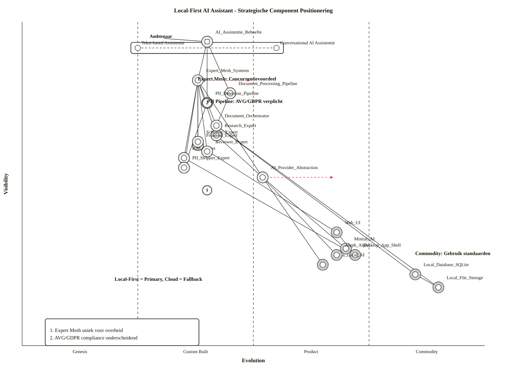
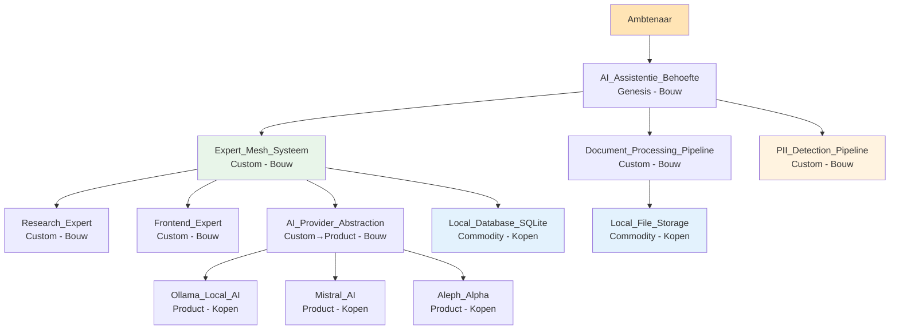

# Wardley Map: Local-First AI Assistant - Strategische Positionering

> **Template Oorsprong**: Officieel | **ArcKit Versie**: 4.3.1 | **Command**: `/arckit:wardley`

## Documentbeheer

| Veld | Waarde |
|------|--------|
| **Document ID** | ARC-000-WARD-001-v1.0 |
| **Document Type** | Wardley Map |
| **Project** | Local-First AI Assistant (Project 000) |
| **Classificatie** | PUBLIC |
| **Status** | DRAFT |
| **Versie** | 1.0 |
| **Aanmaakdatum** | 2026-05-07 |
| **Laatste Wijziging** | 2026-05-07 |
| **Review Cyclus** | Per Kwartaal |
| **Volgende Review Datum** | 2026-08-07 |
| **Eigenaar** | Enterprise Architect |
| **Beoordeeld Door** | PENDING |
| **Goedgekeurd Door** | PENDING |
| **Distributie** | Projectteam, Stakeholders, Architecture Board |

## Revisiegeschiedenis

| Versie | Datum | Auteur | Wijzigingen | Goedgekeurd Door | Goedkeuringsdatum |
|--------|-------|--------|-------------|------------------|-------------------|
| 1.0 | 2026-05-07 | ArcKit AI | Eerste aanmaak vanuit `/arckit:wardley` commando | PENDING | PENDING |

---

## Map Visualisatie

**Bekijk deze map**: Plak de onderstaande map code in [https://create.wardleymaps.ai](https://create.wardleymaps.ai)

```wardley
title Local-First AI Assistant - Strategische Component Positionering
anchor Ambtenaar [0.95, 0.30]
annotation 1 [0.82, 0.38] Expert Mesh: Concurrentievoordeel - Bouw
annotation 2 [0.75, 0.40] PII Pipeline: AVG/GDPR verplicht - Bouw
annotation 3 [0.28, 0.85] Commodity: Gebruik standaard oplossingen
note Local-First = Primary, Cloud = Fallback voor performance [0.20, 0.20]

component Ambtenaar [0.95, 0.30]
component AI_Assistentie_Behoefte [0.92, 0.25]
component Expert_Mesh_Systeem [0.82, 0.38]
component Document_Processing_Pipeline [0.78, 0.45]
component PII_Detection_Pipeline [0.75, 0.40]
component Research_Expert [0.65, 0.42]
component Frontend_Expert [0.62, 0.38]
component Rust_Expert [0.58, 0.35]
component Reviewer_Expert [0.60, 0.40]
component PII_Stripper_Expert [0.55, 0.35]
component Schrijver_Expert [0.63, 0.38]
component Document_Orchestrator [0.68, 0.42]
component AI_Provider_Abstraction [0.52, 0.52]
component Web_UI [0.35, 0.68]
component Desktop_App_Shell [0.28, 0.72]
component Local_Database_SQLite [0.22, 0.85]
component Local_File_Storage [0.18, 0.90]
component Ollama_Local_AI [0.25, 0.65]
component Mistral_AI [0.30, 0.70]
component Aleph_Alpha [0.28, 0.68]

Ambtenaar -> AI_Assistentie_Behoefte
AI_Assistentie_Behoefte -> Expert_Mesh_Systeem
AI_Assistentie_Behoefte -> Document_Processing_Pipeline
AI_Assistentie_Behoefte -> PII_Detection_Pipeline
Expert_Mesh_Systeem -> Research_Expert
Expert_Mesh_Systeem -> Frontend_Expert
Expert_Mesh_Systeem -> Rust_Expert
Expert_Mesh_Systeem -> Reviewer_Expert
Expert_Mesh_Systeem -> PII_Stripper_Expert
Expert_Mesh_Systeem -> Schrijver_Expert
Expert_Mesh_Systeem -> Document_Orchestrator
Expert_Mesh_Systeem -> AI_Provider_Abstraction
Document_Processing_Pipeline -> Document_Orchestrator
PII_Detection_Pipeline -> PII_Stripper_Expert
Research_Expert -> AI_Provider_Abstraction
Frontend_Expert -> Web_UI
Rust_Expert -> Desktop_App_Shell
Document_Orchestrator -> Local_Database_SQLite
Document_Orchestrator -> Local_File_Storage
AI_Provider_Abstraction -> Ollama_Local_AI
AI_Provider_Abstraction -> Mistral_AI
AI_Provider_Abstraction -> Aleph_Alpha
Web_UI -> Desktop_App_Shell
Local_Database_SQLite -> Local_File_Storage

pipeline AI_Assistentie_Behoefte [0.92, 0.25, 0.55]

evolve AI_Provider_Abstraction 0.68 label Commoditiserend door standaardisatie
evolve Expert_Mesh_Systeem 0.50 label Mogelijke productisatie in 18-24 maanden

style wardley
```

<details>
<summary>Mermaid Wardley Map (werkt in GitHub, VS Code en andere Mermaid-viewers)</summary>



**Decorator Gids**:
- `(build)` — Genesis/Custom componenten die in-house gebouwd worden (driehoek marker)
- `(buy)` — Product/Commodity componenten van de markt (diamant marker)
- `(outsource)` — Componenten uitbesteed aan leveranciers (vierkant marker)
- `(inertia)` — Componenten met weerstand tegen verandering (verticale lijn)

</details>

---

## Evolutie Stages Referentie

| Stage | Volwassenheid | Kenmerken | Strategische Acties |
|-------|--------------|------------|---------------------|
| **Genesis** (0.00 - 0.25) | Nieuw, onzeker, snel veranderend | - Uniek en zeldzaam<br>- Slecht begrepen<br>- Snelle verandering<br>- Hoge onzekerheid<br>- Toekomstige waarde onzeker | - R&D focus<br>- Accepteer falen<br>- Experimenteer en verken<br>- Bouw in-house als strategisch |
| **Custom** (0.25 - 0.50) | Ontluikend, groeiend begrip | - Ambachtelijke oplossingen<br>- Custom ontwikkeling<br>- Concurrentievoordeel<br>- Vereist significante skills<br>- Evolueert nog snel | - Investeer in differentiatie<br>- Bouw custom bij concurrentievoordeel<br>- Bescherm IP (patenten) |
| **Product** (0.50 - 0.75) | Rijpende, goede huur diensten | - Producten met features<br>- Huur modellen<br-> Tragere evolutie<br>- Gedefinieerde practices | - Koop producten<br>- Vergelijk features<br>- Standaardiseer waar mogelijk |
| **Commodity** (0.75 - 1.00) | Geïndustrialiseerd, utility | - Gestandaardiseerd<br>- Volume operaties<br>- Hoge afwijkingskosten<br>- Utility diensten | - Gebruik commodity/utility<br>- Cloud diensten<br>- Focus op kosten efficiëntie |

---

## Component Inventaris

### User Needs (Bovenkant Map - Hoge Zichtbaarheid)

| Component | Zichtbaarheid | Evolutie | Stage | Beschrijving | Strategische Notities |
|-----------|---------------|----------|-------|--------------|------------------------|
| Ambtenaar | 0.95 | 0.30 | Genesis | Eindgebruiker van AI assistentie | Primaire stakeholder voor overheidsorganisaties |
| AI_Assistentie_Behoefte | 0.92 | 0.25 | Genesis | Behoefte aan AI-ondersteuning bij dagelijkse taken | Nieuwe user need in overheidscontext - unieke gelegenheid |

### Ondersteunende Capabilities (Midden-Niveau Zichtbaarheid)

| Component | Zichtbaarheid | Evolutie | Stage | Beschrijving | Strategische Notities |
|-----------|---------------|----------|-------|--------------|------------------------|
| Expert_Mesh_Systeem | 0.82 | 0.38 | Custom | Uitbreidbaar expert agent systeem met capability discovery | **Concurrentievoordeel** - uniek voor overheid |
| Document_Processing_Pipeline | 0.78 | 0.45 | Custom | Document parsing, chunking, embedding | Domein-specifiek voor overheidsdocumenten |
| PII_Detection_Pipeline | 0.75 | 0.40 | Custom | PII detectie en redactie voor AVG/GDPR | **Compliance verplichting** - onderscheidend |
| Research_Expert | 0.65 | 0.42 | Custom | Web research en data extraction expert | Domein expertise vereist |
| Frontend_Expert | 0.62 | 0.38 | Custom | Frontend technical expertise (UI/UX) | Web UI specialisatie |
| Rust_Expert | 0.58 | 0.35 | Custom | Rust systems programming expertise | Performance optimalisatie |
| Reviewer_Expert | 0.60 | 0.40 | Custom | Content review en feedback expert | Kwaliteitsborging |
| Schrijver_Expert | 0.63 | 0.38 | Custom | Nederlandse content creatie expert | Lokalisatie differentiatie |
| Document_Orchestrator | 0.68 | 0.42 | Custom | Multi-expert workflow voor document creatie | Workflow coördinatie |
| AI_Provider_Abstraction | 0.52 | 0.52 | Custom→Product | Uniforme interface voor alle AI providers | Beweegt naar product door standaardisatie |

### Infrastructuur Componenten (Lage Zichtbaarheid)

| Component | Zichtbaarheid | Evolutie | Stage | Beschrijving | Strategische Notities |
|-----------|---------------|----------|-------|--------------|------------------------|
| Web_UI | 0.35 | 0.68 | Product | React/TypeScript gebruikersinterface | Standaard web technologie |
| Desktop_App_Shell | 0.28 | 0.72 | Product | Tauri cross-platform desktop shell | Mature desktop framework |
| Local_Database_SQLite | 0.22 | 0.85 | Commodity | Embedded database voor lokale opslag | Gebruik commodity oplossing |
| Local_File_Storage | 0.18 | 0.90 | Commodity | Bestandssysteem voor document opslag | Native OS opslagsysteem |

### Externe Afhankelijkheden

| Component | Zichtbaarheid | Evolutie | Stage | Beschrijving | Strategische Notities |
|-----------|---------------|----------|-------|--------------|------------------------|
| Ollama_Local_AI | 0.25 | 0.65 | Product | Local model hosting voor volledige isolatie | Primary AI provider (local-first) |
| Mistral_AI | 0.30 | 0.70 | Product | Europese AI provider (Frankrijk) | Performance fallback #1 |
| Aleph_Alpha | 0.28 | 0.68 | Product | Europese AI provider (Duitsland) | Performance fallback #2 |

---

## Evolutie Analyse

### Componenten in Genesis (0.00 - 0.25)

**Nieuw, onbewezen, hoge onzekerheid**

| Component | Huidige Positie | Risico | Opportuniteit | Actie |
|-----------|------------------|--------|---------------|-------|
| AI_Assistentie_Behoefte | 0.25 | Medium - nieuwe user need in overheidscontext | Eerst mover advantage in overheids-AI | Accepteer iteratie, focus op user feedback |

**Strategische Aanbevelingen**:

- [x] Accepteer hoge faalratio bij experimenten
- [x] Investeer in R&D en iteratieve ontwikkeling
- [x] Bouw in-house als strategisch differentiator
- [x] Vermijd uitbesteden van core innovatie

### Componenten in Custom (0.25 - 0.50)

**Ontluikende practices, concurrentievoordeel**

| Component | Huidige Positie | Concurrentievoordeel? | Actie |
|-----------|------------------|------------------------|--------|
| Expert_Mesh_Systeem | 0.38 | **Ja** - uniek voor overheidscontext | Bouw en bescherm IP |
| Document_Processing_Pipeline | 0.45 | **Ja** - overheidsdocument formaten | Bouw domein-specifiek |
| PII_Detection_Pipeline | 0.40 | **Ja** - AVG/GDPR compliance | Bouw compliance-gericht |
| Research_Expert | 0.42 | **Ja** - web research expertise | Bouw met specialisten |
| Frontend_Expert | 0.38 | Nee - generieke frontend skills | Overweeg buy vs build |
| Rust_Expert | 0.35 | **Ja** - performance optimalisatie | Bouw voor lokale efficiëntie |
| Reviewer_Expert | 0.40 | Nee - generieke review skills | Overweeg hergebruik |
| Schrijver_Expert | 0.38 | **Ja** - Nederlandse taal expertise | Bouw voor lokalisatie |
| Document_Orchestrator | 0.42 | **Ja** - workflow coördinatie | Bouw voor domein-specifieke workflows |
| AI_Provider_Abstraction | 0.52 | Nee - aan het commoditiseren | Prepareer voor vendor lock-in ontwijking |

**Strategische Aanbevelingen**:

- [x] Bouw custom bij concurrentievoordeel
- [x] Investeer in specialistische skills
- [x] Bescherm IP (patenten, trade secrets)
- [x] Monitor evolutie snelheid - kan snel naar product bewegen
- [x] Build vs Buy beslissing kritiek hier

### Componenten in Product (0.50 - 0.75)

**Rijpende markt, feature differentiatie**

| Component | Huidige Positie | Markt Opties | Actie |
|-----------|------------------|---------------|--------|
| Web_UI | 0.68 | React, Vue, Angular ecosystem | Gebruik standaard frameworks |
| Desktop_App_Shell | 0.72 | Tauri, Electron (overweeg trade-offs) | Tauri gekozen voor kleinere binaries |
| Ollama_Local_AI | 0.65 | Ollama (enige echte speler) | Product-marktpositie |
| Mistral_AI | 0.70 | Mistral API, Azure, AWS | Multi-provider strategie |
| Aleph_Alpha | 0.68 | Aleph Alpha API direct | Europese enterprise optie |

**Strategische Aanbevelingen**:

- [x] Procureer van markt leiders
- [x] Vergelijk feature sets en prijzen
- [x] Standaardiseer op gemeenschappelijke platformen
- [x] Vermijd custom ontwikkeling tenzij kritisch

### Componenten in Commodity (0.75 - 1.00)

**Geïndustrialiseerd, utility diensten**

| Component | Huidige Positie | Commodity Provider | Actie |
|-----------|------------------|-------------------|--------|
| Local_Database_SQLite | 0.85 | SQLite (open source) | Gebruik embedded oplossing |
| Local_File_Storage | 0.90 | Native file systems | Gebruik OS native opslag |

**Strategische Aanbevelingen**:

- [x] Gebruik commodity/utility services
- [x] Focus op kosten efficiëntie, niet features
- [x] Vermijd custom ontwikkeling tegen alle kosten

---

## Build vs Buy Analyse

### Build (In-House Ontwikkeling)

**Kandidaten voor Bouwen**:

| Component | Evolutie Stage | Rationale | Risico | Investering |
|-----------|----------------|-----------|--------|--------------|
| Expert_Mesh_Systeem | Custom (0.38) | Uniek concurrentievoordeel voor overheid | Medium - skills beschikbaar | 6-12 maanden ontwikkeling |
| PII_Detection_Pipeline | Custom (0.40) | AVG/GDPR compliance verplichting | Medium - privacy expertise nodig | 3-6 maanden ontwikkeling |
| Document_Processing_Pipeline | Custom (0.45) | Overheidsdocument domein-specifiek | Low - standaard technieken | 4-8 maanden ontwikkeling |
| Rust_Expert | Custom (0.35) | Performance differentiatie | Low - Rust team beschikbaar | 2-4 maanden ontwikkeling |
| Schrijver_Expert | Custom (0.38) | Nederlandse taal expertise | Low - taal expertise beschikbaar | 2-4 maanden ontwikkeling |

**Build Criteria**:

- ✅ Genesis/Custom stage (< 0.50 evolutie)
- ✅ Biedt concurrentievoordeel
- ✅ Core van business differentiator
- ✅ Geen geschikte markt alternatieven
- ✅ Skills beschikbaar of verwervbaar
- ✅ Strategisch IP eigendom belangrijk

### Buy (Procurement)

**Kandidaten voor Kopen**:

| Component | Evolutie Stage | Markt Opties | Rationale | Procurement Route |
|-----------|----------------|--------------|-----------|-------------------|
| Web_UI libraries | Product (0.68) | MUI, Tailwind, shadcn/ui | Snelheid tot markt | Open source (gratis) |
| Desktop_App_Shell | Product (0.72) | Tauri, Electron | Mature frameworks | Open source (gratis) |
| Ollama_Local_AI | Product (0.65) | Ollama project | Enige local model hoster | Open source (gratis) |
| Mistral_AI | Product (0.70) | Mistral API, Azure, AWS | Europese provider | Direct contract |
| Aleph_Alpha | Product (0.68) | Aleph Alpha direct | Enterprise optie EU | Direct contract |

**Buy Criteria**:

- ✅ Product/Commodity stage (> 0.50 evolutie)
- ✅ Volwassen markt met meerdere vendors
- ✅ Geen concurrentie differentiator
- ✅ Kosten van bouwen > kosten van kopen
- ✅ Time to market kritiek

---

## Inertia en Barrières

**Inertia** = weerstand tegen evolutie door bestaande practices, skills of investeringen

| Component | Huidige Evolutie | Gewenste Evolutie | Inertia Factor | Barrier Beschrijving | Mitigatie Strategie |
|-----------|-------------------|--------------------|----------------|---------------------|---------------------|
| Expert_Mesh_Systeem | 0.38 | 0.50 | **Medium** | Nieuw architectuur patroon voor team | Training, proof-of-concept |
| Local_First_Architectuur | 0.25 | 0.45 | **Hoog** | Cultuur verschuiving van cloud naar local | Change management, pilot projecten |
| PII_Detection_Pipeline | 0.40 | 0.55 | **Low** | Compliance is driver | Minimal - regelgeving dwingt verandering |

**Inertia Bronnen**:

- **Skills inertia**: Team expertise in cloud-native technieken (niet local-first)
- **Proces inertia**: Gevestigde workflows voor cloud development
- **Vendor lock-in**: Bestaande contracten met cloud providers
- **Culturele inertia**: "Cloud first" standaard in overheids-IT
- **Kapitaal investering**: Reeds geïnvesteerd in cloud infrastructuur

**De-risking Strategieën**:

- [x] Upskilling programs voor Rust en local-first architectuur
- [x] Pilot projecten om local-first aanpak te bewijzen
- [x] Gefaseerde migratie om risico te verminderen
- [x] Verandermanagement en communicatie

---

## Beweging en Evolutie Voorspellingen

**Evolutie Snelheid** = hoe snel componenten verwacht worden langs de evolutie as te bewegen

### Volgende 12 Maanden

| Component | Huidig | Voorspeld (12m) | Snelheid | Impact | Actie Vereist |
|-----------|---------|-----------------|----------|--------|----------------|
| AI_Provider_Abstraction | 0.52 | 0.58 | **Medium** | Provider standaardisatie neemt toe | Monitor markt voor AI abstractie lagen |
| Expert_Mesh_Systeem | 0.38 | 0.42 | **Langzaam** | Dominee expertise blijft relevant | Continue investering in differentiatie |
| PII_Detection_Pipeline | 0.40 | 0.45 | **Langzaam** | Privacy compliance blijft maatwerk | Domein expertise uitbouwen |
| Ollama_Local_AI | 0.65 | 0.72 | **Medium** | Local model hosting wordt mainstream | Alternative providers evalueren |

### Volgende 24 Maanden

| Component | Huidig | Voorspeld (24m) | Snelheid | Impact | Actie Vereist |
|-----------|---------|-----------------|----------|--------|----------------|
| AI_Provider_Abstraction | 0.52 | 0.68 | **Snel** | Commoditiserend naar product | Voorbereiden op lock-in ontwijking |
| Expert_Mesh_Systeem | 0.38 | 0.50 | **Medium** | Mogelijke productisatie | IP bescherming, ecosystem bouwen |
| Mistral_AI | 0.70 | 0.80 | **Medium** | LLM markt commoditiseert | Multi-provider strategie behouden |

**Strategische Implicaties**:

- [ ] Componenten bewegen Genesis → Custom: Investeer nu in R&D
- [ ] Componenten bewegen Custom → Product: Bereid je voor op buy vs build
- [ ] Componenten bewegen Product → Commodity: Plan cloud migratie
- [ ] Componenten met hoge snelheid: Monitor markt nauwlettend
- [ ] Componenten met inertia: Plan verandermanaging vroeg

---

## Nederlandse Overheid Context

### Europese AI Compliance

**Europa-First Strategie** (PRIN-004):

| Provider | Prioriteit | EU-gebaseerd | Open Source | Data Residatie | Uitzondering Vereist? |
|----------|------------|--------------|-------------|-----------------|---------------------|
| Ollama (Local) | 1e keuze | ✅ Local (EU) | ✅ | ✅ Local | Nee |
| Mistral AI | 2e keuze | ✅ FR | ✅ | ✅ EU (Parijs) | Nee |
| Aleph Alpha | 3e keuze | ✅ DE | ❌ | ✅ EU (Duitsland) | Nee |
| OpenAI | Laatste | ❌ VS | ❌ | ⚠️ VS (EU compliant?) | Ja (CTO+DPO) |
| Anthropic | Laatste | ❌ VS | ❌ | ⚠️ VS (EU compliant?) | Ja (CTO+DPO) |

### AVG/GDPR Compliance Mapping

| AVG Principe | Gerelateerde Componenten | Compliance Status | Gap Analyse |
|--------------|--------------------------|--------------------|--------------|
| Privacy by Design | PII_Detection_Pipeline, Local_Database_SQLite | ✅ | Pipeline geïmplementeerd |
| Recht op Vergetelheid | Local_Database_SQLite, Local_File_Storage | ✅ | EFF-010 geïmplementeerd |
| Recht op Portabiliteit | Export functionaliteit | ⚠️ | EFF-009 moet geïmplementeerd worden |
| Data Minimisation | PII_Detection_Pipeline | ✅ | Pipeline detecte en redigeert |
| Recht op Toegang | Local_Database_SQLite | ⚠️ | Data export functionaliteit nodig |

**HIGH-RISK AI Componenten**:

- [x] PII_Detection_Pipeline: AVG/GDPR compliance verplichting
- [x] Expert_Mesh_Systeem: Transparantie van AI beslissingen
- [x] DPIA vereist voor productie deployment

---

## Dependencies en Value Chain

**Component Dependencies**:



**Critical Path Analyse**:

- [x] Expert_Mesh_Systeem is critical path naar alle expert functionaliteit
- [x] AI_Provider_Abstraction is critical path naar AI verwerking
- [x] PII_Detection_Pipeline is critical path naar AVG/GDPR compliance
- [x] Single vendor risico: Mistral AI als fallback - mitigeren met Aleph Alpha

---

## Strategische Gameplay

### Gameplay Patroon Analyse

**Tower and Moat** (bescherm concurrentievoordeel):

- [x] **Expert_Mesh_Systeem**: Bouw custom, houd propriëtair
  - Unieke waarde: Capability-based expert discovery voor overheidsdomeinen
  - Switching costs: Domein expertise integratie in experts
  - Ecosystem: Derde partijen kunnen eigen experts toevoegen

- [x] **PII_Detection_Pipeline**: Bouw compliance moat
  - Unique waarde: AVG/GDPR compliance voor Nederlandse context
  - Switching costs: Integratie met document workflows

**Open Source Play** (versnel commoditisatie):

- [x] **AI_Provider_Abstraction**: Open source specificatie publiceren
  - Doel: Voorkom vendor lock-in bij AI providers
  - Impact: Versnel adoptie van Europese providers

**Sensing Engines** (vroeg waarschuwing systemen):

- [x] Monitor LLM markt voor nieuwe Europese providers
- [x] Track local model hosting (Ollama concurrentie)
- [x] Watch voor AI agent framework standaardisatie

---

## Risico Analyse

### High-Risk Gebieden

| Risico | Component(en) | Waarschijnlijkheid | Impact | Mitigatie |
|--------|---------------|-------------------|--------|------------|
| **Single vendor dependency** | Mistral_AI | Medium | High | Multi-provider strategie (Ollama, Aleph Alpha) |
| **Genesis component failure** | Expert_Mesh_Systeem | Low | High | Iteratieve ontwikkeling, fail-fast |
| **Rapid commoditization** | AI_Provider_Abstraction | High | Medium | Open source specificatie, vendor agnostisch ontwerp |
| **Skills gap** | Rust expertise | Medium | Medium | Training, hiring, knowledge sharing |
| **Regulatory change** | AVG/GDPR wijzigingen | Low | High | Continue monitoring, flexibele architectuur |

### Opportuniteiten

| Opportuniteit | Componenten | Potentiële Waarde | Investering Vereist | Actie Plan |
|----------------|--------------|--------------------|---------------------|-------------|
| Europese AI leiderschap | Expert_Mesh + EU providers | High | Medium | Positioneer als EU-first AI oplossing |
| Gemeente ecosystem | Expert_Mesh extensies | High | Low | Derde partijen enablen |
| Open source bijdragen | AI_Provider_Abstraction | Medium | Low | Publiceer als standaard |

---

## Traceerbaarheid

### Requirements Mapping

| Requirement ID | Gerelateerde Componenten | Evolutie Stage | Build/Buy Beslissing |
|----------------|--------------------------|-----------------|---------------------|
| EFF-001 | AI_Assistentie_Behoefte, Expert_Mesh_Systeem | Genesis/Custom | Build |
| EFF-004 | PII_Detection_Pipeline | Custom | Build |
| EFF-005 | Ollama_Local_AI | Product | Buy (open source) |
| EFF-006 | AI_Provider_Abstraction, Mistral_AI, Aleph_Alpha | Custom/Product | Build/Buy hybride |
| NFR-001 | Alle AI providers | Various | Europa-first strategie |
| NFR-002 | PII_Detection_Pipeline, Local_Database_SQLite | Custom/Commodity | Build/Buy per component |
| TECH-001 | Local_Database_SQLite, Local_File_Storage | Commodity | Buy (standaard) |
| TECH-003 | AI_Provider_Abstraction | Custom→Product | Build (nu), Buy (toekomst) |

### Architecture Principles Alignment

| Principe | Gerelateerde Componenten | Compliance | Gap Analyse |
|-----------|--------------------------|------------|--------------|
| P-1: Schaalbaarheid | Expert_Mesh_Systeem (stateless actors) | ⚠️ Partial | Local-first beperkt horizontale schaalbaarheid |
| P-2: Resilientie | AI_Provider_Abstraction (fallback) | ✅ | Multi-provider fallback geïmplementeerd |
| P-3: Interoperabiliteit | AI_Provider_Abstraction (uniform interface) | ✅ | Interface gedefinieerd |
| P-4: EU Soevereiniteit | Alle AI providers | ✅ | Europa-first geïmplementeerd |
| P-5: Security by Design | PII_Detection_Pipeline | ✅ | Privacy pipeline geïmplementeerd |
| P-6: Observabiliteit | Expert_Mesh_Systeem | ⚠️ Partial | Monitoring strategy nodig |

---

## Aanbevelingen

### Directe Acties (0-3 maanden)

1. **Voltooi Expert Mesh documentatie**
   - **Component**: Expert_Mesh_Systeem
   - **Rationale**: Architectuur documentatie loopt achter op implementatie
   - **Investering**: 2-4 weken architectuur werk
   - **Eigenaar**: Enterprise Architect
   - **Succescriteria**: DIAG-002 bijgewerkt met expert mesh

2. **Implementeer Observability Strategy**
   - **Component**: Expert_Mesh_Systeem
   - **Rationale**: Monitoring ontbreekt voor distributed expert systeem
   - **Investering**: 4-6 weken ontwikkeling
   - **Eigenaar**: SRE/DevOps team
   - **Succescriteria**: Distributed tracing, metrics, logging

3. **Finaliseer Local-First Strategy**
   - **Component**: AI_Provider_Abstraction
   - **Rationale**: Documentatie toont onduidelijke prioriteit
   - **Investering**: 1 week documentatie update
   - **Eigenaar**: Architect
   - **Succescriteria**: Ollama = primary, Mistral = fallback duidelijk gedefinieerd

### Korte Termijn Acties (3-12 maanden)

1. **PII Pipeline Validatie**
   - **Component**: PII_Detection_Pipeline
   - **Rationale**: AVG/GDPR compliance moet gevalideerd worden
   - **Investering**: 4-8 weken + DPO review
   - **Eigenaar**: Security Architect
   - **Succescriteria**: DPIA goedgekeurd, accuracy >90%

2. **Expert Ecosystem Uitbreiding**
   - **Component**: Expert_Mesh_Systeem
   - **Rationale}: Maximaliseer concurrentievoordeel via derde partijen
   - **Investering**: 8-12 weken ontwikkeling + documentatie
   - **Eigenaar**: Product Owner
   - **Succescriteria**: Externe developer onboarding docs live

### Lange Termijn Strategische Acties (12-24 maanden)

1. **AI Abstraction Productisatie**
   - **Component**: AI_Provider_Abstraction
   - **Rationale**: Component commoditiseert, prepareer voor marktpositie
   - **Investering**: 12-18 maanden (indien gekozen)
   - **Eigenaar**: Product Management
   - **Succescriteria**: Open source release, community adoptie

2. **Multi-Instance Expert Mesh**
   - **Component**: Expert_Mesh_Systeem
   - **Rationale**: Ondersteun grotere gemeentes (Utrecht schaling)
   - **Investering**: 6-12 maanden architectuur werk
   - **Eigenaar**: Architect
   - **Succescriteria**: Distributed mesh over meerdere instanties

---

## Doctrine Assessments

### Doctrine Maturity Score

| Phase | Score | Assessment |
|-------|-------|------------|
| **I: Stop Self-Harm** | 7/10 | Common language aanwezig, maar documentation gap |
| **II: Context Aware** | 6/10 | Open source bias aanwezig, inertia management nodig |
| **III: Better for Less** | 5/10 | Flow optimalisatie nodig, observerbaarheid ontbreekt |
| **IV: Continuously Evolving** | 4/10 | Ecosystem luisteren nodig, geen single culture |

**Gemiddelde Doctrine Maturity**: 5.5/10

### Verbeterpunten

**Phase I - Prioriteit: Hoog**
- [x] Common language: Expert mesh terminologie is niet universeel begrepen
- [x] Challenge assumptions: Local-first vs cloud-first assumptions uitdagen
- [x] Understand context: Stakeholder context beter documenteren

**Phase II - Prioriteit: Hoog**
- [x] Bias towards open: Expert_Mesh_Systeem als open source delen?
- [x] Manage inertia: Local-first cultuurverschillen adresseren
- [x] Move fast: Snellere iteratie tussen architectuur en implementatie

**Phase III - Prioriteit: Medium**
- [x] Optimise flow: Expert workflow optimaliseren
- [x] Do better with less: Resource efficiëntie verbeteren
- [x] Set exceptional standards: Kwaliteitsstandaarden voor experts definieren

---

## Map Versiebeheer

**Versie Geschiedenis**:

| Versie | Datum | Auteur | Wijzigingen | Rationale |
|---------|-------|--------|-------------|-----------|
| v1.0 | 2026-05-07 | ArcKit AI | Initiële map | Stratgische positie van Local-First AI Assistant |

**Volgende Review Datum**: 2026-08-07

**Review Frequentie**: Per kwartaal

---

## Externe Referenties

| Document | Type | Bron | Kernextracties | Pad |
|----------|------|------|-----------------|-----|
| ARC-000-PRIN-v1.0.md | Architecture Principles | ArcKit | Europa-first AI, Security by Design | projects/000-global/ |
| ARC-000-REQS-v1.0.md | Requirements | ArcKit | Functionele en non-functionele eisen | projects/000-global/ |
| ARC-000-HLDR-v1.0.md | HLD Review | ArcKit | Expert mesh implementatie status | projects/000-local-assistant/ |
| ARC-000-DIAG-002-v1.0.md | Container Diagram | ArcKit | Component architectuur | projects/000-global/diagrams/ |

---

**Gegenereerd door**: ArcKit `/arckit:wardley` command
**Gegenereerd op**: 2026-05-07
**ArcKit Versie**: 4.3.1
**Project**: Local-First AI Assistant (Project 000)
**AI Model**: Claude Opus 4.7
**Generatie Context**: Wardley Map gegenereerd op basis van principles (ARC-000-PRIN), requirements (ARC-000-REQS), en HLD review (ARC-000-HLDR)
